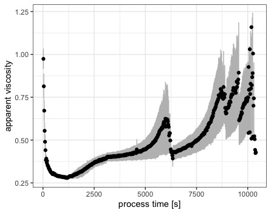
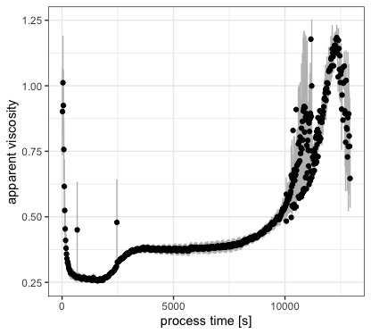

\section{Supplementary Material}

**Appendix A**
\newline
*Rheological data used for the modellation of flow behaviour*

The sets of curves used for the modellation of the general flow behaviour are displayed and described below. In general a variance can be seen in the samples processed in an aluminum cup, concerning the general speed of the structure formation. This has been discussed in detail within this work.

```{r, echo=FALSE, out.width="50%", fig.cap="Plotted mean values (N=5) of the measured apparent viscosity of model processed cheese samples produced from native casein prepared in an aluminium cup: variance can be seen in the time that is needed to reach the second exponential phase of structure formation. This was attributed to the pre-mixing conditions of the samples and included a representation for matrix inhomogenity in the model"}

```
```{r, echo=FALSE, out.width="50%", fig.cap="Plotted mean values (N=3) of the measured apparent viscosity of model processed cheese samples produced from rennet casein prepared in an aluminium cup: variance at the end of processing neglegible. Date included a representation for reproducibility of the flow curve. "}

```
