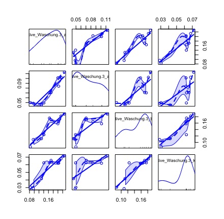

\section{Correlation Analysis of Experimental Data using the R programming language}

Correlation analysis is a powerful statistical tool, that can lead to further insight into closed datasets. Some trends or even applied fits during this study empirically suggested multiple correlations in the experimental data. One example of such an empirically suggested correlation is the development of especially alphaS1 and beta caseins to the interphase, as described in section 4 of this study, with the apparent viscosity obtained by means of rheological processing. The fit for the increase in the total protein measured at the interphase after a centrifugational washing procedure already revealed an R^2 = 0.98 for the correlation with the viscosity increase (data not shown). To elucidate possibly more of such structures a correlation analysis was performed on the compositional data alone, and as a cross correlation analysis.

Do to so, data preparation, also known as data-wrangling is crucial and takes a lof of time in numeric analysis in general. Only a structured set of data is useful in numeric analysis, best prepared in the way that every observation is a row and every variable is a column (@Wehrens2011). 
Data, that is reshaped in that way is called "tidy" data, accordingly, many programs used in R for that matter include the prefix tidy. In this study, the CRAN "tidyverse" package was used for data wrangling. The "tidyverse" is a bundle of self supporting packages (due to the same API key) that helps reshape calculate or clear imported data sets. Especially when dealing with large data sets as in NMR analysis or DLS, a programmed data pre preparation gives better oversight over the data, than the graphical displays usually used. Documentation of the "tidyverse" can be found under https://cran.r-project.org/web/packages/tidyverse/index.html. Correlation analysis was performed using base R functions as well as the CRAN "lares" package (documentation under https://cran.r-project.org/web/packages/lares/index.html). 
The R programming environment has additional powerful built-in tools and add-on packages for graphical correlation analysis. When working with large datasets, it is important to analyze the data in logical clusters. 
The experimentally obtained data of protein concentration in various centrifugationally separated phases were analyzed, the results are displayed in the next section.

\subsection{Results}

The function "scatterplotMatrix" plots a given set of data against itself and gives a graphical display (correlation plot) of possible correlations within the measurement data. The diagonal of this graphical display is the density distribution of the data.
The goal here was to find similarities in the concentration or desorption behavior of caseins in the investigated, centrifugationally separated (and respectively washed) phases. The full correlation plot for the compositional analysis in cream, pellet and serum phase as well as for the wash-phases can be found in Appendix B of the Supplementary Material.

This analysis should besides other purposes serve to validate the observations driven from the experimental data. One observation was, that the single concentrations of the caseins in the purified cream phase and the pellet phase developed in a similar fashion.
To check this observation, a correlation plot for the caseins measured in the cream and interphase was created (Fig.\ref{fig:scat})

```{r scat, echo=FALSE, out.width="90%", fig.cap="Correlation plot of the protein concentrations measured in the cream 1:4 and pellet 5:8 phase. \ Protein concentrations are displayed in the order alphaS1, alphaS2, beta and kappa casein."}

```

Strong correlations can be assumed between the development of kappa casein and beta casein in the pellet, as well as alphas1 casein and beta casein in the cream. However useful for an overview, getting concrete insight towards which measured species in this set correlates the most, more specific correlation plots were obtained. The function "cross_cor()" gives an output of the correlations found in a data set, ranked by their level of significance (either positive or negative values). By analyzing, for example, the compositional data from chapter 3 in that manner, an estimation for protein interaction can be made. This is due to the fact, that the phases were measured at the same apparent processing point. If the interactions of two associated or aggrgated proteins increase or decrease simultaneously at per- or proceeding processing points (i.e. the respective processing times or the arbitrary values A:K), it can be concluded, that they are interacting or aggregating and therefore decrease or increase in a similar manner in the respective phases. Thus, a correlation of the measured concentrations of such caseins over the course of processing should be detected.

```{r cc1, echo=FALSE, out.width="50%", fig.cap="Most significant correlations of the concentrations of single caseins in the investigated phases during processing: \ red colour indicates negative, blue colour positive correlations. "}

```
In Fig.\ref{fig:cc1} the 10 most highly ranked correlations between the development of the casein concentrations in the investigated phases over the course of processing are displayed. It can be seen that proteins in the pellet and the proteins in the cream develop in a similar manner as it was already visible in the scatterplot, as displayed in the previous figure. Especially the development of kappa casein and beta casein concentration in cream and pellet, as well as the development of concentrations of kappa with alphaS1 casein in both phases and the interaction of beta and alphaS1 casein in pellet and cream phase during processing showed high correlations. 
The highest correlation between the development of measured protein concentrations of alphaS2 casein is with itself in the respective cream and pellet phase. Following the logic above, this would mean, that this casein species mainly tends to interact with itself. This would be in conclusion with the findings of @Vollmer2021, where an in-situ separation of the model processed cheese into protein rich and protein depleted areas could be shown. Hence the protein rich structures appear due to a high interactions of caseins, namely kappa, beta and alphaS1 casein, to hydrophobic clusters or even fibrils, depleted from alphaS2 casein, that then mainly interacts with itself.

Another hypothesis, if the casein fibrils, mainly comprising kappa casein, as it was described extensively in @Vollmer2021 and @Vollmer2021a, could potentially be found in the analysis of the casein population in the intermediate spaces of the fatglobules. In theory, these spaces were analyzed by compositional analysis of the wash phases. In Fig.\ref{fig:cc2} it is apparent that the kappa casein is not directly bound to the cream phase. 

```{r cc2, echo=FALSE, out.width="50%", fig.cap="Cross-correlation for the measured kappa casein concentrations in the different phases; \ blue indicates positive, red negative correlations."}

```

The top correlation of measured kappa casein in the investigated phases is inbetween kappa casein in the cream phase and kappa casein at the interphase.
In chapter 4, it was theorized, that the structures around the fat particle are fed by the structures from the pellet, since they occur entangled in the non-diluted system. @Vollmer2021 showed, that fibrils that were later confirmed to consist mainly of kappa casein, connected the fat-globules in the model processed cheese matrix to a fine stranded network. The fibrils were suspected to be found in the pellet after compositional analysis. Hence it can be said, that during this study, potentially aggregated kappa casein can be found especially in the hydrophobic phases of the model cheese matrix. 
Potentially loosely bound kappa casein fibrils might be found in the data of the third washing step, since a significance of ~0.5 is displayed for kappa casein from the third washing experiment and the kappa casein in the pellet. 
Fig.\ref{fig:scat2} shows the correlation plot for washing step 3.
```{r scat2, echo=FALSE, out.width="30%", fig.cap="Correlation plot for the third washing step; proteins are displayed in their measured concentration in the order \ alphaS1, alphaS2, beta and kappa casein."}

```
Fig.\ref{fig:scat2} shows that the density of kappa casein (bottom right square) is normal distributed around a value at the end of the series, i.e. the end of processing. Hence the correlation from the concentrations of kappa casein measured in the wash phase 3 with the kappa casein in the pellet phase comes most likely from the adsorption processes during the second phase of structure formation.

What can be also done is to look for correlations of a dataset with a specific corresponding data vector. The implemented setup "corr_var()" seems ideally suited to check for the correlation of the measured apparent viscosity as interpreted as structure formation throughout this trial and in previous works, and the measured particle concentrations in the respective phases. 
Since we assume, that a hydrophobically linked network was formed, a step-wise increase in potentially hydrophobically interacting proteins in the pellet and in the cream phase is expected.
Fig.\ref{fig:cc3} gives results following this expectation. 

```{r cc3, echo=FALSE, out.width="50%", fig.cap="Correlation of the measured apparent viscosity with the data from the compositional analysis. \ Displayed are the top 10 correlations as indicatied by significance level. A positive correlation is indicated by the blue colour, a negative correlation by the colour red." }

```
Almost every protein fraction in the investigated hydrophobic phases corresponded to a positive structure formation. Almost, as so to that kappa casein is missing in this top rank. This can be interpreted as that the suspected kappa casein fibrils don't interact in the structure build up in the cream, but stabilize it by interconnection. It is interesting, that they seem to help forming hydrophobic bonds to large networks, since their basic function in milk is to prevent this type of aggregation from happening (@Holt2013).
Interesting from this analysis is as well, that the biggest negative correlation was given by three proteins in the wash phase, beta, alphaS1 and kappa casein. It can be concluded, that the desorption of these proteins from the intermediate spaces of the fatglobules doesn't further promote the structure formation, since less and less of these species can be found in the first washing phase of the centrifugationally separated cream. 
The fourth protein species alphaS2, of the first wash phase can be found almost at the bottom of the list of correlation values. This indicated, that the adsorption or desorption of alphaS2 casein to or from the intermediate spaces of the fat globules is not related to the viscosity increase. 


