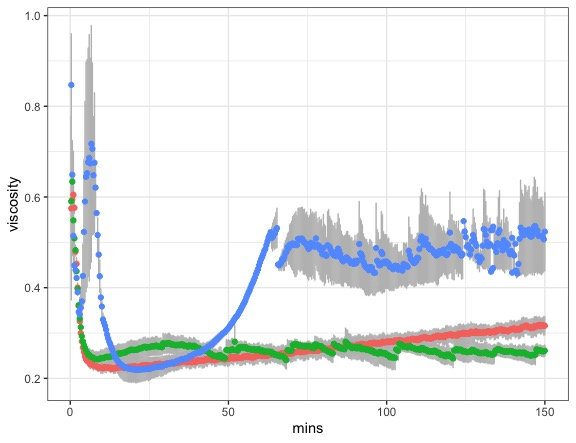
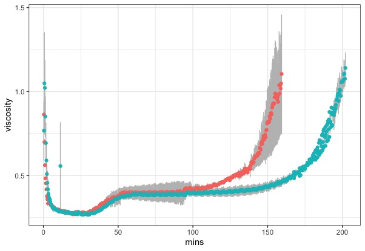
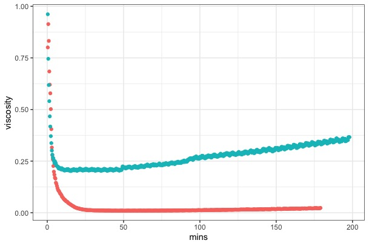
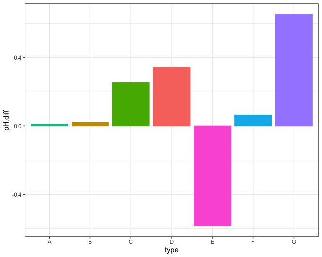

\section{Rheological Profile of structure formation in model processed cheese}
\subsection{Introduction}
The rheological profile of dispersed systems in the food, pharmaceutical or cosmetic industry is an important parameter for the quality assurance of such products. Additionally, the rheological behaviour under certain process conditions can give insight towards the structuring mechanisms occuring on a molecular level. Many studies have been performed on diluted or overall liquid dispersed systems. In @Tatar2016 rheological properties of micro and nanoemulsions are described.
In order to get an overview of the structure formation overall, several model cheeses with varying protein sources were produced: Rennet Casein, Native Casein, Sodium Caseinate. Salt composition was varied for samples made from Sodium Caseinate using HCl and Citric Acid as well as the model-tyical emulsifying salt composition.
We developed a simplified model system which contains 15% total protein (native Casein, in which we disintegrate the casein micelle under the use of melting salts to present reactive protein (-aggregates) for the structure formation) and 20% fat (plant oil). The dry matter of the system is around 40%. 
In order to investigate structural changes during processing, we process the dairy matrix in a shear-stress rheometer, in which we can follow the structure build-up under controlled shear and heat. 
What we see is a reproducible step-wise rise in viscosity, so we produce the samples in a batch to the desired point of the reaction and investigate them. 
The aim was to find two distinctly different rheological profiles in order to further investigate (chapter 4) if the changes in rheological behaviour can also be seen in distributional and compositionla data of the (diluted) matrix to get a better understadning of the aggregation, adsorption and possibly desorption processes during structuring.

\subsection{Material and Methods}

**Production of model process cheese premix**
The composition of the processed cheese premix used corresponded to the model processed cheese recipe developed by @Lenze2019 as follows:
- 20 % fat
- 15 % protein
- approx. 42 % dry matter (DM)
- 3 % Melting salts
- pH approx. 5.8
The recipe is based on the original product; yet, influencing factors such as the type of fat or the age of the cheese can be reduced in order to obtain a system that is as reproducible and comparable as possible.
In the course of the present work, native (micellar) casein, rennet casein and sodium caseinate were used as protein sources. Rapeseed oil was used as fat. The pH value, which should be between 5.75 and 5.85, was adjusted using powdered citric acid. The melting salts were also weighed out as powder the dry matter.

The individual recipe components were weighed into a beaker on an analytical balance. The protein powder was weighed separately into a weighing dish. The protein-oil-water dispersion was prepared with the aid of the dispersing device "Ultra Turrax T25" at a speed of about 5,000-9,000 min-1. First, the salts, oil and water were mixed to form emulsion until the salts were dissolved. Then the protein powder was slowly mixed in to obtain a homogeneous processed cheese premix. The pH value was determined shortly before processing using a solid pH meter.

**Production of the processed cheese and viscosity measurement**
Thermal processing of the processed cheese premix and the simultaneous online viscosity measurement was carried out using the  "AR Rheometer 1000" from TA Instruments. The rheometer is equipped with a Peltier element and an external water bath to control the temperature in the sample cup. A stirrer blade with a length of 6 cm was used as the measuring geometry, which is attached to the drive shaft with a screw connection. This was used both for viscosity measurement and for mixing and shearing the cheese mass. To close off the sample cup and prevent water loss, a suitable lid was made and fitted until the stirring blade could rotate smoothly.

Shortly before the measurement, the process temperature was set. The premix was placed in the sample cup and the measurement started as soon as the desired temperature was reached.
Flow curves were obtained as a function over time time and measurements were performed in triplicate.

```{r chapIadd, child='chapterIadd.Rmd'}
```

\subsection{Results and discussion}
The composition of model process cheese (table...) lead to a dry mater of 40 % with protein concentrations from 15-17% TP. Samples were pre-mixed prior to processing, since it was found that without an initial emulsification step, no stable educt (melt/sol) could be produced in the processing cup (see appendix...). It should be noted that @Lenze2019 used pre-emulsified fat (milk fat) in the process which led to the stable educt.
```{r , echo=FALSE, out.width="75%", fig.cap="Detailed rheological profile of model processed cheese samples made with sodium caseinate as source material. Variation was in the type of salt used for pH adjustment to a value of 5.88: HCl (blue), Citric Acid (red), emulsifying salts (green). Measurements were performed in triplicate and plotted as mean; variation in viscosity indicated as grey shade."}

```
We see the calcium dependency of the first phase of the structure formation. Interesting here as well is the behaviour of sodium caseinate in relation to the degree of Calcium release. The rest of Calcium Ions in Sodium Caseinate is directly bound to phosphoserine residues. When processed without melting salts, we can see a structure development up to the first plateau. After that, no further structure development could be recorded. This leads to the hypothesis, that the initially chelated Calcium Ions in micellar Samples are not immobile or inert in the system within their chelated complex, but can - and will after time- initiate a second structure formation phase, i.e. a second growth phase. @Post2012 showed a dependency of solubility of especially beta-caseins from pH in an environment containing calcium chloride. 

Structure formation only apparent in samples without Ca2+ complexing salts. First stage of structure formation might be Calcium driven, since the remaining Calcium (which is associated with the Phospho-Serin in Sodium Caseinate) is removed by emS -> no typical structure formation visible. We can see, that the removal of colloidal Calcium is neccessary to form the first log phase, removal of Serin bound Calcium (-Phosphate) strongly hinders structure formation. 
Reasons are probably electrostatic interactions with the interface and or electrostatic repulsion of casein particles when large negatively charged residues are exposed. 

```{r echo=FALSE, out.width="75%", fig.cap="Detailed rheological profile of model processed cheese samples made with native casein (red), or rennet casein (blue) as source material. Measurements were performed in triplicate and plotted as mean; variation in viscosity indicated as grey shade."}

```

MC is faster and more "unsteady" in terms of str.form due to smaller particle size of the powder (i.e.source) which leads to higher inhomogenity and an initially flocculated state -> shorter lag1. NCoS shows behaviour like micellar Cas up to end of lag2. No further str.form was detected.

We see that the first stages of structure formation show no difference concerning Native or Rennet Casein as a source material. The start of the second log-phase, however, starts earlier in samples made from Native Casein. This is probably due to higher matrix inhomogenity of the Native Casein samples, due to smaller particle size of the powder. When pre-mixing the samples, it was observed that the smaller particle size of the Native Casein showed powdered clusters. --> LITERATURE: matrix inhomogenity leads to faster flocculation of dispersed systems.
This is also apparent in the higher standard deviation of the Native Casein samples in comparison to Rennet Casein samples. 
```{r echo=FALSE, out.width="75%", fig.cap="Rheological profile of control samples w/o any addition of salts: native casein (red) and sodium caseinate (blue)"}

```

Controls show that Native Casein without any addition of emulsifying salts at native pH has a very slow (if any) structure formation after about 125min of processing. Sodium Caseinate shows a higher level of viscosity to begin with, which was also visibile through the appearance of the sample. Samples from Native Casein without any addition of melting salts didn't produce a stable emulsion during heat-processing, samples from Sodium Caseinate did. 

```{r echo=FALSE, out.width="75%", fig.cap="Difference in starting pH of the sample premix and pH of the sample product after processing: (A) sodium caseinate w/o emulsifying salts; (B) native casein w/o emulsifying salts; (C) rennet casein with emulsifying salts; (D) native casein with emulsifying salts; (E) sodium caseinate with HCl; (F) sodium caseinate with citric acid; (G) sodium caseinate with emulsifying salts"} 

```

pH for all samples was set to 5.80 +/- 0.03, prior to processing. Samples from Rennet Casein and Native Casein showed an increase in pH over the course of the reaction (up to 6.17), samples from Sodium Caseinate showed a slight increase in pH for samples made with Citric Acid but no additional Calcium Chelators up to 5.86 +/- 0.01. The strongest increase in pH was apparent for samples made from Sodium Caseinate with emulsifying salts: pH of the processed sample rose to 6.48 +/- 0.02. Only the samples made of Sodium Caseinate and HCl (i.e. without any Calcium chelating agents) showed a decrease in pH to 5.22 +/- 0.01. 

We can see that Calcium Chelating Salts increase the pH of the sample and thus change the charge in the Casein molecules. THey become more soluble and therefore lose their ability to interact strongly with the fat surface, when depleted of Caseinate bound Calcium. see annotations in "Effect of temperature and pH on the solubility of caseins: Environmental influences on the dissociation of alpha S- and beta-casein".

The strong pH increase in samples made from Sodium Caseinate and emulsifying salts comes most likely due to de-phosphorylation of the Calcium sensitive Caseinates (alphas and beta). Since the Hydroxy Group of the corresponding Serin residue is a far weaker acid than the respective Phosphate Group, the pH of a Casein containing matrix will increase with ongoing de-phosphorylation of the Caseines.

Also it can be hypothesised that the secondary structure formation is dependent on aggregation of the emulsified fat particles, because no 2nd_log could be obtained with samples made from Sodium Caseinate with HCl. There seems to be an electrostatic repulsion or rather no linking agent to form a secondary structure as seen in samples made from initially micellar (native or rennet) caseins. Also, adjustment of PH with a Calcium Chelating acid (i.e. citric acid) led to a slight structure formation, compareable with the observed structure formation for samples made from the Sodium Caseinate Control. This means, that stabilization of the Caseinate bound Calcium is important for the first stage of structure formation, as well as buffering of the pH. 

It might be possible that the structure formation up to the second lag-phase of samples made from sodium caseinate with HCl is due to the pH being too low and no buffering agents being available, thus the elctrostatic repulsion being too high.
Besides that it is apparent, that the aluminium cup leads to faster overprocessing, which is due to a better heat transfer capacity of the aluminum and the higher friction in the aluminium cup, which might provoke an autocatalytic effect. Comparing the shear rates, we see that the process speed is dependent of the shear rate, which is in conclusion with rheological behaviour for non-Newtonian fluids, as well as with the faster structure formation (i.e. higher reaction rate), due to higher collision probability of the particles.

Whats interesting here as well is the behaviour of Sodium Caseinate in relation to the degree of Calcium deprivation. The rest of Calcium Ions in Sodium Caseinate is directly bound to Phosphoserine residues. When processed without melting salts, we can see a structure development up to the first plateau. After that, no further structure development could be recorded. This leads to the hypothesis, that the initially chelated Calcium Ions in micellar Samples are not immobile or inert in the system within their chelated complex, but can - and will after time- initiate a second structure formation phase, i.e. a second growth phase. 

\subsection{Conclusion and outlook}
One aim of this study was to find. models with high similarity in composition (ionic environment and strength) but with very different struture formation properties. Native and Rennet Casein samples showed no significant difference in the overall shape of the structure formation, only start of second log differed which can be attributed to differing matrix homogeneity due to differing powder-particle size. Thus, it can be postulated that the state of kappa Cas has no significant impact on creaming, but the overall aggregated state as well as the availability of Calcium linkage areas. It can be hypothesized, that the structure formation occurs under formation of a Calcium intake or Calcium linkage, if the system is Calcium depleted, no stable structure could be obtained. 
Since Calcium is long known to be the factor stabilizing Caseinate based emulsions [@Dickinson1998], a null model from the creaming process with calcium deprived sodium caseinate systems was developed. As expected, calcium deprived emulsion gels didn't show structure formation. However samples made from Sodium Caseinate, that were still calcium deprived but had no pH buffering (i.e. the sodium caseinate model with HCl) showed an increase in viscosity. Thus the mobility of the caseins to form self-assemblies lieke in the HCl model as well as the inhibition of structure formation through the lack of Calcium ions could be shown. 