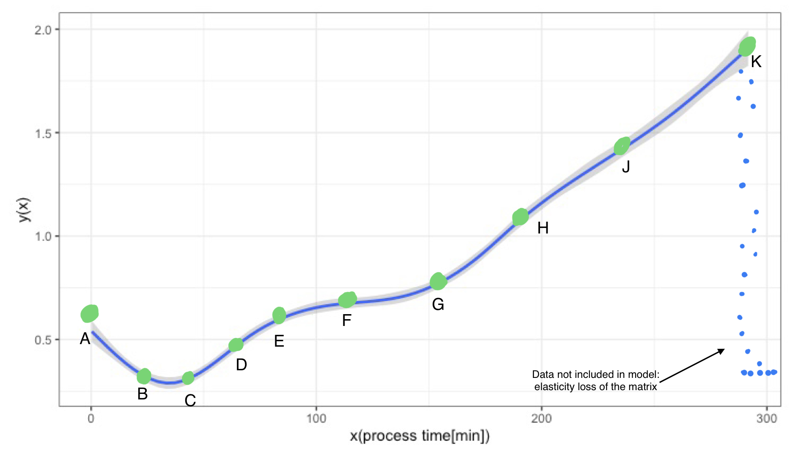
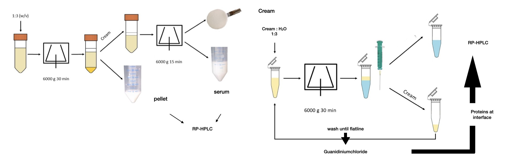
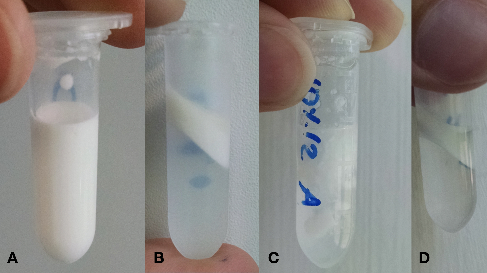
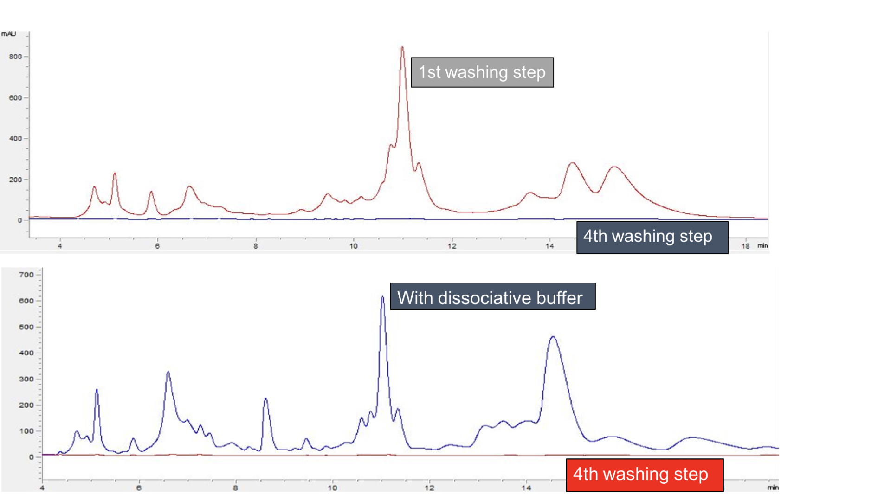
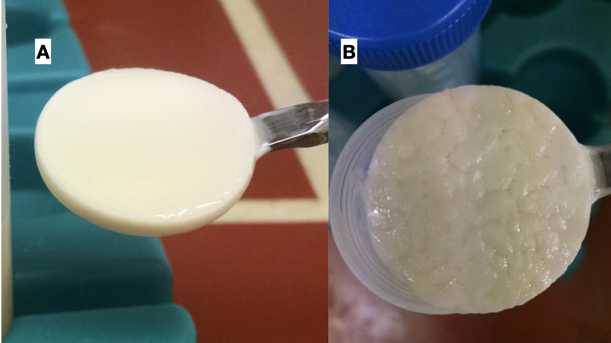
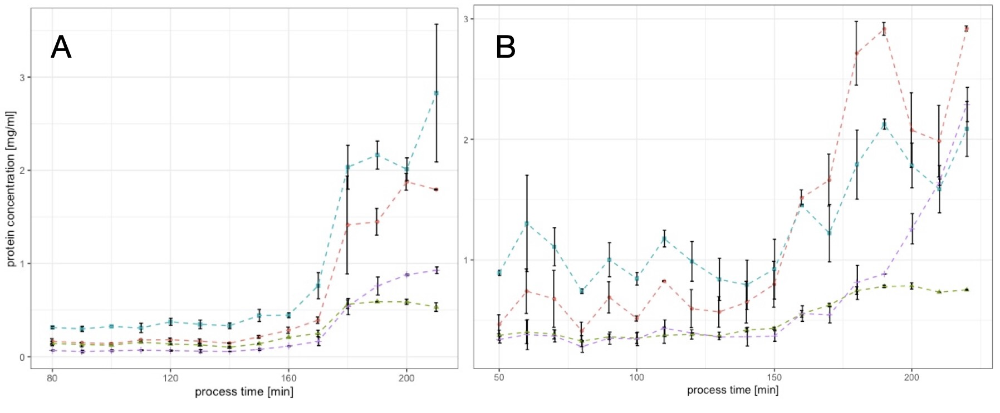

\section{Quantitative matrix distribution of Caseinates during thermal processing of model process cheese}

\subsection{Introduction}

The stability of many emulsified food, cosmetic or pharmaceutical matrices is defined by the ability to bind a dispersed phase. Many of these matrices are processed under heat and shear. The clarification of the underlying structuring and also emulsification mechanisms would help gain a deeper understanding of structure formation, protein adsorption and protein (re-) distribution during processing.
One proteinogenic agent that is known to stabilize emulsions and form gels, also simultaneously, is casein. Casein is highly insensitive to heat degradation, especially when processed below 100^C (@Dumpler2018). An interesting feature about caseins is their ability to aggregate, i.e. form structures without the help of covalent bonds. Thus, caseinogenic food structures like (processed) cheese are stabilized mostly via physicochemical interactions (@Dickinson2006).
Most gels produced from casein only are expected to be formed via covalent (Disulphide bonds) or electrostatic (crystallisation or dipol-dipol) links. It is known that systems with casein as the structuring agent, such as processed or cream cheese, are not covalently linked (@Lenze2019). @Dickinson2012 showed mechanisms for non-covalent and non-hydrophilic interactions for structure formation, namely bridging flocculation and depletion flocculation.

There is strong evidence that caseins serve as a model for many other amphoteric unstructured proteins, which undergo structuring under the formation of hydrophobic aggregates. When a dispersed phase is present, proteins adsorb to the fat surface; until now it is unclear how strong these interactions are and how the adsorption towards the interface works. 
Therefore, a method to investigate, if there is tightly bound protein at the interface which cannot be desorbed using hydrophilic interactions (i.e. washing), was developed. The buffer solution, described by @Bonizzi2009, was used in larger quantities as previously described, to desorb the caseins in the isolated and washed cream phase from the fat in order to put them back into solution and therefore, making them an analyte for RP-HPLC.

Two model systems were investigated, odium caseinate and native Casein, both processed at the same target pH of the educt of 5.88, as adjusted by citric acid and the emulsifying salt mixture as first described in @Lenze2019 and in the parallel works of @Vollmer2021. 
The systems were chosen according to the findings of section 3 in this work. The aim was to investigate models, which are very similar in composition but show different aggregation behaviour during structure formation. Both were processed under the same ionic environment. 
The hypothesis to be tested in this section was if hydrophobic aggregates are formed during processing (aka the creaming reaction) which are inert towards re-solubilization in water. Also, it was to be observed, if the step-wise structure formation in samples made from native casein, or the respective abundance of such a structure formation as seen in samples made from sodium casein in this work, is in any way linked to the obtained compositional data.

\subsection{Material and Methods}

In order to find a linkage between apparent viscosity and intrinsic composition of the matrix, the distribution of caseinates or caseins during structure formation was investigated. Since the model matrix is a dense sol in hot and a soft solid in cold state, the matrix was diluted after cooling and centrifugationally separated. The procedure as well as the sampling of the process times is described below.

**Preparation of model processed cheese to distinct processing steps as batch**
\newline
Cheese samples were premixed and processed as it was presented in section 3.2 of this work. The distinct processing steps that were defined to be further analyzed were chosen roughly at the processing times displayed in Fig.\ref{fig:sampling}.
To follow the structure formation on a compositional level, the high reproducibility of the flow-curves was used to produce the model cheeses up to the desired processing steps as a batch, which means that for every full follow-up of the structure formation, a total of nine (or five in systems made from sodium caseinate) premixes was produced and processed to the desired time. A triplicate of three full runs was analyzed in its composition, i.e. for native casein, 27 premixes were produced and processed, for sodium caseinate 15, respectively, since no structure formation was detected and thus no strong shifts in particle concentration at later processing stages, thus, a longer sampling range was chosen.

```{r sampling, echo=FALSE, out.width="75%", fig.cap="sampling events for further compositional analysis as identified in the flow curves, shown on the modeled flow curve from the previous section: \ A: premix, B: melting complete, C: beginn 1st log phase, D: intermediate 1st log phase, E: end of 1st log phase, F: plateau phase, G: beginning of 2nd log phase, H: 1st intermediate 2nd log phase, J: 2nd intermediate 2nd log phase, K: end 2nd log phase.", fig.scap="Sampling events for further analysis"}

```

Since the flow curves had variance in the process time that was needed to induce the detected second exponential phase, the samples that should serve as token of the second exponential phase were not processed to the exact same processing times. Instead, the appearance of the second structure formation was monitored, if a first increase in viscosity from the plateau phase was clearly visible processing was stopped to obtain the step G. Steps H, J and K were sampled accordingly. It is also important to note that the end of the process was defined by the matrix not being able to be sheared evenly in the processing set-up anymore, as indicated by the blue dots at the end of the process in Fig.\ref{fig:sampling}.

**Preparation of the upscaled process for the continous measurement**
\newline
For upscaling, the the matrix was enlarged ten-fold, with the same respective concentrations of components. In the matrix processed with only 5% fat, the dry matter was replaced using inulin (w/w) as inert dry matter.

**Sample preparation for phase separation**
\newline
6 g of the processed processed cheese sample was weighed into 50 ml purifier tubes and diluted 1:3 (w/v) with deionised water. To produce a homogeneous dispersion, a dispersion device was used and the dispersion was prepared at a speed of about 6,000-8,000 rpm. For phase separation, the samples were centrifuged at 6000 g and 10 °C for 30 min on the Multifuge (Heraeus Group, Hanau, Germany). This produces a three-phase system consisting of a fat phase (cream), water phase and pellet. The fat phase was lifted off with the help of a stainless steel spoon and transferred into a prepared 50 ml purifier tube. The water phase was poured into another tube. 
For better separation of the cream phase the liquid phases were centrifuged a second time. The fat disc was lifted out of the tube and put into a prepared 50 ml purification tube, taking care to lift off as little aqueous phase as possible.

**Analysis of individual casein fractions by RP-HPLC**
\newline
The qualitative and quantitative determination of the individual casein fractions alphaS1-, alphaS2-, beta- and kappa-casein was performed by RP-HPLC (reversed-phase - high-performance liquid chromatography) according to a method developed by @Bonfatti2008 and @Bonizzi2009 and further modified and adapted by @Dumpler2017.

**Preparation of the guanidine buffer**
\newline
The guanidine buffer for use in the HPLC analysis was prepared as follows: first, a 0.1 M Bis-Tris buffer was prepared. The buffer was subsequently used together with weighed guanidine HCl, trisodium citrate and DTT to prepare the final buffer solution. After preparation, the buffer was filled into 50 ml Greiner tubes and frozen at -40 °C until use.

**Processing of the processed cheese samples**
\newline
The samples were diluted and centrifuged as described. Thus, the starting product was available in three phases, each of which was processed differently for HPLC analysis. An overview of the separation and washing procedure as described further down below is given in Fig.\ref{fig:centri}.

```{r centri, echo=FALSE, out.width='80%', fig.cap='Flowchart of the centrifugational separation method of the three phases further analyzed in this work: Cream, Serum and Pellet Phase. \ Centrifugation speeds before RP-HPLC analysis varied in later sections of this work, not the overall procedure as displayed here.', fig.scap='Overview of centrifugational separation and washing procedure'}

```

**Pellet**
\newline
The pellet was diluted with 5 ml deionised water to obtain a suitable protein concentration for determination on the HPLC system. The sample was homogenised with a vortex device and 0.2 ml were mixed with 0.8 ml guanidine buffer. After an incubation time of at least 30 minutes, the sample was filtered through a disposable filter (pore size 0.45 um) into the HPLC vials and stored in the refrigerator or freezer (-40 C) until measurement.

**Water phase**
\newline
To obtain a suitable concentration, the water phase was first diluted 1:1 (v/v) with deionised water. Afterwards, 200 micronl of sample was mixed with 800 micronl of guanidine buffer, filtered into a vial and stored in a cold place.

**Cream and wash-phases**
\newline
The cream samples were first washed with deionised water to remove protein from the aqueous phase still in the sample. For this purpose, 0.5 g of the fat phase was weighed into a 2 ml micro tube, mixed with 1 ml deionised water and homogenised on the vortex device. This was followed by creaming of the fat phase using an Eppendorf centrifuge at 6000 g for 30 min. The base was drawn up into a syringe using a cannula and filled into a prepared micro tube. The wash-out procedure was repeated 4-5 times. The 4-5 wash-phases were mixed 1:5 with the buffer solution, filtered into a vial and stored in the freezer until HPLC measurement. The number of washing steps was determined by the found HPLC concentration in the preceeding washing steps. When the protein concentration in the analyzed washing phases dropped below the detection level of the DAD of the HPLC, it was concluded that no further protein can be desorbed from the fat particle using water as a solvent. In Fig.xx, this is indicated by the term "flatline". 
The washed out cream was then mixed with 500 ul guanidine buffer and homogenized. The buffer causes a strong dissociation and dissolution of the proteins from the fat interface into the aqueous phase. After an incubation time of at least 30 min, the sample was centrifuged again. 
The now fat-free protein dissolved in the buffer solution was obtained using a syringe and analyzed in the HPLC measurement after filtration through a disposable filter.


\subsection{Results and Discussion}

\subsubsection{Development of protein concentration of single caseins in model processed cheeses from batch preparation}

In this section, the development of the measured protein concentrations and therefore, their distribution within the three centrifugationally separated phases is discussed. 
After treatment with the guanidinium buffer, the samples showed two clearly separated phases and a pronounced interphase, as can be seen in Fig.\ref{fig:eppi}. 

```{r eppi, echo=FALSE, out.width="75%", fig.cap="appearance of cream samples over the course of the washing procedure: \ diluted cream prior (A) to and after (B) 1st centrifugation (i.e. washing step), (C) flocculated state after 4th centrifugation and prior to treatment with buffer solution, (D) after treatment with buffer solution, free fat apparent at the surface", fig.scap="Appearence of cream at various points during the washing method"}

```
The washing experiment proved to show no measureable protein concentration in the liquid phase after four, in some cases five washing steps. The subsequent treatment of the flocculated cream with the guanidinium buffer resulted in the chromatograms as displayed in Fig.\ref{fig:chrom}.

```{r chrom, echo=FALSE, fig.cap="RP-HPLC chromatograms obtained during the washing procedure: effectiveness of cream washing next to effectiveness of the chaotropic salt", fig.scap="RP-HPLC chromatograms obtained during the washing procedure"}

```

Fig.\ref{fig:n.cream} shows the measured concentration of single caseins desorbed from the interphase with the guanidinium buffer, which represents the liquid pahse (D) in Fig.\ref{fig:eppi}. It is apparent that over the course of processing, especially the concentration of alphaS1 and beta-casein increases in in the isolated fat phase. At the investigated times, the proteins in the cream phase were found as follows:

```{r n.cream, echo=FALSE, out.width="80%", fig.cap= "Measured casein concentrations in the cream phase after centrifugational separation and multiple washing steps: \ beta casein (blue) and alphaS1 casein (red) strongly adsorb to the interphase during the first (25-50 min) and second log phase (100-150 min) of the structure formation (see rheological profiles in chapter 3). kappa casein (violet) and alphaS2 casein adsorb during the second log phase to the interphase, however in smaller amounts", fig.scap="Casein concentrations in native cream samples"}
knitr::include_graphics("plots/2.1_n.cream.jpeg")
```
  
  * A: the premix, i.e. the non heated educt that is about to be processed. Especially beta cesein can be found in an increased amount of 1.75 mg/ml.
  * B - C: initiation of the educts, by full dissociation of the micelles and also full hydration of the monomers, represented by the display of a minimum viscosity. Desorption of beta casein from A to B, no increase in protein concentration in cream measureable at this point.
  * D: increase of all measured protein concentrations at the interphase.
  * E: no increase of kappa casein and alphaS2 at the interphase, increase of beta casein and alphaS1 at the interphase.
  * F-G: no significant increase in protein concentration detectable at the interphase.
  * H-K: strong increase in protein concentration found at the interphase, especially of kappa casein (from 0.25 to 0.6 mg/ml), alphaS1 (from 0.25 to 1.6 mg/ml), and beta casein (from 0.7 to 2.25 mg/ml). AlphaS2 casein increased as well, however to lesser amounts (0.4 mg/ml to 0.6 mg/ml).

The development of the measured protein concentrations over time suggests the formation of a hydrophobic network that adsorbs to the interphase in order to (further) emulsify it, rather than the the formation of the network at the interphase per se. Also, no desorption from the interphase, as suggested in @Lenze2019 could be detected. It can be suggested, that the appearance of free oil in overcreamed samples comes from the particulate structure of the network.
It can be hypothesized, that the network up to points F or G, is an emulsion filled gel (as in Fig.\ref{fig:efg}), whereas the gels at H-K are particulate gels (@Dickinson2012). This also suggests the formation of an in-situ hydrophobic aggregate (since it is able to emulsify the fat) that requires a conformation or hydration change in the proteins to happen. This will be explored in detail in section 6 of this work, where a colloid model of the processed cheese system is investigated.

The adsorption towards the interphase however, appears to be a two step process. Since we see two log phases during structure formation as in Chapter 3, comparing the time stamps, it becomes apparent that especially the second phase of structure formation is determined by the binding of proteins to the fat globule, or now fat particle.
The high concentration of beta casein in the premix (0 minutes) shows the emulsion state of the initial matrix. By the premixing procedure, hydrophobically bound micellar beta casein dissociated from the micelle in order to emulsify the fat during the premixing process.


```{r n.serum, echo=FALSE, out.width="80%", fig.cap="Measured casein concentrations in the soluble or serum phase after centrifugational separation: \ overall decrease of especially alphaS1 casein (red) and beta casein (blue) during processing; alphaS2 casein (green) showed a slight increase, whereas kappa casein (violet) did not change significantly in its concentration in the serum or soluble phase.", fig.scap="protein concentrations in the native serum phase"}

knitr::include_graphics("plots/2.2_n.serum.jpeg")
```
Fig.\ref{fig:n.serum} indicates a decrease in more hydrophobic caseins (alphaS1 and beta caseins) in the soluble phase of the model cheese made from native casein. As it will be discussed later in further detail, the two decreasing casein fractions visible here tend to form aggregates. Since the environment of processed cheese is a ionically charged environment, one can assume that the diluted cheese matrix as represented is ionically charged as well. 
alphaS2 casein is the only casein fraction to increase in the so obtained serum phase. Since those caseins are the least hydrophobic in terms of hydrobhobic amino acid clustering (@Lucey2018), it is easy to understand why the alphaS2 caseins gain in concentration in the serum phase over processing. 
This is especially true, considering the formation of a hydrophobic network, as theorized earlier. The measurement of the protein concentration of single caseinates in the insoluble or pellet phase (Fig.\ref{fig:n.pellet}) should theoretically display the formation of such a network.

```{r n.pellet, echo=FALSE, out.width="80%", fig.cap= "Measured casein concentrations in the insolubly aggregated or pellet phase after centrifugational separation: \ concentration of all caseins increase in the pellet during structure formation; analogous to the development of protein concentrations in the cream phase; mainly beta casein (blue) and especially alphaS1 casein (red) aggregate in the pellet during the log phases of structure formation. kappa casein (violet) and alphaS2 casein (green) increase in the pellet concentration especially during the second log phase of the structure formation.", fig.scap="Protein concentrations in the native pellet phase"}
knitr::include_graphics("plots/2.3_n.pellet.jpeg")
```
The pellet represents (aggregated) protein which is insoluble in the water phase. During the first exponential phase of structure formation (25min - 50 min) and especially during the second phase of structure formation (100min - 150 min), we see an increase of protein in the pellet. Since the same effect and especially the same proteins show this behaviour as well in the cream phase, it can be suggested that hydrophobic aggregation is also apparent in the pellet phase. 
Thus, the aggregates we see in the pellet after the first exponential phase might be protein aggregates which are in contact with the cream in the non-diluted matrix. Thus, the washing and the therefore needed dilution separates the model processed cheese from native casein into three fractions. 
The development of the protein concentration in the pellet showed a step wise inncrease, as did the development of the protein concentration in the cream phase. Thus, it can be hypothesized, that those two phases are in contact with each other in the non-diluted matrix.

A chemical description can be made for the three phases obtained by centrifugational separation, centrifugational cream washing and respective compositional analysis - cream, pellet and serum - when contrasting the structure formation reaction as a strictly chemical process. The observations on the system made so far here and elsewhere suggest a two step aggregation process. In between these two aggregation processes are two (differently long) lag phases, the first one was already defined by @Lenze2019 and others as the hydration of the casein and simultaneous melting, induced by the melting salts. Since it was shown by @Vollmer2021 that kappa casein fibrils are aligning during the second lag or stationary phase, it can be assumed, that an inner restructuring takes place at this stage of processing. The protein concentrations measured in the respective phases during this stage of processing,did not change significantly, which proposes that this phase is dominated mainly by the reconformation of the system into two separated structures later on, i.e. no aggregation that lead to an exponential increase in viscosity took place. This is the holding step or the intermediate step in a two step reaction. 
Considering this, the investigated phases can be described as follows:
    (a) protein bound to the surface area/fat particle defines the first fraction;
    (b1) soluble Protein (i.e. still "reactive" protein that shifts the equlibrium of the reaction to the respective product side, because there is a constant supply of educt, i.e. reaction partners from the soluble phase, and 
    (c) insoluble or insolubly aggregated protein (i.e. protein that has aggregated during processing. 
The third, i.e. pellet phase is possibly connected by hydrophobic network formation with embedding of the fat particles, that may be surrounded by a hard shell of proteins at later stages of processing. Thus it can be theorized that we see the development from a soft-shell fat particle towards a hard-sphere fat particle.

```{r wash, echo=FALSE, out.width="80%", fig.cap="Measured total protein concentration in the wash phases after centrifugational purification of the cream phase: \ top to bottom is equivalent to washing steps 1 to 5 or 1 to 4 respectively. \ The measured total protein concentration is the sum of the measured caseins in the wash phase.", fig.scap="Total protein concentrations in the native wash phases" }
knitr::include_graphics("plots/2.4_n.washall.jpeg")
```
Fig.\ref{fig:wash} shows the development of the concentration of proteins in the intermediate spaces between the fat globules or particles over the course of processing of model processed cheese. Washing steps 1 to 4 or 5 in some cases, showed the same general trend. Up to process point D, which represents the middle of the first exponential phase, an increase in the total protein concentration of the wash phases can be detected. During the second lag phase, represented by process times E to G, the protein detectable from the wash phases stays the same. In the second log phase, represented by process times H to K, a strong decrease of the measured protein concentration in the wash phases is apparent. 
The protein with the largest amount in the wash phases 1 and 2 was alphaS2 casein.

This leads to the conclusion, that during the first log phase, the proteins actively adsorb to the interface. After that, there is no active adsorption to the interphase, this effect might be due to the growth limiting factor represented by the shear stress applied on the system. There is no change in protein concentration in the cream as well as in the wash phases detectable during the second lag or plateau phase. In the second log phase of the structure development of the model process cheeses made from native casein, there seems to be no active adsorption of protein into the cream phase, hence the decrease in total protein in the wash phases. However, the protein concentration in the washed-out cream phase, i.e. the protein directly bound to the interphase increases. 

In order to explain these two somewhat contradicting effects, one has to consider that the now separated phases occur next to each other in the non diluted cheese matrix. We see an increase of protein concentration in the insoluble or pellet phase of the system during the second log phase. Since the insoluble structures in the pellet represent the gelled continous phase of the model cheese, the insolubly aggregated structures are also in contact with the proteins that are adsorbed to the fat particle. Hence it can be assumed, that the proteins building up the "shell" of the fat particle in the second log phase, are not fed from reactive or soluble proteins in the serum phase as in the first log phase, but from the already aggregated structures that later (after centrifugational separation) form the pellet. 
This means also, that during the second phase of structure formation, less unassociated or unbound protein is in between the fat globules, but that the fat globules are interconnected via a fine stranded protein network, which cannot be desorbed from the interface. This leads to the conclusion, that over the course of the structure formation reaction in model process cheese, hydrophobic interactions become the dominating force for aggregation. 

\subsubsection{Development of protein distribution in model cheeses made from sodium caseinate}

In a comperative study, the protein concentrations in the centrifugationally separated phases of processed cheese samples made from sodium caseinate as a source material were investigated. Section 3 revealed, that model processed cheese systems obtained from sodium caseinate processed with emulsifying salts showed no structure formation, when processed as emulsifying salts.
Therefore the hypothesis, that the structure formation can be investigated using the method described here, could be tested. If there are compositional indications for structure formation in the native casein samples, such indications for no structure formation should be present in the samples made from sodium caseinate.

Fig.\ref{fig:s.cream} shows the measured protein concentration for the cream samples made from sodium caseinate. 
```{r s.cream, echo=FALSE, out.width="80%", fig.cap= "Development of concentrations of beta casein (blue), alphaS1 casein (red), kappa casein (violet) and alphaS2 casein \ in the cream phase of model process cheeses made from sodium caseinate.", fig.scap="Protein concentrations in the sodium cream"}
knitr::include_graphics("plots/2.5_s.cream.jpeg")
```
Besides the kappa casein up to a process time of 45 minutes, all caseins in the cream phase decrease. kappa casein seems to initially adsorb to the interphase, but later desorbs again over processing, together with the sodium caseinate molecules initially adsorbed to the interphase by the premixing process.
The kappa casein however increases at the interphase up to a process time of 35 min. This could again be attributed to the formation of kappa casein fibrils, that can further stabilize the interphase, to a certain extent at least than the other caseins within the system. As it was already discussed, the caseins are the most unsensitive towards calcium ions and therefore also for changes of the calcium environment. The formation of kappa casein fibrils could thus be the initiating step for aggregation, however, in order to form higher structures, other proteins might aggregate at or with the kappa casein fibrils into the large structures seen in @Vollmer2021. To do so, it is thinkable that calcium ions are needed, either to drive the proteins into the possibly hydrophobic aggregated structures, aka by means of depletion, or to link the hydrophobically aggregted structures via electrostatic bridges. 

Fig.\ref{fig:s.cream} indicates that the fat particle which is formed in systems with sodium caseinate is of different characteristics than those formed from native casein. This is also represented by the morphology of the cream phases, Fig.\ref{fig:real.cream} shows an image of the two separated cream disks. In addition the hypothesis that with this compositional analysis, indications for structure formation can be obtained, cannot be falsified. This leads to the theory, that during structure formation processes in composite gels like processed cheese, either the aggregation phenomena occur at, with or in favour for the interphase. 
This theory of a hydrophobic network formation will be explored later in this work in further detail, however regarding the cream phases of the two investigated types of model cheeses within this section, they appear different.

```{r real.cream, echo=FALSE, out.width="50%", fig.cap="Comparison of centrifugationally isolated fat phases in model processed cheese samples made either from \ native casein (A) or sodium caseinate (B)", fig.scap="from native  casein and sodium caseinate"}

```
Fig.\ref{fig:real.cream}(B) shows the coarse structure of the cream obtained from samples made with sodium caseinate. Fig.\ref{fig:real.cream}(A) displays the fine emuslion of a native cream disk. Free oil seems apparent in the sample made from sodium caseinate. The cream phase isolated from samples made from native casein on the other hand shows no free oil and a homogenous texture. 
The difference in the emulsion stability of the samples could be explained due to the absence of calcium ions in sodium caseinate cheeses as connecting agent for the proteins to form a particulate shell around the fat globule. 
@Dickinson1998 investigated the gravity creaming of sodium caseinate oil-in-water emulsions under the influence of calcium ions. Calcium deprived systems showed little adsorbance of casein to the interface. 
It can be concluded, that the primary adsorption of caseinates to the interface in model processed cheese is calcium driven, since the calcium containing native casein systems showed strong adsorbance of caseins to the interphase, whereas sodium caseinate model systems exhibited minor adsorbance to the interface. The same effect seems to occur here. 

```{r s.sodium, echo=FALSE, out.width="80%", fig.cap= "Development of concentrations of beta casein (blue), alphaS1 casein (red), kappa casein (violet) and alphaS2 casein \ in the serum phase of model process cheeses made from sodium caseinate.", fig.scap="Protein concentrations in the sodium serum phase"}
knitr::include_graphics("plots/2.6_s.serum.jpeg")
```
the protein concentrations in the obtained serum and pellet phases of the processed cheese samples made from sodium caseinate were also measured. In Fig.\ref{fig:s.sodium}, the soluble or serum phases of the chesses are displayed over the processing time, Fig.\ref{fig:p.sodium} displays the pellet of such systems in a similar manner.

Protein concentrations in the serum phase in samples made from sodium caseinate didn't change significantly, besides alphaS1 casein, which decreased. The initial concentrations at 0 min in cold state are probably lower in reality, the centrifugational separation and longer incubation of samples probably led to a further solubilization of sodium caseinates into the serum phase from the insoluble phase, which explains the discrepancy in total protein concentration of the samples.

```{r p.sodium, echo=FALSE, out.width="80%", fig.cap= "Development of concentrations of beta casein (blue), alphaS1 casein (red), kappa casein (violet) and alphaS2 casein (green) in the pellet phase of model process cheeses made from sodium caseinate.", fig.scap="Protein concentrations in the sodium pellet phase"}
knitr::include_graphics("plots/2.7_s.pellet.jpeg")
```
In comparison to the samples made from native casein, the initially unsoluble proteins during premixing in cold state in samples made from sodium caseinate become more and more soluble during processing. Therefore the protein concentrations in the pellet as displayed in Fig.\ref{fig:p.sodium} decrease. 
Analogue to the cream samples, it seems that a certain degree of aggregated insoluble casein particle can be formed, however, a linking agent seems to lack, as no bigger structures can be formed during processing. 

The main chemical component lacking in the sodium caseinate systems is the calcium that was chelated from the calcium phosphate nanoclusters (CCP) of the native micelles in their respective model cheese systems. 
It could be assumed, that especially in the second log phase of the structure formation, calcium ions are essential. It could connect the caseins by bridging two negative charges from acidic amino acids which is commonly used in cheesemaking under the addition of calcium chloride. 

The plateau phase preceeding the second log phase is suspected to form homogenously aligned structures, that later form into fibrils. Their secondary connection to clustered aggregates could be connected via electrostatic calcium binding, which would also explain the higher water binding capacity of the investigated pellets, as seen in Fig.\ref{fig:pel.vol}.

The concentration of total protein in the wash phases of the sodium caseinate samples didn't change significantly during processing (data not shown), which is in conclusion with the behaviour of the sodium samples, meaning that no changes in adsorption to the interphase or aggregation to larger structures occurs.

\subsubsection{Development of pH of model cheeses and dry matter of respective cream phases}

The theory, that free calcium from chelation out of the casein micelle is able to connect the caseins via their centers of phosphorylation to form a tighter structure is also supported by the comparison of the development of the pH of the sodium and native casein models during processing.

```{r pH, echo=FALSE, out.width="80%", fig.cap="Development of pH during processing of model processed cheese \ made from native casein (red) or sodium caseinate (blue), with a linear fit (dashed line)", fig.scap="pH values measured over processing"}
knitr::include_graphics("plots/2.8_pH.jpeg")
```
Fig.\ref{fig:pH} shows the development of the pH from samples processed to specific times. The increase in both sets of samples was significant (p < 0.05) over the full processing time. The pH increase in samples from sodium caseinate develops to a higher value (6.49) than in the samples made from native casein (6.02) during the same time span. Also, the pH increase in samples made from native casein increased significantly only in a step wise manner, between 70 minutes and 100 minutes of processing time. 
This time span represents the transition from the plateau to the beginning of the second exponential (second log) phase. 

A higher pH indicates a higher negative net-charge of the proteins. Up to the beginning of the second log phase at 100 minutes, the pH in the native samples is buffered around the targeted value (5.88). After that, the pH increases to approx. 6.05, where it stays stable until the end of the investigated process. 

A higher negative net charge inn the matrix also indicates the potential for possible new electrostatic binding sites, when, at least divalent, cations are present. 

It seems however unlikely that structures connected via 'classic' electrostatic binding (or bridging, due to the moist environment) are insoluble in water. Since the unsoluble structures were shown to be formed prior to 100 minutes by an increase in all protein concentrations in the pellet, at least the primary aggregate is connected differently.
Hydrophobic interaction presents itself again as a good candidate for such a primary aggregation, since they appears at close range and under the exclusion of water. Calcium, however may play a role in secondary aggregate connection, with a subsequent increase in apparent viscosity. 

Comparing the native and the sodium caseinate systems it becomes also possible that the aggregates in the pellet of the native samples form the "soft shell" of the fat particles, which later becomes a hard shell as described in @Dickinson2012. These shell proteins can be detected in the wash phases of the cream after dilution.  Before dilution, the gaps between the fat domains were filled with the aggregated "soft shell" protein that we find in the pellet after dilution. This means that hydrophobic aggregates are still able to swell, which is reasonable since they are still colloids, or colloid particles. 
Interestingly, the aggregates in the pellet as well as in the cream are only prone to swelling, not to resolubilisation in water. This implies that some sort of aggregation is apparent, where hydrophobic clusters form the core with (partially) hydrateable protein at the surface. This theory is supported by the development of the dry matter of the cream (Fig.\ref{fig:dry.c}) over processing.

```{r dry.c,echo=FALSE, out.width="80%", fig.cap="Development of dry matter in centrifugationally separated cream phases of samples made from sodium caseinate (blue) and \ samples made from native casein (red), with a linear fit (dashed line)", fig.scap="Dry matter of the cream phases"}
knitr::include_graphics("plots/2.9_dM.cream.jpeg")
```
The dry matter of the sodium caseinate cream decreases, if at all, only slightly during processing. The dry matter of the native casein cream first shows a slight increase after melting. 
Since the protein concentration in the cream decreases between those two processing points, it can be hypothesized, that the more hydrateable proteins leave the interphase, hence the larger dry matter, since less water can be bound to the interphase at this point. A
Afterwards, a strong decrease in the dry matter of the native cream samples becomes apparent. Before the second log phase of structure formation, which starts at 100 minutes, the dry matter of the native cream increases again, followed by a strong decrease up to the end of processing.  The increasing amount of the size of the sphere, which is made up of amphoteric proteins, leads to stronger hydration of the shell after dilution, i.e. a decreasing dry matter.
It seems however unlikely that structures connected via 'classic' electrostatic binding (or bridging, due to the moist environment) are insoluble in water.

\subsubsection{Development of protein concentration of single caseins in the cream phase of model processed cheeses from continous processing}

In order to test the reproducibility of the process as a whole as well as to test the validity of the results of the samples that were treated with the washing method, and upscaled process was investigated in detail. The data showed conclusive results throughout, meaning a strong increase of protein to the interphase at late processing times. Likewise, the proteins to be dominately found at the interphase were again kappa casein, alphaS1 casein and beta casein. 
Fig.\ref{fig:vh} displays two exemplary results from this trial, the measured protein concentration at the interphase for samples made with 20% and 5% fat, respectively. The viscosity of the samples revealed an increase in viscosity and a pronounced second exponential phase (data not shown).

```{r vh, echo=FALSE, fig.cap="measured protein concentrations in the cream of an upscaled process: (A) 5\\% total fat concentration, \ (B) 20\\% total fat concentration: beta casein (blue), alphaS1 casein (red), kappa casein (violet) and alphaS2 casein (green)", fig.scap="Protein concentrations in the cream of upscaled processes"}

```

It can be seen, that the lower fat concentration is visible at the interphase up to the beginning of the second exponential phase (after 150 - 160 minutes of processing). This leads to the conclusion, that up to the second exponential phase, the proteins are coated with aggregated protein from the bulk. After that, hydrophobic aggregation occurs at large scale, thus a hydrophobic shell is formed around the fat globule that grows in size during processing.

Also, the adsorption of (potentially aggregated) kappa casein becomes even stronger in an upscaled process, probably due to fact of a higher reactive protein mass to begin with, therefore, more kappa casein primary aggregates can be formed, that later adsorb to the interphase.
@Liang2017 investigated the creaming stability of also highly concentrated (10% w/w) sodium caseinate emulsions under the addition of maltodextrin. It could be found, that after an addition of 15% maltodextrin, the fat droplets were effectively hindered to interact, due to the large polysaccharide network. Inulin has been known to bind water as well and was already used as a fat replacement (@Soowiej2014) in model acid induced processed cheese. It was found, that inulin didn't alter the water binding properties of the cheese samples but that their hardness increased due to a finer dispersion of fat droplets. Considering the measured protein concentrations at the respective interphases (Fig. \ref{fig:vh}, Fig. \ref{fig:s.cream}, Fig. \ref{fig:n.cream}), it can be seen that the sodium caseinate samples were effectively hindered to form a network of interacting fat droplets, while the calcium containing samples showed large interaction properties, also at low fat concentrations. 
As it will be discussed also later in this work, this effect can be attributed in part to calcium, however it can be expected, that the constant agitation of the matrix leads to droplet and particle collisions, that show specific interactions that will induce the matrix formation and also separation at later processing stages. 
The findings of @Lenze2019 that a matrix with reduced fat shows a lesser structure formation could not be seen in the upscaled process. Even more, the viscosity increase as well as the increase in proteins at the interphase were exponential, in samples with 5% and 20% fat content. This is probably due to the different dry matter add-ons used; Lenze used lactose, which is a reducing Di-saccharide, hence it could be possible that the proteins got "blocked" from structure formation due to lactosylation of lysine residues (i.e. formation of early Amadori products as in @Dumpler2018 ). Inulin proved itself to be inert towards reactions with protein.

\subsection{Summary and Outlook}

This data set shows how the proteins in the model processed cheese distribute themselves during processing. Due to the thermal stress, they undergo different aggregation processes, which appear to be distinguishable. Sodium caseinate models show only slight tendencies towards distribution, aggregation or adsorption to the interphase. It seems that something is "hindering" the caseins in the sodium caseinate model to form large aggregates. One could say, the sodium caseinate system is missing some sort of connective force or agent. Respectively it can be said that some driving force in the native casein models is "enabling" the proteins to form aggregates. 

A compositional analysis of a centrifugationally obtained pellet was also performed in @Vollmer2021a. The protein concentration was treated as % of the total protein concentration in the system, to normalize the natural distribution of casein. No conclusive answers to a detailed distribution of caseins could be given, besides the concentration of kappa casein in the pellet. The centrifugation procedure used in this work had softer conditions, 6.000*g* compared to ~22.000*g*. It seems reasonable that higher centrifugation speeds also lead to collective concentration of hydrophobically associated aggregates in the pellet.
A different display of the measured concentration was chosen in this work, since it was expected, that the caseins are present as monomers after melting and therefore, their single measured concnetration, and not the concentration relative to their concentration in the micelle was chosen for analysis. This was done to see an overall shift of caseins in the matrix, also including their absolute occurence in the system (i.e. their single concentrations).

So what are differences between the native and sodium caseinate models? Since the pH and the ionic strength are set the same initial value in both systems, the differences are only two: the size of the initial colloid, and released Calcium. The melting salts lead to the release of micellarily bound or associated Calcium. Calcium Ions are known to form stronger gels when added to a Casein matrix (as it is often done in cheesemaking). Since they are divalent cations, they are able to screen or bridge  two negative charges. The pH of the structure formation is ~ 5.9, the IEP of Caseins (mean) is 4.6, so the Caseins show a negative net charge during the whole course of the reaction. This negative net charge would lead to electrostatic repulsion. Thus, the negative charge is screened by Calcium and therefore, single caseins can interact within very small distances, which then lie in the (distance) range for hydrophobic interactions. Another fact that underlines this theory is that hydrophobic interactions agrow stronger at high temperatures, which means that thermodynamically speaking, during processing of the model cheese, this kind of aggregation seems favuorable. 

From the washing experiment, the underlying reactions for the two lag and log phases can be derived. The first lag and log phase are dominated by the redistribution of calcium and caseins, due to the initial effect of the melting salts. The second lag phase limits the growth of aggregates and shows the effect of the shear stress on the system. The second log phase represents the hydrophobic aggregation of especially alphaS1 and beta caseins. The aggregation occurs in the continous, as well as at the interphase. It could be shown, that the proteins develop a higher affinity to aggregate than to adsorb to the fat globule, therefore, the fat gets emulsified to a lesser and lesser extent until it is released by the system in form of free oil (see also Fig.xx in Chapter 2).

The advantage of the washing method (in contrast to other methods of investigation like native page, dumas method, IR, etc.) is the possibility to isolate and investigate a hydrophobic surface, in the form of a colloidal fat particle, with proteins forming a soft-shell - represented by the adsorption during the first log phase. This soft shell then develops into a hard sphere during the second log phase. 
Through the isolation of the proteins from the fat phase using a chaotropic buffer as described in @Bonizzi2009, fat is not disrupting the measurement, in contrast to PAGE and IR, where fatty samples lead to overlayered data response. Dumas gives us total Nitrogen, which can be calculated into protein concentration, using an empiric factor. The big disadvantage is though, that we don't see the the concentrations of single Caseinates. Additionally, Dumas works only for concentrations > 1 mg/ml and it's not advisable to measure fat rich samples, due to the flammability of fat. Qualification and Quantification with HPLC (especially the Guanidinium Step) brings robust, reliable, conclusive and easy-to-compare data.
By investigation of the proteins in the fat phase of an upscaled, continous process it could be shown that the measurement data was not specific to the processing conditions (like mass flow, shear speed, area of heat transfer) in a rheometer. Since the data from the batch processing and continous processes also displayed a strong increase of protein detectable in or at the interphase during the end of processing, it can be concluded, that the data represents the compositional changes at the interphase in a well suited manner. 
Also, the variance in fat concentration gave conclusive results, since the amount of protein found at the interphase before entering the second exponential phase, i.e. that amount of not highly aggregated protein at the interphase increased with the total amount of fat used. The occurence of a second exponential phase of structure formation was found at all fat concentrations, further proving that fat serves not as a structuring agent but mainly has a secondary role as reactive surface, where protein aggregation can occur. Protein aggregation into large networks, that are insoluble by water, however, seems to occur also without the large amount of an interphase present, leading to the conclusion that the fat is emulsified as a by product of the protein aggregation. This also leads to the conclusion that the dominating network formation steering this process is hydrophobic interaction.

The findings presented in this chapter are also in conclusion with the findings of @Vollmer2021. The composition of the samples in the cite work were similar to the native casein samples investigated in this work. The processing conditions in this work were slightly different - only the shear rate (see discussion in Chapter 3) was accelerated, in order to gain a higher sample throughput by the reduction of processing time due to a higher collision rate. The TEM images displayed in the reference study showed the formation of fibrillogenic casein structures in the second log phase, or second phase of structure formation. These structures represent the here described hard-shell of caseins forming the fat particle. By the present study, the composition of the fibrillar structures can be suspected as to mainly being alphaS1 kappa and beta caseins, since they are the dominating proteins at the interphase during the second phase of processing, as well as in the pellet.