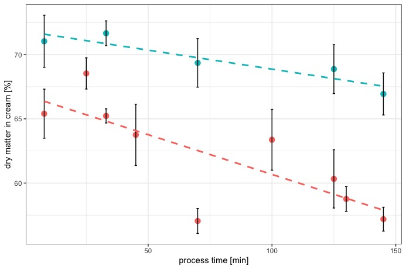

\section{Quantitative matrix distribution of Caseinates during thermal processing of model process cheese}

\subsection{Introduction}

The stability of many emulsified food, cosmetic or pharmaceutical matrices is defined by the ability to bind a dispersed phase. Many of these matrices are processed under heat and shear. The clarification of the underlying structuring  mechanisms would help to get a deeper understanding of structure formation, protein adsorption and protein (re-) distribution during processing. Most gels are formed with covalent (Disulphide bonds) or electrostatic (crystallisation or dipol-dipol) links. It is known that systems with casein as the structuring agent, such as processed or cream cheese, are not covalently linked [@Lenze2019]. @Dickinson2012 showed mechanisms for non-covalent and non-hydrophilic interactions for structure formation, bridging flocculation and depletion flocculation.
There is strong evidence that caseins serve as a model for many other amphoteric unstructured proteins, which undergo structuring under the formation of hydrophobic aggregates. When a dispersed phase is present, proteins adsorb to the fat surface; until now it is unclear how strong these interactions are and how the adsorption towards the interface works. 

Therefore, a method to investigate, if there is tightly bound protein at the interface which cannot be desorbed using hydrophilic interactions (i.e. washing), was developed.
Two model systems were investigated : Sodium Caseinate and native Casein. Both were processed under the same ionic environment. The hypothesis to be tested in this section was if hydrophobic aggregates are formed during processing (aka the creaming reaction) which are inert towards re-solubilization in water.

\subsection{Material and Methods}
In order to find a linkage between apparent viscosity and intrinsic composition of the matrix, the distribution of caseinates or caseins during structure formation was investigated. Since the model matrix is a dense sol, the matrix was diluted after cooling and centrifugationally separated. The procedure is presented below.

**Preparation of model processed cheese**

Cheese samples were premixed and processed as it was presented in chapter 3.2.

**Sample preparation for phase separation**

6 g of the processed processed cheese sample was weighed into 50 ml purifier tubes and diluted 1:3 (w/v) with deionised water. To produce a homogeneous dispersion, a dispersion device was used and the dispersion was prepared at a speed of about 6,000-8,000 rpm. For phase separation, the samples were centrifuged at 6000 g and 10 °C for 30 min on the Multifuge (Heraeus Group, Hanau, Germany). This produces a three-phase system consisting of a fat phase (cream), water phase and pellet. The fat phase was lifted off with the help of a stainless steel spoon and transferred into a prepared 50 ml purifier tube. The water phase was poured into another tube. For HPLC analysis the water phase and the cream were centrifuged a second time. The fat disc was lifted out of the tube and put into a prepared 50 ml purification tube, taking care to lift off as little aqueous phase as possible.

**Analysis of individual casein fractions by RP-HPLC**

The qualitative and quantitative determination of the individual casein fractions alphaS1-, alphaS2-, beta- and kappa-casein was performed by RP-HPLC (reversed-phase - high-performance liquid chromatography) according to a method developed by @Bonfatti2008 and @Bonizzi2009 and further modified and adapted by @Dumpler2017b.

**Preparation of the guanidine buffer**

The guanidine buffer for use in the HPLC analysis was prepared according to the method of @Bobe1998. First, a 0.1 M Bis-Tris buffer was prepared. The buffer was subsequently used together with weighed guanidine HCl, trisodium citrate and DTT to prepare the final buffer solution. After preparation, the buffer was filled into 50 ml Greiner tubes and frozen at -40 °C until use.

**Processing of the processed cheese samples**

The samples were diluted and centrifuged as described. Thus, the starting product was available in three phases, each of which was processed differently for HPLC analysis.

**Pellet**

The pellet was diluted with 5 ml deionised water to obtain a suitable protein concentration for determination on the HPLC system. The sample was homogenised with a vortex device and 200 ul of it was mixed with 800 ul guanidine buffer. After an incubation time of at least 30 minutes, the sample was filtered through a disposable filter (pore size 0.45 um) into the HPLC vials and stored in the refrigerator or freezer (-40 °C) until measurement.

**Water phase**

To obtain a suitable concentration, the water phase was first diluted 1:1 (v/v) with deionised water. Afterwards, 200 micronl of sample was mixed with 800 micronl of guanidine buffer, filtered into a vial and stored in a cold place.

**Cream and wash-phases**

The cream samples were first washed with deionised water to remove protein from the aqueous phase still in the sample. For this purpose, 0.5 g of the fat phase was weighed into a 2 ml micro tube, mixed with 1 ml deionised water and homogenised on the vortex device. This was followed by creaming of the fat phase using an Eppendorf centrifuge at 6000 g for 30 min. The base was drawn up into a syringe using a cannula and filled into a prepared micro tube. The wash-out procedure was repeated four times. The four wash-phases were
mixed 1:5 with the buffer solution, filtered into a vial and stored in the freezer until HPLC measurement.

The washed out cream was then mixed with 500 ul guanidine buffer and homogenized. The buffer causes a strong dissociation and dissolution of the proteins from the fat interface into the aqueous phase. After an incubation time of at least 30 min, the sample was centrifuged again. 

The now fat-free protein dissolved in the buffer solution was analyzed in the HPLC measurement after filtration through a disposable filter.
\newpage
\subsection{Results and Discussion}

\subsubsection{Development of protein distribution in model cheeses made from native casein}

The development of the measured protein concentrations and therefore, their distribution within the three centrifugationally separated phases is shown below. Fig.xx shows that over the course of processing, especially the concentration of alphaS1 and beta-casein increases in in the isolated fat phase.
```{r , echo=FALSE, out.width="80%", fig.cap= "Measured casein concentrations in the cream phase after centrifugational separation and multiple washing steps: beta casein (blue) and alphaS1 casein (red) strongly adsorb to the interphase during the first (25-50 min) and second log phase (100-150 min) of the structure formation (see rheological profiles in chapter 3). kappa casein (violet) and alphaS2 casein adsorb during the second log phase to the interphase, however in smaller amounts"}
knitr::include_graphics("plots/2.1_n.cream.jpeg")
```
The adsorption towards the interphase however, appears to be a two step process. Since we see two log phases during structure formation as in Chapter 3, comparing the time stamps, it becomes apparent that especially the second phase of structure formation is determined by the binding of proteins to the fat globule, or now fat particle.
The high concentration of beta casein in the premix (0 minutes) shows the emulsion state of the initial matrix: By the premixing procedure to form stable emulsion, hydrophobically bound micellar beta casein can dissociate from the micelle in order to emulsify the fat during the premixing process.
@Dickinson1998 investigated the effect of Ca2+ on the shear-thinning behaviour (which was interpreted as creaming or emulsion instability). This was attributed to fact that in a calcium free environment, depletion flocculation of unbound caseinate structures can occur, whereas in an environment containing calcium ions, the adsorbance of caseins to the interface is enhanced. From these complex structures being formed at the interface during processing of the model cheeses, the system travels further towards hydrophobic interactions which will destabilize the system over time, due to constant shear and heat.

```{r, echo=FALSE, out.width="80%", fig.cap="Measured casein concentrations in the soluble or serum phase after centrifugational separation: over all decrease of especially alphaS1 casein (red) and beta casein (blue) during processing, alphaS2 casein (green) showed a slight increase, whereas kappa casein (violet) did not change significantly in its concentration in the serum or soluble phase"}

knitr::include_graphics("plots/2.2_n.serum.jpeg")
```
Fig.xx indicates a decrease in more hydrophobic caseins (alphaS1 and beta caseins) in the soluble phase of the model cheese made from native casein.

```{r , echo=FALSE, out.width="80%", fig.cap= "Measured casein concentrations in the insolubly aggregated or pellet phase after centrifugational separation: concentration of all caseins increase in the pellet during structure formation; analogous to the development of protein concentrations in the cream phase , mainly beta casein (blue) and especially alphaS1 casein (red) aggregate in the pellet during the log phases of structure formation. kappa casein (violet) and alphaS2 casein (green) increase in the pellet concentration especially during the second log phase of the structure formation."}

```
The pellet represents (aggregated) protein which is insoluble in the water phase. During the first exponential phase of structure formation (25min - 50 min) and especially during the second phase of structure formation (100min - 150 min), we see an increase of protein in the pellet. Since the same effect and especially the same proteins show this behaviour as well in the cream phase, it can be suggested that hydrophobic aggregation is also apparent in the pellet phase. 
Thus, the aggregates we see in the pellet after the first exponential phase might be protein aggregates which are in contact with the cream in the non-diluted matrix. Thus, the washing and the therefore needed dilution separates the model processed cheese from native casein into three fractions. Protein bound to the surface area/fat particle defines the first fraction, soluble Protein (i.e. still reactive protein that shifts the equlibrium to the product side, because there is a constant supply of educt, i.e. reaction partners) the second and insoluble or insolubly aggregated protein (i.e. protein that has aggregated during processing, possibly hydrophobic network formation with embedding of the fat particles) the third phase.

```{r , echo=FALSE, out.width="80%" , fig.cap="Measured total protein concentration in the wash phases after centrifugational purification of the cream phase: top to bottom is equivalent to washing steps 1 to 5 or 1 to 4 respectively. The measured total protein concentration is the sum of the measured caseins in the wash phase." }
knitr::include_graphics("plots/2.4_n.washall.jpeg")
```
Fig. xx shows the development of the concentration of proteins in the intermediate spaces between the fat globules or particles over the course of processing of model processed cheese. Washing steps 1 to 4 or 5 in some cases, showed the same general trend. Up to process point D, which represents the middle of the first exponential phase, an increase in the total protein concentration of the wash phases can be detected. During the second lag phase, represented by process times E to G, the protein detectable from the wash phases stays the same. In the second log phase, represented by process times H to K, a strong decrease of the measured protein concentration in the wash phases is apparent. 
This leads to the conclusion, that during the first log phase, the proteins actively adsorb to the interface. After that, there is no active adsorption to the interphase, this effect might be due to the growth limiting factor represented by the shear stress applied on the system. There is no change in protein concentration in the cream as well as in the wash phases detectable during the second lag or plateau phase. In the second log phase of the structure development of the model process cheeses made from native casein, there seems to be no active adsorption of protein into the cream phase, hence the decrease in total protein in the wash phases. However, the protein concentration in the washed-out cream phase, i.e. the protein directly bound to the interphase increases. 
In order to explain these two somewhat contradicting effects, one has to consider that the now separated phases occur next to each other in the non diluted cheese matrix. We see an increase of protein concentration in the insoluble or pellet phase of the system during the second log phase. Since the insoluble structures in the pellet represent the gelled continous phase of the model cheese, the insolubly aggregated structures are also in contact with the proteins that are adsorbed to the fat particle. Hence it can be assumed, that the proteins building up the "shell" of the fat particle in the second log phase, are not fed from reactive or soluble proteins in the serum phase as in the first log phase, but from the already aggregated structures that later (after centrifugational separation) form the pellet. This means also, that during the second phase of structure formation, less unassociated or unbound protein is in between the fat globules, but that the fat globules are interconnected or starting to interconnect by a fine stranded protein network, which cannot be desorbed from the interface. This leads to the conclusion, that over the course of the structure formation reaction in model process cheese, hydrophobic interactions become the dominating force for aggregation. 

\subsubsection{Development of protein distribution in model cheeses made from sodium caseinate}

```{r , echo=FALSE, out.width="80%", fig.cap= "Development of concentrations of beta casein (blue), alphaS1 casein (red), kappa casein (violet) and alphaS2 casein in the cream phase of model process cheeses made from sodium caseinate."}

```
Besides the kappa casein up to a process time of 45 minutes, all caseins in the cream phase decrease.
Fig.xx indicates that the fat particle wich is formed in systems with sodium caseinate is of different characteristics than those formed from native casein. This is also represented by the morphology of the cream phases, Fig.xx shows an image of the two separated cream disks. 

```{r, echo=FALSE, out.width="50%", fig.cap="Comparison of centrifugationally isolated fat phases in model processed cheese samples made either from native casein (A) or sodium caseinate (B)"}
knitr::include_graphics("~/Desktop/PhD/data/Rstudio/Rdata_diss/thesis/images/cream_disc_compare.jpeg")
```
Fig. xx(B) shows the coarse structure of the cream obtained from samples made with sodium caseinate. Free oil seems apparent. The cream phase isolated from samples made from native casein on the other hand shows no free oil and a homogenous texture. The difference in the emulsion stability of the samples can be explained due to the absence of calcium ions in sodium caseinate cheeses as connecting agent for the proteins to form a particulate shell around the fat globule. 
@Dickinson1998 investigated the gravity creaming of sodium caseinate oil-in-water emulsions under the influence of calcium ions. Calcium deprived systems showed little adsorbance of casein to the interface. It can be concluded, that the primary adsorption of caseinates to the interface in model processed cheese is calcium driven, since the calcium containing native casein systems showed strong adsorbance of caseins to the interface, whereas sodium caseinate model systems exhibited little to no adsorbance to the interface. The same effect seems to occur here. 

```{r , echo=FALSE, out.width="80%", fig.cap= "Development of concentrations of beta casein (blue), alphaS1 casein (red), kappa casein (violet) and alphaS2 casein in the serum phase of model process cheeses made from sodium caseinate."}
knitr::include_graphics("plots/2.6_s.serum.jpeg")
```
Protein concentrations in the serum phase in samples made from sodium caseinate didn't change significantly, besides alphaS1 casein, which decreased. The initial concentrations at 0 min in cold state are probably lower in reality, the centrifugational separation and longer incubation of samples probably led to a further solubilization of sodium caseinates into the serum phase from the insoluble phase (see below), which explains the discrepancy in total protein concentration of the samples.

```{r , echo=FALSE, out.width="80%", fig.cap= "Development of concentrations of beta casein (blue), alphaS1 casein (red), kappa casein (violet) and alphaS2 casein in the pellet phase of model process cheeses made from sodium caseinate."}

```
In comparison to the samples made from native casein, the initially unsoluble proteins during premixing in cold state in samples made from sodium caseinate become more and more soluble during processing. Therefore the protein concentrations in the pellet as displayed in Fig.xx decrease. Analogue to the cream samples, it seems that a certain degree of aggregated insoluble casein particle can be formed, however, a linking agent seems to lack, as no bigger structures can beformed during processing. The main component lacking in the sodium caseinate systems is the calcium that was chelated from the calcium phosphate nanoclusters (CCP) of the native micelles. It can be assumed, that especially in the second log phase of the structure formation, calcium connects especially the alphaS1 and beta caseins via their phosphoserine clusters under formation of a calcium bridge. Compareable structures are known from the so-called "egg-box" structure in carragenaan, where the hydrocolloids are connected by forming a ionic bridge to connect two monovalent anionic areas via a divalent cation [@egg_box].
The concentration of total protein in the wash phases of the sodium caseinate samples didn't change significantly during processing (data not shown), which is in conclusion with the behaviour of the sodium samples, meaning that no changes in adsorption to the interphase or aggregation to larger structures occurs.

\subsubsection{Development of pH of model cheeses and dry matter of respective cream phases}

The theory, that free calcium from chelation out of the casein micelle is able to connect the caseins via their centers of phosphorylation to form a tighter structure is also supported by the comparison of the development of the pH of the sodium and native casein models during processing (Fig.xx).

```{r , echo=FALSE, out.width="80%", fig.cap="Develoopment of pH during processing of model processed cheese made from native casein (red) or sodium caseinate (blue), with a linear fit (dashed line)"}
knitr::include_graphics("plots/2.8_pH.jpeg")
```
The pH increase in samples from sodium caseinate develops to a higher value than in the samples made from native casein. A higher pH represents a higher negative net-charge of the proteins. Up to the beginning of the second log phase at 100 minutes, the pH in the native samples is buffered. After that, the pH increases to approx. 6.05, where it stays stable until the end of the investigated process. The detected increase can be explained by the exposure of negatively charged side chains from the dissolution of the casein micelle by the melting salts. It can be theorized, that up to a process time of 100 minutes, the centers of phosphorylation in the caseins are saturated with sodium ions from the melting salts. Under re-structuring of the whole system, the sodium ions might be replaced with calcium ions, which would lead to higher net charge of the proteins but not as high as when no calcium is present in the system, as it is case in sodium caseinate samples.

Comparing the native and the sodium caseinate systems, especially their wash phases, it becomes also possible that the aggregates in the pellet of the native samples form the "soft shell" of the fat particles, which later becomes a hard shell as described in @Dickinson2012. These shell proteins can be detected in the wash phases of the cream after dilution.  Before dilution, the gaps between the fat domains were filled with the aggregated "soft shell" protein that we find in the pellet after dilution. This means that hydrophobic aggregates are still able to swell, which is reasonable since they are still colloids, or colloid particles. Interestingly, the aggregates in the pellet as well as in the cream are only prone to swelling, not to resolubilisation. This implies that some sort of aggregation is apparent, where hydrophobic clusters form the core with (partially) hydrateable protein at the surface.

This theory is supported by the development of the dry matter of the cream (Fig.xx) over processing: 
```{r ,echo=FALSE, out.width="80%", fig.cap="Development of dry matter in centrifugationally separated cream phases of samples made from sodium caseinate (blue) and samples made from native casein (red), with a linear fit (dashed line)"}

```
The dry matter of the sodium caseinate cream decreases, if at all, only slightly during processing. The dry matter of the native casein cream first shows a slight increase after melting. Since the protein concentration in the cream decreases between those two processing points, it can be hypothesized, that the more hydrateable proteins leave the interphase, hence the larger dry matter, since less water can be bound to the interphase at this point. Afterwards, a strong decrease in the dry matter of the native cream samples becomes apparent. Before the second log phase of structure formation, which starts at 100 minutes, the dry matter of the native cream increases again, followed by a strong decrease up to the end of processing.  The increasing amount of the size of the sphere, which is made up of amphoteric proteins, leads to stronger hydration of the shell after dilution, i.e. a decreasing dry matter.

\subsection{Summary and Outlook}
This data set shows how the proteins in the model processed cheese distribute themselves during processing. Due to the thermal stress, they undergo different aggregation processes, which appear to be distinguishable. Sodium caseinate models show only slight tendencies towards distribution, aggregation or adsorption to the interphase. It seems that something is "hindering" the caseins in the sodium caseinate model to form large aggregates. One could say, the sodium caseinate system is missing some sort of connective force or agent. Respectively it can be said that some driving force in the native casein models is "enabling" the proteins to form aggregates. 
So what are differences between the native and sodium caseinate models? Since the pH and the ionic strength are set the same initial value in both systems, the differences are only two: the size of the initial colloid, and released Calcium. The melting salts lead to the release of micellarily bound or associated Calcium. Calcium Ions are known to form stronger gels when added to a Casein matrix (as it is often done in cheesemaking).  Since they are divalent cations, they are able to screen or bridge  two negative charges. The pH of the structure formation is ~ 5.9, the IEP of Caseins (mean) is 4.6, so the Caseins show a negative net charge during the whole course of the reaction. This negative net charge would lead to electrostatic repulsion. Thus, the negative charge is screened by Calcium and therefore, single caseins can interact within very small distances, which then lie in the (distance) range for hydrophobic interactions. Another fact that underlines this theory is that hydrophobic interactions agrow stronger at high temperatures, which means that thermodynamically speaking, during processing of the model cheese, this kind of aggregation seems favuorable. 

Summarizing the washing experiment, the underlying reactions for the two lag and log phases can be derived therefrom. The first lag and log phase are dominated by the redistribution of calcium and caseins, due to the initial effect of the melting salts. The second lag phase limits the growth of aggregates and shows the effect of the shear stress on the system. The second log phase represents the hydrophobic aggregation of especially alphaS1 and beta caseins. The aggregation occurs in the continous, as well as at the interphase. It could be shown, that the proteins develop a higher affinity to aggregate than to adsorb to the fat globule, therefore, the fat gets emulsified to a lesser and lesser extent until it is released by the system in form of free oil (see also Fig.xx in Chapter 2).

The advantage of the washing method (in contrast to other methods of investigation like native page, dumas method, IR, etc.) is the possibility to isolate and investigate a hydrophobic surface, in the form of a colloidal fat particle, with proteins forming a soft-shell - represented by the adsorption during the first log phase. This soft shell then develops into a hard sphere during the second log phase. 
Through the isolation of the proteins from the fat phase using a chaotropic buffer [@Dumpler2017b], fat is not disrupting the measurement, in contrast to PAGE and IR, where fatty samples lead to overlayered data response. Dumas gives us total Nitrogen, which can be calculated into protein concentration, using an empiric factor. The big disadvantage is though, that we don't see the the concentrations of single Caseinates. Additionally, Dumas works only for concentrations > 1 mg/ml and it's not advisable to measure fat rich samples, due to the flammability of fat. Qualification and Quantification with HPLC (especially the Guanidinium Step) brings robust, reliable, conclusive and easy-to-compare data.

The findings presented in this chapter are also in conclusion with the findings of @Vollmer2021. The composition of the samples in @Vollmer2021 was similar to the native casein samples investigated in this work. The processing conditions in this work were slightly different - only the shear rate (see discussion in Chapter 3) was accelerated, in order to gain a higher sample throughput by the reduction of processing time due to a higher collision rate. The TEM images obtained by @Vollmer2021 showed the formation of fibrillogenic casein structures in the second log phase, or second phase of structure formation. These structures represent the here described hard-shell of caseins forming the fat particle. By the present study, the composition of the fibrillar structures can be identified as mainly being alphaS1 and beta caseins. @Vollmer2021 reported, that in the investigated samples, areas with higher protein density next to areas with lower protein density develop during structure formation. These findings are in conclusion with the development of the protein concentrations in the pellet and the serum phase, where mainly beta and alphaS1 caseins are concentrating (pellet) or were found to a lesser extend (serum).

@Dickinson2012 describe the transition from emulsion filled gels to particulate gels. Combining the results of the present study with the results of @Vollmer2021, one can come to the conclusion that this type of transition also occurs in the investigated model processed cheese.

