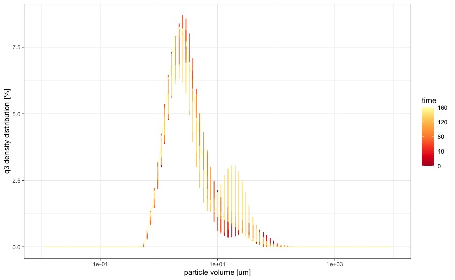
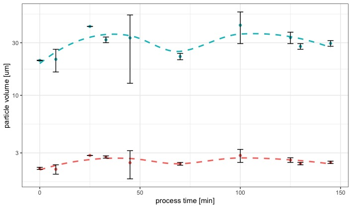
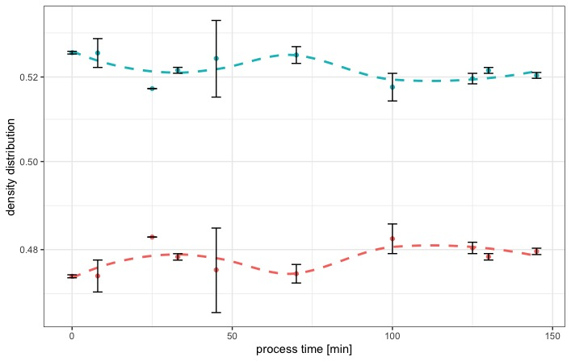
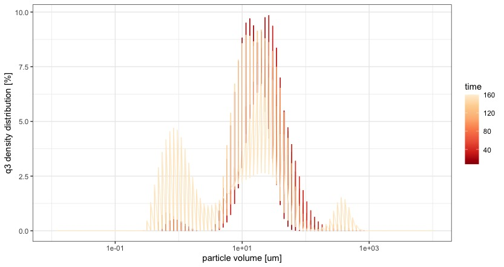
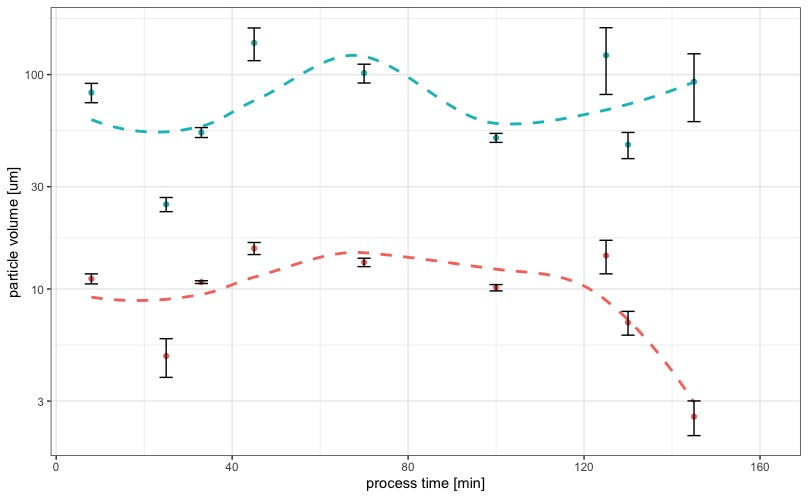
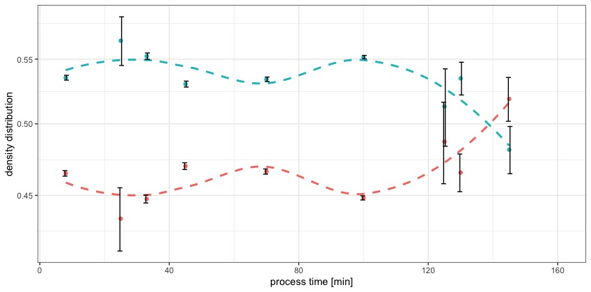
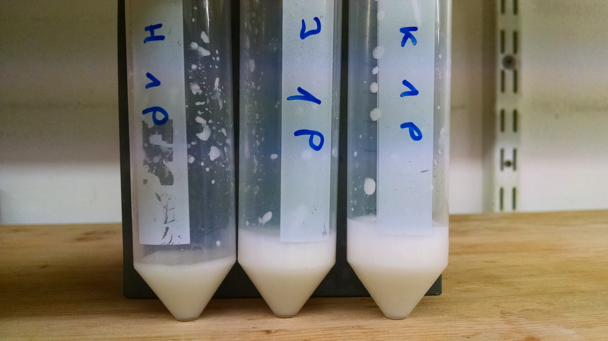
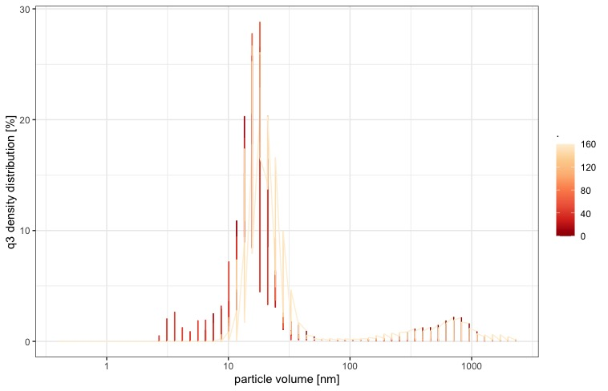
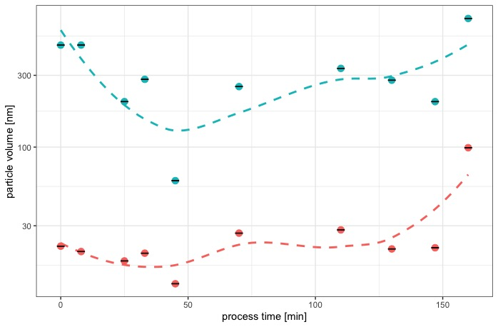

\section{Investigation of particle size development in the bulk phase and at the interphase during processing stages of model process cheeses}

\subsection{Introduction}

In composite materials, that can be described as emulsion gels or soft-solids, the binding state of the filler particle, which is represented by the fat particle is crucial for the viscoelastic properties and overall appearence of the gels. Fat droplets can be either incorporated into the matrix as an 'active filler' that will strengthen the gel, or as an 'inactive filler' that weakens the gel towards shear stress (@Dickinson2012). 
Composite materials like processed cheese can be viewed as a composite material that is a very concentrated or dense emulsion in hot state, also referred to as sol, but solidifies into a gel structure upon cooling, due to the binding of the water molecules into the protein structure (@Fox2016). It has been shown that the cheese in hot and cold state is related directly in terms of hot-state viscosity and gel strength (@Rock2010). Furthermore it has been shown in concentrated sodium caseinate emulsions (10% w/w protein, 30% oil), that high zero shear viscosity was the main reason for preventing phase separatio in depletion flocculated emulsions (@Liang2017). 

Therefore, the investigation of the fat particle size over the course of processing a model processed cheese matrix can give insight towards the growth behaviour of the fatglobules in sheared emulsions. Particle size measurements of fat-droplets in processed cheese samples have been done before, see for example @Chen2012. 
Particle size or particle volume measurements are commonly used, when the aggregation behaviour of single monomers or mixtures of proteins is to be investigated. Two different set-ups can be found for different ranges of expected particle size. Dynamic light scattering measures the Brownian motion of macromolecules in solution and puts into relation to their hydrodynamic radius (i.e. the measured particle size or also called particle volume in this work) using the Mie-Theory. Larger particles will diffuse more slowly through the solvent than small particles, and therefore, the beam of light that is used as "instrument" in this set-up gets scattered differently according to particle size (@Sandhu2018). It is commonly used for sizes <1 um.Laser diffraction uses a different approach and puts the diffraction of a laser beam into relation with the particle size using the Fraunhofer estimation (especially in the analysis of fat particles) and is used for expected particle sizes of >1 um.

In order to gain even further insight into the processed cheese matrix, particle size analysis are not only to be performed in the cream phases of the cheeses, but also in their separated other phases, pellet and serum. It should be investigated, if the particle sizes in the insoluble aggregate follow any trend that can be interpreted toward the recorded aggregation phenomena in the model system so far. 
Besides the determination of the particle sizes in general, the reproducibility of the centrifugational separation method should be monitored during this part of the study. If the obtained particle sizes, especially in the pellet, since this is the most "reliable" phase appearing due to simple G-Force, show low standard deviations, one can assume that the separated structures by means of centrifugation are not at random, but by underlying aggregation phenomena. 
Thus, this analysis serves the purpose of giving further insight towards the aggregation mechanisms happening during the processing of model processed cheese on a micro scale, as well as further validating the isolation method prior to analysis.


\subsection{Material and Methods}

6 g of the processed processed cheese sample as manufactured in chapter 3 was weighed into 50 ml purifier tubes and diluted 1:3 (w/v) with deionised water. To produce a homogeneous dispersion, a dispersion device was used and the dispersion was prepared at a speed of about 6,000-8,000 rpm. For phase separation, the samples were centrifuged at 6000 g and 10 °C for 30 min on the Multifuge (Heraeus Group, Hanau, Germany). This produces a three-phase system consisting of a fat phase (cream), water phase and pellet. The fat phase was lifted off with the help of a stainless steel spoon and transferred into a prepared 50 ml purifier tube. The water phase was poured into another tube.

The differently obtained phases were further prepared for particle size measurements. To obtain only "truely" soluble proteinogenic structures in the soluble, or serum phase, this phase was prepared with ultracentrifugation (70.000*g*) and subsequent filtration (cutoff 2500 nm) prior to measurement in a Malvern Zetasizer. 

The cream phase was further diluted 1:10 (w/v) using a solution containing 1% sodiumdodecylsulfate (SDS). SDS is a strong tenside and prevents the fat globules or particles in the cream from aggregation during the measurement. In addition, it disrupts (loosely) aggregated fat particles.

The pellet or insoluble phase was diluted in deionized water 1:10 (w/v) prior to the particle size measurement. So prepared cream and pellet phases were suspected to be in the micro scale and therefore analyzed using a Malvern Mastersizer.


\subsection{Results and Discussion}
\subsubsection{Data processing}

Data was processed using the "normalmixEM" algorithm within the R programming language. The algorithm is used for finite mixture models, a detailed description is given by the programmers of the algorithm under @Derek2020. Since the distributions of the particle volumes did not show a monomodal distribution, a multiple component model was fitted with either k=2, k=3 or k=4. 
Three and four component models had a lower logarithmic likelihood than the two component model throughout all tested samples during this trial, which is not surprising, since the particle distributions in the different phases showed a bimodal distribution over processing. Therefore, the two component model represented the best fit in the analyzed phases and was used for further distribution analysis.

\subsubsection{Particle size distribution in cream phase}

Fig.\ref{fig:ov.pgv.cream} gives a summary for the measured particle size distribution in the analyzed cream phases. In general a shift form larger to smaller particles over the course of processing becomes apparent, however it appears to be not very pronounced. As it was stated above a definitive conclusion cannot be drawn by viewing the distributions, therefore the distributions were modeled.

```{r ov.pgv.cream, echo=FALSE, warning=FALSE, out.width="100%", fig.cap="q3 density distribution of measured particle sizes of centrifugationally separated cream phases: \ darker colours indicate shorter processing time, lighter colours indicate longer processing times.", fig.scap="Measured particle size distribution in the cream phase"}

```
Over the course of the creaming reaction in model processed cheeses, the cream phase of the centrifugationally separated matrix shows smaller particle sizes, indicated by the lighter colours being in the range of smaller particles. In general, the particle sizes varied only little in range. To check this observation, the modelled particle sizes (of small and large components) were plotted over the processing time.

```{r size.pgv.cream, echo=FALSE, out.width="80%", fig.cap="Development of Particle Volume of small (red) and large (blue) fat particles over processing time"}

```

Fig.\ref{fig:size.pgv.cream} indicates that small and large fat particles detectable in the cream phase of the model processed cheese follow the same trend: first, the fat particles grow in size during the first exponential phase of structure formation. The premixing process seems to create smaller fatglobules, than the system can maintain during the first stage of the creaming reaction. After reaching a maximum in size at the end of the first exponential phase of structure formation at 45 minutes, the fat particles become smaller. This leads to the conclusion, that the first stage of structure formation is not defined by the formation of a fine emulsion with small fat particles, but rather by the formation of a continous network in the bulk phase. 
This is also indicated by Fig.\ref{fig:n.cream} in chapter 4, a strong adsorption of proteins to the interphase could only be detected during the second exponential phase of structure formation. Regarding the development of the fat particle sizes during this phase, the data seems also conclusive, since, after growing in size again towards the beginning of the second exponential or log phase (100 minutes of processing), the fat globules shrink and a fine emulsion is formed up to the end of the investigated process. The detectable changes are however minimal, which can also lead to the conclusion, that the changes of fat binding in the matrix is not a structure defining step, since there seems to be no progressive change in fat particle sizes. Since it is known from previous investigations in this work, that the hydration properties of the proteins,  at the interphase and in the pellet increase during structure formation, it can be assumed, that the actual fat globule size at late stages of processing are smaller than the displayed values, since the protein shell, which was shown to grow in size is part of the particle. @Vollmer2021 and @Vollmer2021a, as well as @Lenze2019, @Noronha2008c and @El-Bakry2011 all reported the formation of a fine emulsion during processing, so the general trend to bind the fatglobules stronger during processing can be seen in this work as well. 
It has to be considered however, that in this study, no other surfactants were used. So the abundance of smaller fatglobules or the significant shrinkage of the fat globules might be an effect that is not induced (primarily) by casein. It can be assumed that the displayed emulsification processes in the cited works are mainly due to whey proteins, which are commonly present by the use of milk powders or by the use of dairy cream or butter as the fat phase, which are per se emulsions. 
In the upscaling event already described previously, differently homogenized casein emulsions, by homogenization of a 5% casein emulsion at different pressure rates were added to 15% protein after homogenzation and processed continously. The samples during processing revealed, what was already seen in @Lenze2019 and elsewhere; smaller initial fatglobules lead to faster structure formation. The decrease of the fat particle size was stronger in the upscaled system, however it can be concluded, that the trend displayed here are in accordance with the literature.

Looking at the density distribution of the fat particles, meaning the amount of small and large particles in the system, the same conclusions can be derived (Fig.\ref{fig:dens.c}).

```{r dens.c, echo=FALSE, out.width="80%", fig.cap="Development of density distribution of small (red) and large (blue) fat particles over processing time"}

```

It shows that the distribution of small and large components in the investigated cream phase over the course of processing. The density distribution of the small components has the same trend trend than the development of the particle sizes in general, which leads to the assumption that the system in general puts work into the formation of smaller fatglobules. 
The amount of large components has a maximum at 70 minutes of processing, also the large particles display their smallest size during processing at this point. Both effects are also in conclusion with the findings of @Lenze2019, where the formation of a small interconnected network of fat particles is hypothesized, described by microscopic techniques, as well as particle size measurements.
It seems likely, that the system is only able to bind a lesser amount of fat into small fat globules or particles over the course of processing, since a further emulsifying agent is missing. In @Rock2010 it was shown, that the addition of small-level surfatants led to a vast increase of the structure formation processes, up to a point where no plateau phase was detectable anymore. This was also seen in the samples prepared during upscaling that were homogenized to an initial fat globule size of 1 um. The structure formation process in those samples was ~50% shorter than the controls (data not shown).

In all samples with a surfactant or pre-emulsified fat, also in this study, the initial increase 
Indications that caseins at higher concentrations can bind ever smaller amounts of fat was already described by @Brunner1991. This seems also be the case in the model processed cheese analyzed herein, however with the difference that the amount of "free casein" increases *in-situ* during processing.

@Vollmer2021 investigated a matrix similar in composition, but processed at lower speed at six different processing times. These processing times were also represented in this study, however with smaller values for the respective processing times. The formation, elongation, and alignment of fibrillar structures was reported as well as their detailed function within the structure formation reaction. In principle, a shell like structure made out of fibrillar building blocks was reported to surround the fatglobule, enclosing it at later processing stages.

\subsubsection{Particle size distribution in insoluble or pellet phase}

Fig.\ref{fig:ov.s.pellet} gives a summary for the measured particle size distribution in the analyzed pellet phases. In general, a shift form medium sized particles into smaller and larger particles over the course of processing becomes apparent:

```{r ov.s.pellet, echo=FALSE, warning=FALSE, out.width="100%", fig.cap="q3 density distribution of measured particle sizes of centrifugationally separated insoluble or pellet phases: \ darker colours indicate shorter processing time, lighter colours indicate longer processing times.", fig.scap="Measured particle size distributions in the pellet phase"}

```
Even though three distributions are apparent in general, the two component model still had the best fit, since the single measurements showed a bimodal distribution throughout. A separation of the bulk phase into two differnt types of aggregates or aggregate scales is indicated. To check this observation, the modelled particle sizes are shown in Fig.\ref{fig:s.pellet}. It indeed shows, that at later processing stages, smaller aggregates become apparent, baecause the small components decreased from 10 microns to around 3 microns between 120 and 150 minutes of processing. The larger aggregate increased during this processing stage, from 70 microns to 10 microns. It can be theorized, that the larger network is constructed by the smaller enteties, a conclusion that was also drawn in @Vollmer2021.

```{r s.pellet, echo=FALSE, out.width="80%", fig.cap="Development of Particle Volume of small (red) and large (blue) insoluble particles over processing time"}

```

The effect of the melting salts can be seen at a process time of 25 minutes, showing the lowest size in the pellet for large and small components. During the first exponential phase of structure formation (75 minutes), a larger insoluble network is formed, where small and large particles are interconnected.
Additionally, since the decrease in particle size at the end of processing in the pellet is a gradual process, it can also be assumed that the fragmentation of the hydrophobic aggregate with begining pase separation is displayed here.

```{r d.pellet, echo=FALSE, out.width="80%", fig.cap="Development of Density Distribution of small (red) and large (blue) insoluble particles over processing time"}

```

The density distribution of the insolubly aggregated particles as indicated in Fig.\ref{fig:d.pellet} changes significantly in the last exponential phase of structure formation. Up to this point, the smaller components have also a smaller proportion of particles in the matrix. 
During the end of the investigated process, the smaller components form the larger domain of the network, which is also indicated by a larger swelling volume of the investigated pellet Fig.\ref{fig:d.pellet}.

@KeesdeKruif2015a determined the water holding capacity of casein gels by comparison of the swelling and de-swelling behaviour under different process conditions (like temperature) and salt concentrations. Gels that were linked with transglutaminase were also investigated. It was found, that enzymatically linked gels swell to a lesser extend than physically linked casein gels. 
Also the water binding and water release behaviour of highly concentrated renneted casein gels were the same as in casein micelles. The network formed in the pellet shrinks overall in particle size, however the volume of the pellet after dilution and centrifugational seperation incresed. Below is an image of the increasing swollen pellet volume from model processed cheese after various processing times (Fig.\ref{fig:vol.pel}.

```{r vol.pel, echo=FALSE, out.width="75%",fig.align='center', fig.cap="Volume of a diluted and centrifugationally separated aliquot of model processed cheese: left to right: \ increase of apparent water binding capacity of insoluble aggregates after 125, 135 and 145 minutes of processing.", fig.scap="Swelling properties of pellet at later processing stages"}

```

In contrast to @KeesdeKruif2015a, the casein particles that are formed during the structure formation of model processed cheeses investigated herein didn't dissolve completely after dilution. This leads to the conclusion, that the emulsifying salt mixture used herein leads to a formation of a more hydrophobic network, that can't be easily dissolved by water.

The results of the particle size analysis in the pellet as well as the findings of @Vollmer2021 indicate, that the model processed cheese system undergoes a process of higher order structuring shortly before and during the second stage of structure formation. Taking into account that the small fat particles grow smaller during the last stage of structure formation, it can be derived that the components in the pellet phase and the fat globules are interconnected and form a particulate network made out of smaller substructures, as it was described in @Dickinson2012.
The results however don't suggest a de-emulsification process. Rather it seems, that a shell of proteins is built around the fat globules, which becomes more rigid during processing and can therefore also rupture at late processing stages and release the enclosed fat. 

\subsubsection{Particle size distribution in the soluble or serum phase}

The serum phase was analyzed using DLS, since the expected sizes after ultracentrifugation of the serum phase were estimated to be in the nano-scale. An overview of the measured particle size distributions is shown in Fig.\ref{fig:ov.size.serum}.

```{r ov.size.serum, echo=FALSE, warning=FALSE, out.width="100%", fig.cap="q3 density distribution of measured particle sizes of centrifugationally separated (70.000g) soluble or serum phases: \ darker colours indicate shorter processing time, lighter colours indicate longer processing times.", fig.scap="Measured particle sizes in the serum phase after ultracentrifugation"}

```

It shows a more dynamic course for the development in the particle sizes which remain soluble, during the course of processing. The darker colours at 5-10 nm indicate free caseins before processing next to intact casein micelles at ~500 nm. Over the course of processing, medium sized (10-70 nm) structures develop next to larger structures around 700 nm. 
However, to get a detailed picture of the processes happening in the serum phase, the modeled particle size or volume distribution in the serum phase is shown below.

```{r s.serum, echo=FALSE, out.width="80%", fig.cap="Development of Particle Volume of small (red) and large (blue) soluble particles over processing time after ultra centrifugation (70.000g)", fig.scap="Modeled particle sizes in the serum phase"}

```

Fig.\ref{fig:s.serum} indicates shrinking soluble particles up to the end of the first exponential phase of structure formation. After that, a step-wise increase in particle sizes, in the small as well as in the large fractions was observed. 
The decrease in particle sizes in the serum phase up to process times of 50 minutes to a minimum value of ~50 nm for the large component and ~10 nm for the small component. This process time marks the end of the first exponential phase, it can be assumed, that small hydrophilic or amphoteric aggregates or even protein monomers are present that emulsify the fat into an emuslion filled gel. Subsequently the soluble aggregates increase in size, to a plateau of 30 nm for the small component and 300 nm for the large component, respectively. During the second stage of structure formation, between 140 and 160 minutes of processing, the small components triple in size to a value of 100 nm, the large components increase in their size to a value of 750 nm. 

During this stage of processing, the small insoluble aggregates decrease, while the large components increase. This indicates a phase separation. It shows that a hydrophobic network, that binds only little amounts of water in the dense system is present next to a large hydrophilc network, that stores the water and potentially also the ions. This is also indicated by the LM-images obtained by @Vollmer2021, shown in section 2 of this work. Areas of lower protein density next to areas with high protein density became present. In a follow up study (@Vollmer2021a), the phase separation could not be seen, however the samples lacked a first exponential increase in apparent viscosity. The samples were processed with 25% more mass so it is thinkable that the samples did not reach yet a critical number of particle-particle interactions that could initiate the phase separation, since at later stages of processing, the dense protein network, which is suspected to be the hydrophobic network in this work, became apparent.
The strong display of phase separation in @Vollmer2021 can be due to the low processing speed and lower mass that was processed. By processing the samples in that way, the growth of particles was not hindered and thus the pressure on the matrix to form aggregates from those aggregates was enhanced. This was done to show the suspected hydrophilic network next to the hydrophobic network, since it was suspected, that higher mixing speed could also lead to higher mixing of the *in-situ* separated phases and therefore to not display the phenomena of overcreaming, as it was discussed in @Lee2003a.

\subsection{Summary and Outlook}

For the investigated particle sizes in the cream phase it can be concluded, that casein doesn't act as a strong emulsifier when used in a model processed cheese system without other surfactants. It binds the fat into smaller units, however not as pronounced as when, for example, whey proteins are present to emulsify the fat phase. This effect has been shown in processed cheese systems, especially by @Lenze2019 and @Rock2010. The stabilization of fat during heat treatment of milk has been studied extensively by @Dumpler2018 and showed various stabilization mechanisms where the interaction of beta-lactoglobulin or whey proteins in general and caseins or the casein micelle, respectively, affected the stability of the systems.

The particle sizes of the cream showed, that the fine emulsion is formed at later processing stages. When considering the flexibility of larger fatglobules compared to the rigidity of smaller fat particles (@Dickinson2012), the course of the measured apparent viscosity can be explained.
At the end and after first log phase, the fat globule sizes increase, as well as the particle sizes in the pellet. This indicates, that the plateau phase is defined by aggregation of the molecules in the bulk to a larger network, whereby the fat size increases which keeps the elasticity in the system, hence no increase in apparent viscosity. During the second exponential phase, these newly formed structures in the bulk bind and emulsify the fat phase, structures that are too large break into smaller subunits by the pressure the system puts on itself. These fragmented aggregates, however are also hydrophobic in nature, hence the fat is also stabilized by the fragments of the hydrophobic aggregates.

This is also supported by the fact, that in the hydrophobic or insoluble phases of the system, the particle sizes shrink, while in the soluble or serum phase, the particle sizes increase during processing. This can be explained by the formation of small hydrophobic particles that form larger networks, next to hydrophilic aggregates that tend to bind more and more amounts of water and probably also the ions in the system. This process later leads to phase separation of the matrix.

In sum, the particle sizes and distribution are in accordance with the findings of @Vollmer2021, @Lenze2019 and the data presented so far. It can be concluded, that two different phases of structure formation occur during the processing of model processed cheeses. Also, the particle sizes in the investigated pellet indicate the formation of a separated casein network out of larger and smaller substructures. It is further to be determined, if the hydrophobic network is a product of the high protein concentration or the processing condition, i.e agitation (v) and high Temperature.