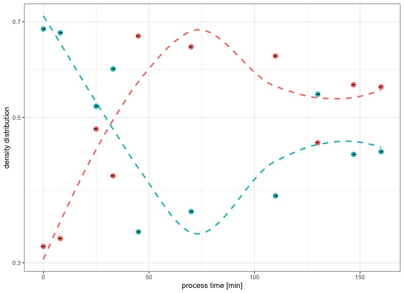

\section{Investigation of particle size development in the bulk phase and interface during processing of model process cheeses}
Particle size volume of fatty phases of aqueously separated casein emulsion-filled-gels
\subsection{Introduction}

\subsection{Material and Methods}

\subsection{Results and Discussion}
\subsubsection{Data processing}

Data was processed using the "normalmixEM" algorithm within the R programming language. Since the distributions of the particle volumes did not show a monomodal distribution, a multiple component model was fitted with either k=2, k=3 or k=4. Three and four component models had a lower logarithmic likelihood than the two component model throughout all tested samples during this trial, which is not surprising, since the particle distributions in the different phases showed a bimodal distribution over processing. Therefore, the two component model represented the best fit in the analyzed phases and was used for further distribution analysis.

\subsubsection{Particle size distribution in cream phase}

Fig.xx gives a summary for the measured particle size distribution in the analyzed cream phases. In general a shift form larger to smaller particles over the course of processing becomes apparent:
```{r echo=FALSE, warning=FALSE, out.width="100%", fig.cap="q3 density distribution of measured particle sizes of centrifugationally separated cream phases: darker colours indicate shorter processing time, lighter colours indicate longer processing times."}
knitr::include_graphics("plots/3.1_all.pgv.jpeg")
```
Over the course of the creaming reaction in model processed cheeses, the cream phase of the centrifugationally separated matrix shows smaller particle sizes, indicated in Fig.xx by the lighter colours being in the range of smaller particles. In general, the particle sizes varied only little in range. 

To check this observation, the modelled particle sizes (of small and large components) were plotted over the processing time as shown in Fig.xx.

```{r , echo=FALSE, out.width="80%", fig.cap="Development of Particle Volume of small (red) and large (blue) fat particles over processing time, with a 'loess fit' (dashed lines); two step emulsification is indicated"}
knitr::include_graphics("plots/3.2_pgv.cream.jpeg")
```

Fig.xx indicates that small in large fat particles detectable in the cream phase of the model processed cheese follow the same trend: first, the fat particles grow in size during the first exponential phase of structure formation. The premixing process seems to create smaller fatglobules, than the system can maintain during the first stage of the creaming reaction. 
After reaching a maximum in size at the end of the first exponential phase of structure formation at 45 minutes, the fat particles become smaller. This leads to the conclusion, that the first stage of structure formation is not defined by the formation of a fine emulsion with small fat particles, but rather by the formation of a continous network in the bulk phase. 

This is also indicated by Fig.xx in chapter 4, a strong adsorption of proteins to the interphase could only be detected during the second exponential phase of structure formation. Regarding the development of the fat particle sizes during this phase, the data seems also conclusive, since, after growing in size again towards the beginning of the second exponential or log phase (100 minutes of processing), the fat globules shrink and a fine emulsion is formed up to the end of the investigated process. 

Looking at the density distribution of the fat particles, meaning the amount of small and large particles in the system, the same conclusions can be derived (Fig.xx).

```{r , echo=FALSE, out.width="80%", fig.cap="Development of density distribution of small (red) and large (blue) fat particles over processing time, with a 'loess fit' (dashed lines)"}
knitr::include_graphics("plots/3.3_c.density.jpeg")
```

Fix.xx shows that the distribution of small and large components in the investigated cream phase over the course of processing. The density distribution of the small components has the same trend trend than the development of the particle sizes in general, which leads to the assumption that the system in general puts work into the formation of smaller fatglobules. 
The density distribution of the large components has a maximum at 70 minutes of processing, considering that the large particles have their smallest value during processing at this point (see Fig.xx), both effects is also in conclusion with the findings of @Lenze2019, where the formation of a small interconnected network of fat particles is hypothesized, described by microscopic techniques.

However, the initial hypothesis, that proteins leave the interphase cannot be concluded from the data obtained. It seems more likely, that the system is only able to bind a certain amount of fat into small fat globules or particles over the course of processing, hence the visible free fat at the end of the process. 
Indications that caseins at higher concentrations can bind ever smaller amounts of fat was already described by @Brunner1991. This seems also be the case in the model processed cheese analyzed herein, however with the difference that the amount of "free casein" increases *in-situ* during processing.

\subsubsection{Particle size distribution in insoluble or pellet phase}

Fig.xx gives a summary for the measured particle size distribution in the analyzed pellet phases. In general, a shift form medium sized particles into smaller and larger particles over the course of processing becomes apparent:

```{r echo=FALSE, warning=FALSE, out.width="100%", fig.cap="q3 density distribution of measured particle sizes of centrifugationally separated insoluble or pellet phases: darker colours indicate shorter processing time, lighter colours indicate longer processing times."}
knitr::include_graphics("plots/3.4_all.pellet.jpeg")
```
Even though Fig.xx shows three distributions in general, the two component model still had the best fit, since the single measurements showed a bimodal distribution throughout. A separation of the bulk phase into two differnt types of aggregates or aggregate scales is indicated. To check this observation, the modelled particle sizes are shown in Fig.xx.

```{r , echo=FALSE, out.width="80%", fig.cap="Development of Particle Volume of small (red) and large (blue) insoluble particles over processing time, with a 'loess fit' (dashed lines)"}
knitr::include_graphics("plots/3.5_p.size.jpeg")
```

The initial assumption, that the particles or insolubly aggregated structures in the pellet phase of centrifugationally separated model processed cheeses grow into two different scales of sizes can be confirmed by Fig.xx. 
The effect of the melting salts can be seen at a process time of 25 minutes, showing the lowest size in the pellet for large and small components. During the first exponential phase of structure formation (75 minutes), a larger insoluble network is formed, where small and large particles are interconnected. 
During the subsequent lag phase of structure formation, the smaller aggregates stay the same in size, whereas the larger aggregates shrink. During the second exponential phase of structure formation, the separation into a network made of large components and small components becomes apparent, which is also in conclusion with the TEM images of the model system, obtaines by @Vollmer2021. 
This effect becomes even more more apparent in the density distribution of small and large components, as seen in Fig.xx.

```{r , echo=FALSE, out.width="80%", fig.cap="Development of Density Distribution of small (red) and large (blue) insoluble particles over processing time"}
knitr::include_graphics("plots/3.6_p.density.jpeg")
```

The density distribution of the insolubly aggregated particles as indicated in Fig.xx changes significantly iin the last exponential phase of structure formation. Up to this point, the smaller components have also a smaller proportion of particles in the matrix. 
During the end of the investigated process, the smaller components form the larger domain of the network, which is also indicated by a larger swelling volume of the investigated pellet (Fig.xx).

@KeesdeKruif2015a determined the water holding capacity of casein gels by comparison of the swelling and de-swelling behaviour under different process conditions (like temperature) and salt concentrations. Gels that were linked with transglutaminase were also investigated. It was found, that enzymatically linked gels swell to a lesser extend than physically linked casein gels. 
Also the water binding and water release behaviour of highly concentrated renneted casein gels were the same as in casein micelles. The network formed in the pellet shrinks overall in particle size, however the volume of the pellet after dilution and centrifugational seperation incresed. Below is an image of the increasing swollen pellet volume from model processed cheese after various processing times.

```{r, echo=FALSE, out.width="75%", fig.cap="Volume of a diluted and centrifugationally separated aliquot of model processed cheese: left to right: increase of apparent water binding capacity of insoluble aggregates after 125, 135 and 145 minutes of processing."}
knitr::include_graphics("~/Desktop/PhD/data/Rstudio/Rdata_diss/thesis/images/swelling_pellet.jpg")
```

In contrast to @KeesdeKruif2015a, the casein particles that are formed during the structure formation of model processed cheeses investigated herein didn't dissolve completely after dilution. This leads to the conclusion, that the emulsifying salt mixture used herein leads to a formation of a more hydrophobic network, that can't be easily dissolved by water.

The results of the particle size analysis in the pellet as well as the findings of @Vollmer2021 indicate, that the model processed cheese system undergoes a swift reconformation shortly before and during the second stage of structure formation. Taking into account that the small fat particles (section 5.3.1) grow smaller during the last stage of structure formation, it can be derived that the small components in the pellet phase and the small fat globules are interconnected and form a particulate network made out of smaller substructures, as it was described in @Dickinson2012.

\subsubsection{Particle size distribution in the soluble or serum phase}

The serum phase was analyzed using a "Malvern Zeta Sizer", since the expected sizes after ultra centrifugation of the serum phase were estimated to be in the nano-scale. An overview of the measured particle size distributions is shown in Fig.xx:

```{r echo=FALSE, warning=FALSE, out.width="100%", fig.cap="q3 density distribution of measured particle sizes of centrifugationally separated (70.000g) soluble or serum phases: darker colours indicate shorter processing time, lighter colours indicate longer processing times."}
knitr::include_graphics("plots/3.7_all.pgv.jpeg")
```

Fig.xx shows a more dynamic course for the development in the particle sizes which remain soluble, during the course of processing. The darker colours at 5-10 nm indicate free caseins before processing next to intact casein micelles at ~500 nm. Over the course of processing, medium sized (10-70 nm) structures develop next to larger structures around 700 nm. 
However, to get a detailed picture of the processes happening in the serum phase, the modelled particle size or volume distribution in the serum phase is shown below.

```{r , echo=FALSE, out.width="80%", fig.cap="Development of Particle Volume of small (red) and large (blue) soluble particles over processing time after ultra centrifugation (70.000g), with a 'loess fit' (dashed lines)"}
knitr::include_graphics("plots/3.8_s.size.jpeg")
```

Fig.xx indicates shrinking soluble particles up to the end of the first exponential phase of structure formation. After that, a step-wise increase in particle sizes, in the small as well as in the large fractions were observed. 
Since this is not the final matrix, but dilution therefrom, it cannot be derived, if the soluble particles found here are not dissolved from the aggregate. Nevertheless, soluble protein (-aggregates) have a higher tendency to still react or aggregate onto other structures, since they are not yet (irreversibly) bound into a larger network. 
This indicates, that during the end or, more accurately, in the second half of the structure formation process, more reactive protein is available, which interacts either with the cream phase, or the pellet phase. The 'loess fit' in Fig.xx suggests a stepwise aggregation process, similar shapes of the development of parameters were found throughout this trial (i.e. viscosity, protein concentration interphase, etc.), therefore, a correlation analysis was performed (see chapter 8).

Looking at the density distribution, a swift change can be detected after the first exponential phase of structure formation (Fig.xx). This means, that the small reactive particles dominate the soluble phase after a primary interaction with the other components of the model system. 

```{r , echo=FALSE, out.width="60%", fig.cap="Development of Density Distribution of small (red) and large (blue) insoluble particles over processing time, with a 'loess fit' (dashed lines)"}

```

\subsection{Summary and Outlook}

In sum, the particle sizes and distribution are in accordance with the findings of @Vollmer2021, @Lenze2019 and the data presented so far. It can be concluded, that two different phases of structure formation occur during the processing of model processed cheeses. 
Even more the particle sizes in the investigated pellet indicate the formation of a separated casein network out of larger and smaller substructures. 
The particle sizes of the cream showed, that the fine emulsion is formed at later processing stages. When considering the flexibility of larger fatglobules compared to the rigidity of smaller fat particles [@Dickinson2012], the course of the measured apparent viscosity can be explained.

MORE TEXT MORE LITERATURE