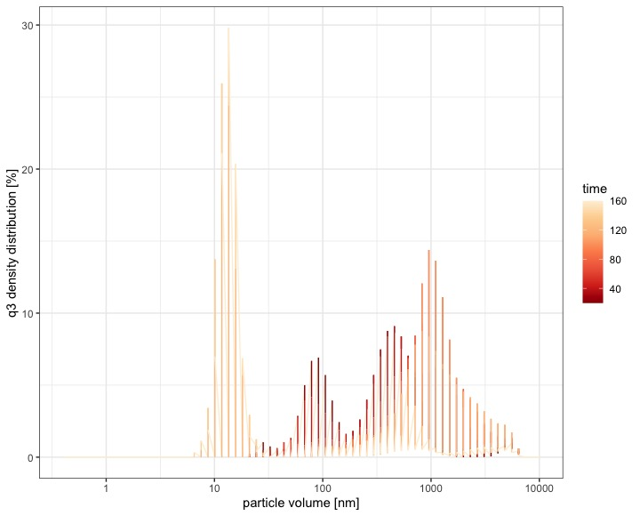
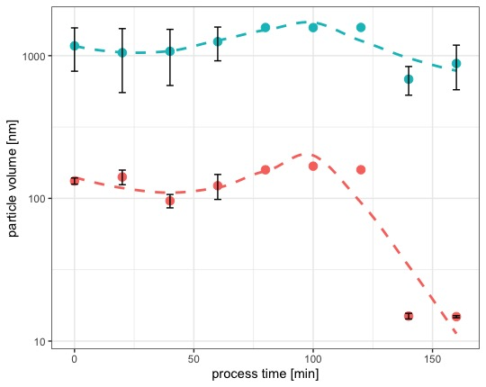
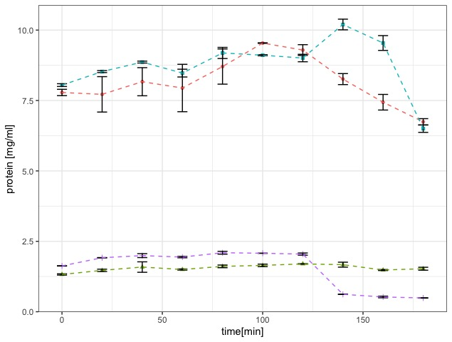
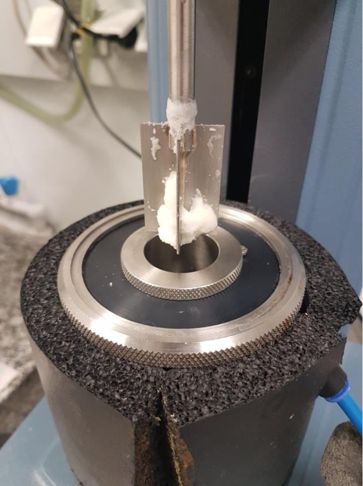

\section{Colloidal aggregation of Rennet Casein under the influence of shear, heat and emulsifying salts}
\subsection{Introduction}
\subsection{Material and Methods}

For further analysis of the swelling behaviour, casein solutions of specific concentrations, with and without melting salts, were Investigated. The solutions were prepared with rennet casein. Protein contents of 1% and 3% were investigated. For this purpose, the protein powder was dissolved in the required concentration in deionised water and then stored at 4°C  Under constant stirring for at least 12 hours. Depending on the test, the melting salts listed above were added in quantities adapted to the protein quantity Of the model cheese samples.
After 12-hours of swelling, 35 grams of the casein solution were measured in a Rheometer MCR 302, using a rotating vane and cup geometry. The process was started and stopped at the desired process time. Afterwards, the samples were transferred into a 50ml purification tube and stored in the 4°C refrigeration until further analysis.

Particle Size Analysis

HPLC measurements
\subsection{Results and Discussion}

```{r , echo=FALSE, out.width="100%", fig.cap="Overview of measured particle size distribution in solutions made from 1% (*c(TP)*) casein,  processed with melting salts, after ultracentrifugation (70.000g) and subsequent filtration (2500 nm): darker areas indicate shorter, lighter areas longer processing times. In-situ reaggregation after filtration at ~4000 nm"}
knitr::include_graphics("plots/4.1_1.all.jpeg")
```
no indication for seed formation apparent, even distribution throughout. Tendency for larger aggregates at later processing times indicates a tendency to reaggregate, since the samples have undergone filtration before measurement. A conclusion therefrom is, that at later processing times, highly active or 'reactive monomers' are present, that tend to aggregate, especially in the ionically charged environment present here. 
Such monomers were already described in [@reactive_monomers]. 
The findings of @Vollmer2021 and @Vollmer2021a indicate that. However in an environment with a total protein concentration [TP] of 1% casein, the monomers might not reach a certain number to form singular, potentially small structures, that could be identified as seeds.
In an environment with a protein concentration of 3% casein, however, such small structures are visible (Fig.xx).

```{r , echo=FALSE, out.width="100%", fig.cap="Overview of measured particle size distribution in solutions made from 3% (*c(TP)*) casein,  processed with melting salts, after ultracentrifugation (70.000g) and subsequent filtration (2500 nm): darker areas indicate shorter, lighter areas longer processing times. Strong indication for seed development at later processing stages visible at ~10 nm"}

```
As already seen in 1% TP solutions, the 3% TP solutions also showed reaggregation phenomena after longer processing times. Even more so, a critical concentration seems to be reached, to form a substructure on their own. This is in accordance with previous studies of aggregation phenomena in a mixed protein environment. 
**Quellen insert WPI fibrils aus Irland usw** presented the formation of fibrils made from WPI, after long incubation times (12-24 hours) and pH=2. This environment breaks the globular beta-lactoglobulin down into string like substructures. Acoordingly, a mixed environment is present, with different peptidic residues or proteinogenic strings. At certain cencentrations, fibrils or ribbon like structures are formed. Also, a certain length of incubation is necessary, to induce the aggregation.
This can be compared to the aggregation phenomena seen here, since a strong ionic environment next to string like proteins are present. Also, a certain incubation time seems to be needed to "kick-start" the aggregation. 
A more conclusive answer can be found in the modelled distribution.

```{r , echo=FALSE, out.width="100%", fig.cap="Development of modelled particle volume, plotted over processing time; small particles indicated by red sphere, large particles indicated by blue sphere with an applied 'loess fit' (y~x, dashed line). Data suggests formation of a very small aggregate of ~14nm after 140 min of incubation"}

```
The modeled distribution (Fix.xx) represents the experimental data well. A two component model (k=2) seems sufficient and prevents over-fitting, in particular when the medium sized aggregates at ~150 nm seem to disappear after the formation of the small aggregates. In addition, the large particles seem to decrease as well, while the small particles in between 140 and 160 minutes of processing don't decrease any further. 
The density distribution or proportion of small and large measured particles is seen in Tab.xx.
density 1 / 140 / 38
          / 160 / 36
The density of the small component increases at the end, which is probably due to reaggregation of the reactive seed into larger structures, hypothetically similar or commpareable to the small structures apparent in @Vollmer2021. 


This theory can be supported by the additional data obtained from the system of 3% TP processed with emulsifying salts. The flow-curve obtained by the set-up in the processing in a rheometer shows a steep increase, beginning at xx minutes, with a maximum at xx minutes and a stabilization at a higher level than prior to the exponential aggregation phase (Fig.xx).
        
```{r , echo=FALSE, out.width="100%", fig.cap="Flow curve of a 3% Tp casein solution processed with a vane blade geometry"}
knitr::include_graphics("plots/4.5_coll.rheo.jpeg")
```


Fig.xx shows the composition of the aggregate. At 100 minutes, alphaS1 begins to decrease significantly in the supernatant, showing that an aggregate is formed. Prior to this, a steady increase of soluble particles can be detected. After 120 minutes beta casein also decreases significantly up to the end of the process.

```{r , echo=FALSE, out.width="100%", fig.cap="Development of measured particle concentration in supernatant of samples made from 3% TP, processed with emulsifying salts; beta casein (blue), alphaS1 casein (red), kappa casein (violet) and alphaS2 casein (green)"}

```

In accordance with the appearence of insoluble visibly large aggregates at the stirrer of the rheometer (Fig.xx) after 140 minutes of processing it can be stated, that this aggregate is primarily formed by alphaS1 casein and secondarily by beta casein. The slight increase in beta casein proir to the decrease at the end might be due to a release from an aggregate, which those two caseins happily form [@casein_interactions].

```{r , echo=FALSE, out.width="50%", fig.cap="Visible large flocculated aggregate at the stirrer of the vane geometry after 140 minutes of processing"}

```
The decrease in kappa casein which couldn't be found in the pellets analyzed in their composition in chapter 4 is due to the use of rennet casein in this study instead of native casein in chapter 4. this further supports the formation of a largely hydrophobic aggregate, where a lesser solubility in water leads to the formation of an insoluble, flocculated aggregate, which can be also described as depletion flocculation. This is fulfilled by the kappa casein in rennet casein, since the hydrophilic glycosylated part is missing, therefore it starts to deplete from the solution into the flocculated state.

\subsection{Summary and Outlook}

To the authors knowledge, no aggregation phenomenon similar to this has been presented from casein. In conclusion with the works of @Vollmer, where a casein fibrilization in the equal model processed cheese matrix was detected, it can be theorized, that in this study the primary aggregate, or "seed" for fibrilazation might be displayed. 
Regarding the "Rework" effect as described in detail by @Lenze2019, it can be theorized, that the formation of a hydrophobic aggregate, mainly comprising of alphaS1 and beta casein is formed at late processing stages. Adding such material to a "fresh" matrix then includes the primary aggregate. Since the emulsification of the fat into fine particles is enhanced during these stages of processing as well, it can be stated, that those structures are also better at emulsifying fat, than otherwise aggregated casein particles or monomers therein. This is also in conclusion with the theory of a hydrophobic particle.

In order to form fibrils without any degree of covalent interaction, one must consider the possible connection points for this type of interactions in the respective casein.
**HCA PLOTS**

If the strong charge from the phosphoserine residue isn't overcome, the caseins are not able to reach a close enough range to form this kind of strong hydrophobic interactions. This is due to the effect, that hydrophobic interactions have the smallest size range, as indicated by DLVO theory. An electrostatic bridge or even crystallization under the chelation of calcium ions could explain the occurence of such a close range. 
Considering this, it seems interesting that the hydrophobic forces are stronger than the energy derived from solving the electrostatic bond in water. 

**Find data to electrostatic Casein bridge**