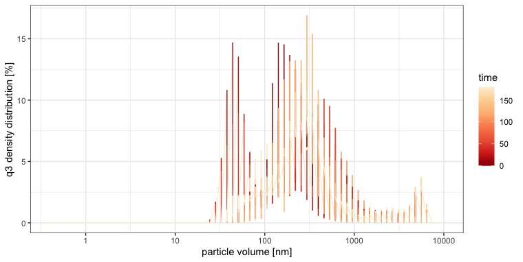
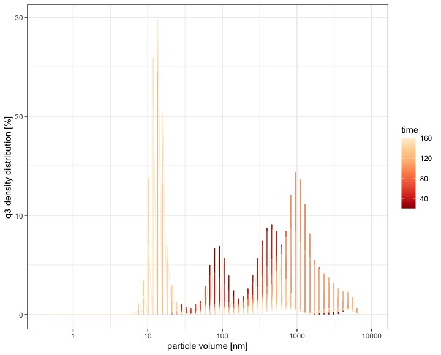
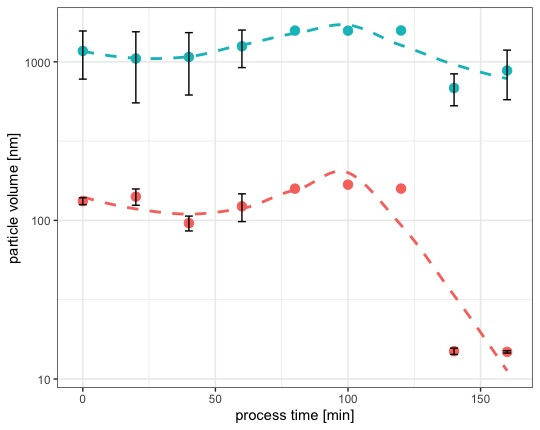
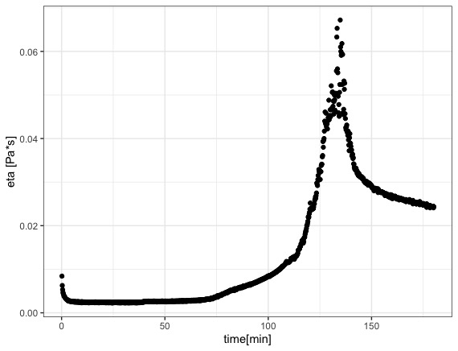
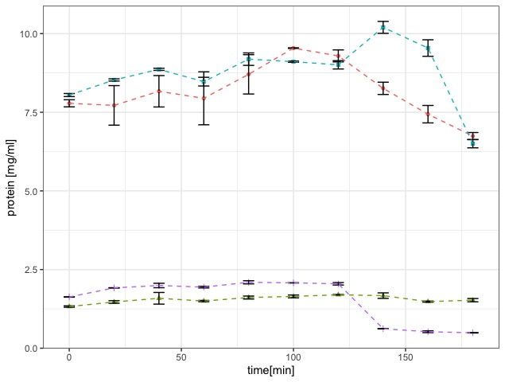
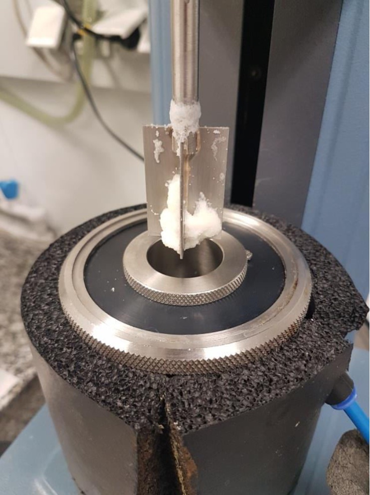
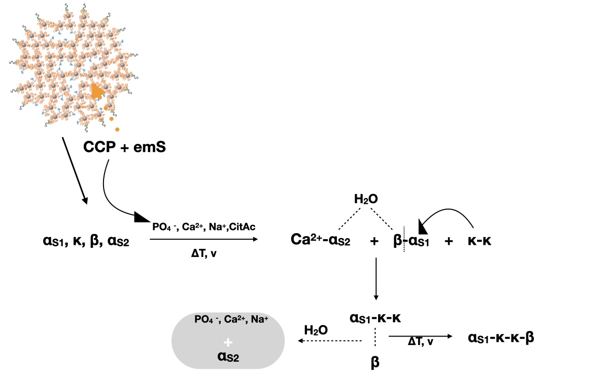

\section{Colloidal aggregation of rennet casein under the influence of shear, heat and emulsifying salts}
\subsection{Introduction}

Caseins are flexible proteinogenic molecules which show a wide range of aggregation behaviour in response to their environment or treatment. Also, they are bioactive molecules which can carry minerals due to post-translational modification of the serine groups with phosphate. Their bioactivity or function as a potential carrier is not limited to ions; since they can perform hydrophilic as well as hydrophobic interactions with itself and other molecules (@Casanova2021). Therefore the aggregation mechanisms that lead to the formation of the processed cheese structure investigated within this study can be of versatile nature. The aggregation of casein, however, seems to be the reason for the gelation of the model system in cold state.

In food systems like processed cheese, gelation of the matrix occurs due to the heat set gelation of the casein (micelles). @Nicolai2021 recently reviewed the gelation of caseins by heat and concluded that gelation of casein micelles is hindered under the addition of calcium chelating agents. 
The structure, stability and reaction properties of the casein micelle is mainly defined by the interaction of the protein mojeties in the micelle with the CCP (@Gaucheron2012). The aggregation phenomena resulting from casein in (partly) native state are also steered by their initial degree of mineralization. It could be shown that demineralization of native micelles promotes the formation of hydrophobic aggregates (@Nogueira2020). Since the structure formation in processed cheese uses the demineralization of the casein micelle to form new stuctures, it can be assumed that the protein-protein interactions coming from the free caseins from the demineralized micelle are also interacting to form hydrophobic aggregates.

From the compositional analysis in terms of particle size distribution and protein concentration of the processed cheese matrix alone, a conclusive pathway for the theorized aggregation to occur could not be given. Also, the creaming reaction was investigated so far in this work mainly in presence of a dispersed phase. Since @Lee2003a already showed protein network formation in fat free gels, the threshold value for measureable protein aggregation in a processed cheese system can be measured by processing of a diluted casein solution with melting salts. The aim was to find substructures that might represent the building blocks or a represantative model of such structures, that initiate a structure formation as seen in the TEM images of @Vollmer2021. To achieve this, solutions of low concentrations (1% and 3% casein) were processed with a respective aliquot of emulsifying salts, in order to model the special environment in the bulk phase at a molecular or nano scale.

Also, as it was concluded in the previous section, this part of the study should determine, if the aggregation phenomena seen in the model matrix so far are occuring due to the high concentration of the proteins in the system or the agitation (v) which forces collision of the particles.

\subsection{Material and Methods}

For further analysis of the swelling behaviour, casein solutions of specific concentrations, with and without melting salts, were investigated. The solutions were prepared with rennet casein. Protein contents of 1% and 3% were investigated. For this purpose, the protein powder was dissolved in the required concentration in deionised water and then stored at 4°C Under constant stirring for at least 12 hours. Depending on the test, the melting salts listed above were added in quantities adapted to the protein quantity of the model cheese samples.
After 12-hours of swelling, 35 grams of the casein solution were measured in a Rheometer (Anton Paar,MCR 302, Austria) using a rotating vane and cup geometry and a shear rate of 50/s, to simulate the processes in the custom made processing cup. The process was started and stopped at the desired process time. Afterwards, the samples were transferred into a 50ml purification tube and stored in the 4°C refrigeration until further analysis.
For every process time that was analyzed (0, 20, 40, 60, 80, 100, 120, 140, 160 and 180 minutes) a new casein solution was processed, so as to have the same amount of reacting mass in every process (analogue to the sampling of the processed cheese as in section 3 and 4 of this work). Samples were processed in duplicate and measured as a duplicate of a duplicate (N=4).

**Particle Size Analysis**
\newline
The expected paricle sizes were expected to be at nano-scale. Therefore, ultra centrifugation at 70.000g was applied to samples. The supernatants of the samples were then filtered at a cutoff of 2500 nm using a MERCK syringe filter. A a one time use polymeric measuring cuvette for a Malvern Zetasizer was cleared from any dust using pressured air. The processed samples were filtered directly into the measuring cuvette to avoid contamination of the samples with dust particles. 
The particles were then measured at a Malvern Zetasizer, each sample was measured ten times over several minutes.
The so obtained data was processed using the R programming environment. Component analysis for multimodal distribution was performed, using the "nomalmixEM" algorithm as described in the previous section.

**HPLC measurements**
\newline
The supernatants of the processed samples after ultra centrifugation at 70.000g were analyzed using the HPLC procedure as described in section 4. To obtain a suitable concentration, the samples were first diluted 1:1 (v/v) with deionised water. Afterwards, 200 ul of sample was mixed with 800 ul of guanidine buffer (see chapter 4), filtered into a vial and measured with RP-HPLC according to the method displayed in @Dumpler2018.

\subsection{Results and Discussion}

Fitting of the particle sizes was performed as it was described in section 5 of this work. First, an overview plot for the measured particle sizes was prepared, with a colour scale representing the processing times. Afterwards, the particle sizes were modeled to obtain size and distribution for the single components.


```{r , pgv1, echo=FALSE, out.width="100%", fig.cap="Overview of measured particle size distribution in solutions made from \ 1\\% c(TP) casein, processed with melting salts, \ after ultracentrifugation (70.000g) and subsequent filtration (2500 nm): \ darker areas indicate shorter, lighter areas longer processing times. In-situ reaggregation after filtration at \\~ 4000 nm", fig.scap="Measured particle size distribution of solutions from 1 TP casein"}

```
Fig.\ref{fig:pgv1} displys no indication for seed formation apparent, even distribution throughout. Tendency for larger aggregates at later processing times indicates a tendency to reaggregate, since the samples have undergone filtration before measurement. A conclusion therefrom is, that at later processing times, highly active or 'reactive monomers' are present, that tend to aggregate, especially in the ionically charged environment present here. The high tendency for demineralized caseins to show hydrophobic aggregation was also shown in @Nogueira2020.

The findings of @Vollmer2021 and @Vollmer2021a indicate hydrophobic aggregation as well. However in an environment with a total protein concentration TP of 1% casein, the monomers might not reach a certain number to form singular, potentially small structures, that could be identified as seeds.
In an environment with a protein concentration of 3% casein, however, such small structures are visible (Fig.\ref{fig:pgv3}).

```{r pgv3, echo=FALSE, out.width="100%", fig.cap="Overview of measured particle size distribution in solutions made from 3\\% c(TP) casein, \ processed with melting salts, after ultracentrifugation (70.000g) and subsequent filtration (2500 nm): \ darker areas indicate shorter, lighter areas longer processing times. Strong indication for seed development at later processing stages visible at \\~10 nm", fig.scap="Measured particle size distribution in 3 TP casein solutions"}

```
As already seen in 1% TP solutions, the 3% TP solutions also showed reaggregation phenomena after longer processing times. Even more so, a critical concentration seems to be reached, to form a substructure on their own. Also, a certain incubation time seems to be needed to "kick-start" the aggregation by reaching a critical concentration of primary aggregates. The critical concentration can also be seen in terms of a critical fractal dimension, that was reported elsewhere (@Lazzari2016) for colloidal aggregation. It has to be considered that a polydisperse matrix is present. Hence, hydrophobic particles with a small radius of gyration might appear next to large molecules that are hydrated.

@Vollmer2021 reported the formation of dense aggregates next to amorphous structures that later were again separated into smaller subunits. At the final processing stage of 415 minutes, one of these subunits are characterized as needles, displaying roughly the same length ( ~ 14 nm) as the small component found after 140 minutes of processing in the casein solution. The nature of the detected fibrils was discussed, but no conclusive answer could be given. 

```{r pgv3m, echo=FALSE, out.width="100%", fig.cap="Development of modelled particle volume, plotted over processing time; \ small particles indicated by red sphere, large particles indicated by blue sphere with an applied 'loess fit' (y~x, dashed line). Data shows formation of a very small aggregate of ~14nm after 140 min of incubation", fig.scap="particle volume of 3% casein solutions over processing time", fig.scap="modelled particle sizes for 3 TP casein solutions over processing time"}

```

The modeled distribution (Fix.\ref{fig:pgv3m}) represents the experimental data well. A two component model (k=2) seems sufficient and prevents over-fitting, in particular when the medium sized aggregates at ~150 nm seem to disappear after the formation of the small aggregates. In addition, the large particles seem to decrease as well, while the small particles in between 140 and 160 minutes of processing don't decrease in size any further. The modelled density distributions revealed that up to 80 - 100 minutes of processing, the distribution of small to large components was about 50:50 (%). At late processing times, this distribution changes to 30:70 small to large components. This suggests, that the small components are removed from the soluble phase, by participating in hydrophobic aggregation, since the samples were treated with ultracentrifugation.
What also applies here, is the theory, that up to 120 minutes of processing, we see hydrated particles, and the measured particle volume of ~100 nm shows their radius of gyration, i.e. the hydrate shell. The strong decrease to a tenth of the initial particle size suggests the loss of the hydrate shell from the measured particle, which speaks again for hydrophobic aggregation, as well as for a reconformation of the system, since apparently, the charged parts of the small particles are turned inward as to not bind large amounts of water.

It can be hypothesized, especially in combination with the measured protein concentration in the supernatent after ultra centrifugation (Fig.\ref{fig:collHPLC}), that the aggregates of > 100 nm are soluble, strongly hydrated dimers of alphaS1 and beta casein. The formation of the kappa casein seed, which is hydrophobic and therefore very small in size, happens simultaneously. In fact, the modellation of a three component model (data not shown) suggested this, since the density distribution of the smallest component (~14 nm in size) rose at the end of the process from 13% to 36%. 

The density of the small component increases at the end, which is probably due to reaggregation of the reactive seed into larger structures, hypothetically similar or commpareable to the small structures identified as needles in @Vollmer2021. 

This theory can be supported by the additional data obtained from the system of 3% TP processed with emulsifying salts. The flow-curve obtained by the set-up in the processing in a rheometer shows a gradual increase, beginning at 75 minutes, followed by a steep increase with a maximum at ~135 minutes and a decrease after 140 minutes with the tendency to remain at higher plateau level after 160 minutes of processing (Fig.\ref{fig:coll.rheo}. The flow curve displayed here resembles the flow curve of a fat-free model processed cheese system as in @Lee2003a. It was theorized, that the proteins form a network, which leads to a peak in viscosity, before the network fragmentizes or collapses. This seems to be displayed here as well.
        
```{r coll.rheo, echo=FALSE, out.width="100%", fig.cap="Flow curve of a 3 TP casein solution processed with a vane blade geometry"}

```

Fig.\ref{fig:collHPLC} shows the composition of the suspected aggregates. Between 100 and 120 minutes of processing, kappa casein decreases to its final value. Also, an increase in beta casein as well as a decrease in alphaS1 casein is visible in the supernatant at this stage of processing. Up to this stage of processing, respectively between 50 and 100 minutes, alphaS1 and beta casein increased in the supernatant in the same fashion, suggestion the formation of a hydrophilic aggregate of ~ 140 nm in size (of gyration).
After 120 minutes beta casein also decreases significantly up to the end of the process. Also, alphaS1 casein decreases further. 
No change in concentration of the alphaS2 casein in the supernatant was detected, which suggests, that alphaS2 casein is not participating in the formation of a hydrophobic network, at least not in the same degree as the other caseins.

```{r collHPLC, echo=FALSE, out.width="100%", fig.cap="Development of measured particle concentration in supernatant of samples made from 3\\% TP, processed with emulsifying salts; \ beta casein (blue), alphaS1 casein (red), kappa casein (violet) and alphaS2 casein (green)", fig.scap="Measured protein concentrations in the supernatant of 3 TP casein solutions after ultracentrifugation"}

```

In accordance with the appearence of insoluble visibly large aggregates at the stirrer of the rheometer (Fig.\ref{fig:coll.agg}) after 140 minutes of processing it can be stated, that a large insoluble aggregate was formed out of kappa casein, alphaS1 casein and beta casein. The slight increase in beta casein proir to the decrease at the end might be due to a release from an hydrophilic aggregate, which those two caseins readily form (@Lucey2018).

```{r coll.agg, echo=FALSE, out.width="50%", fig.cap="Visible large flocculated aggregate at the stirrer of the vane geometry after 140 minutes of processing"}

```


\subsection{Summary and Outlook}

One aim of this study was to explore the theory, of aggregation phenomena on a colloidal level could reveal structures that are also present in the dense matrix, due to the same ionic environment and strength. 

It could be seen by compositional analysis with RP-HPLC, that the soluble structures in the colloidal solution first increase in concentration and are made up of a chimera of alphaS1 and beta casein. This increase only lasts until a processing time of 120 minutes: after, a decrease in alphaS1 and kappa casein can be seen, after 140 minutes of processing, beta casein also decreases. This suggests an insoluble (i.e. hydrophobic) aggragtion of those three caseins in a step wise manner.

In order to form hydrophobic aggregates without any degree of covalent interaction, one must consider the possible connection points for this type of interactions in the respective casein.
In section 1 of this work, a computed hydrophobic cluster analysis plot as it was also shown in @Lucey2018, was performed. Under the use of this, a possible alignment of beta and alphaS1 casein might become possible, when the two centers of phosphorylation as marked specifically in Fig.\ref{fig:HCA} in section 1 of this work, are screened or reduced in charge in way that they can allow close range between the particles. Another possibility is, that alphaS1 and beta casein are associated at only specific hydrophobic binding points via hydrophobic interaction into for example circular structures.
Fibrils from other molecules like *beta-lactoglobulin* are known to have translucent properties in solution. The aggregates detected in this study were were opaque. Due to the turbidity of the aggregate but its ordered particulate structure it might be theorized, that the initial kappa casein fibrils and the amorphous or linear aggregate from alphaS2 and beta casein are hydrophobically associated in a turbular way, therefor the lacking translucence.  

This suggests a mechanism for the hydrophobic aggregation occuring here. The mechanism takes into account, that kappa casein will be the first to get released from its CCP, since it sits on the outside of the micelle. Hence, the formation of the primary aggregate, so to say a kappa casein seed that might also be seen in the needles in @Vollmer2021 after 415 minutes of processing (which then become visible due to fragmentation of the network), becomes plausible. @Nogueira2020 showed the aggregation mechanisms of demineralized casein micelles next to native micelles upon rehydration. It could be shown that the partly demineralized casein micelles had a higher resistance to stirring than native micelles. It was found that this was due to exposition of reactive groups and increase in the tryptophan hydrophobicity, which then led to hydrophobic aggregation. In addition it was found that removing 15% of the CCP led to a larger pore size of the casein micelle.

```{r mech1, echo=FALSE, out.width="100%", fig.cap="Proposed reaction mechanism for hydrophobic aggregation and consequential phase separation: full lines are insoluble aggregation or ionic-bond, dashed lines indicate association. Grey box indicates phase separation.", fig.scap="Proposed reaction mechanism"}

```

The reaction mechanism presented in Fig.\ref{fig:mech1} shows the primary formation of a (possibly irreversible) kappa casein hydrophobic seed next to a hydrophilic (and reversible) aggregate out of alphaS1 and beta casein. In the next step of the reaction (at 100 minutes of processing), the hydrophilic aggregate dissociates due to a suggested "hydrophobic pull", maybe compareable to a dipole inducing +I or -I effect that occurs in organic molecules on a substituted carbon atom. Also this pull could be depletion from co solvent (i.e. the ions) exclusion from one aggregate.
An intermediate hydrophobic aggregate is formed out of the already aggregated kappa casein and the newly released alphaS1 casein. This intermediate further aggregates with beta casein (after 140 minutes of processing) to form the growing hydrophobic network. It is suggested, that the network growth is limited in the dense processed cheese system, due to the shear pressure the dense matrix applies on itself, which then leads to probably irreversible fragmentation of the hydrophobic aggregate made out of kappa, alphaS1 and beta casein.

Comparing the abundance of visible aggregates in the 1% casein solutions, as well as the small component of ~14 nm, it is possible that either a fractal dimension of aggregates is not (yet) reached, to initiate this aggregation mechanism. Since the solutions are constantly stirred during heating, it can also be the case that the incubation time for visible aggregation to occur in a 1% TP casein solution must be longer than the tested times (maximum of 180 minutes) within this study.

The phenomena seen in this study can be attributed to the aggregation phenomena seen in processed cheese. The measured protein concentrations of the pellet and cream phase in section 4 of this work showed an increase in those protein mojeties, that decreased in the supernatant of this study. In combination with the imaging data obtained by @Vollmer2021 and @Vollmer2021a it can be concluded that the formation of the fine casein network is primarily formed by initially sized or aggregated seeds that further promote a hydrophobic aggregation process that is irreversible and happens due to a seeding effect that was induced by reaching a critical concentration of a primary aggregate. 
In conclusion with these works where a casein fibrilization in the equal model processed cheese matrix was detected, it can be theorized, that in this study the primary aggregate, or "seed" for fibrilazation is displayed, as well as the amorphous large aggregate that was found within TEM analysis. A final clarification could be done by TEM imaging of the colloidal aggregate and comparison to the already obtained images.

Regarding the rework effect as described in detail by @Lenze2019 and others, it can be theorized, that the formation of a hydrophobic aggregate, mainly comprising of alphaS1 and beta casein is formed at late processing stages. Adding such material to a "fresh" matrix then includes the primary aggregate. Since the emulsification of the fat into fine particles is enhanced during these stages of processing as well, it can be stated, that those structures are also better at emulsifying fat, than otherwise aggregated casein particles or monomers therein. This is also in conclusion with the theory of a hydrophobic particle.


