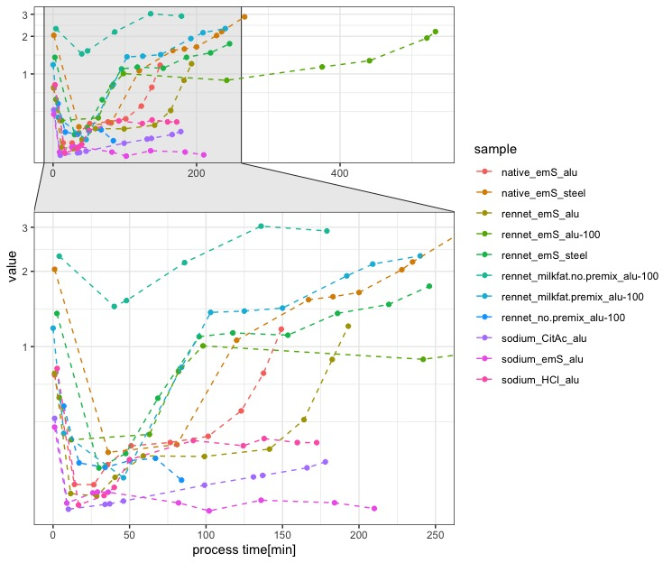
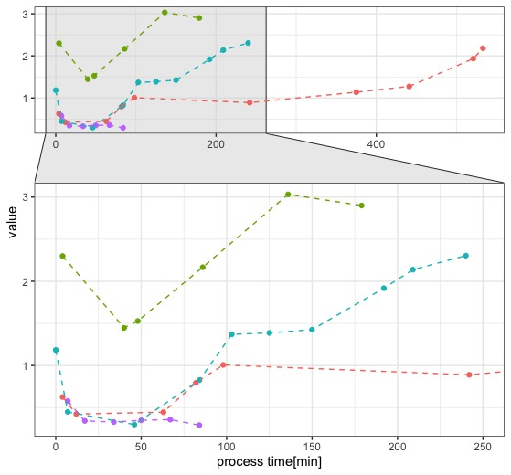
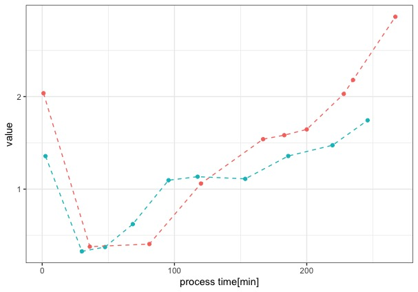
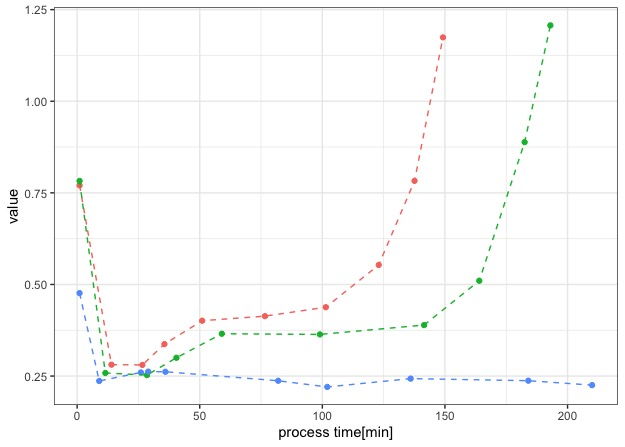

\subsection{Comparison of models tested during model development}

```{r, echo=FALSE, out.width="100%", fig.cap="Overview of Viscosity Development during structure-formation reaction in model processed cheeses varying either in composition (native, rennet or sodium casein[ate] with the mixture of emulsifying salts used herin [emS] or sodium caseinate with either [HCl] or citric acid [CitAc] for pH adjustment), preparation (pre-homogenisation [premix, no.premix] and pre-emulsification of fat [milkfat, oil is the default]) or processing conditions (heat-transfer i.e. free Energy [alu, steel], or shear rate i.e. mixing/aggregation rate [alu-100, alu 200/s is the default])"}

```


```{r, echo=FALSE, out.width="75%", fig.cap="Comparison of Rheological profile during structure formation of pre-homogenised (red, blue) or non-homogenised (violet, green) samples and of pre-emulsified (green, blue) fat (in form of milkfat) or unemulsified (red, violet) fat (in form of oil). Note that the red and violet curves are identical in their composition but vary in terms of pre-homogenisation."}

```
Fig


```{r , echo=FALSE, out.width="75%", fig.cap="Rheological Profile of samples made from native (red) or rennet (blue) casein, processed in a steel cup"}

```
The overall Rheological Profile of samples made from native or rennet casein, differs only slightly. Native casein samples show a faster structure formation than rennet casein samples, as well as an overall higher viscosity. This can be due to the different initial particle sizes of the casein powders, since the rennet casein powder had a more granular consistency, whereas the native casein powder was powdery. 
**Quelle** described the formation of stronger gels from inhomogenous samples, due to faster bridging-flocculation of the fat particles. This also leads to a prefered formation of particulate fat globules and thus, for an emulsion filled gel to the formation of a particle gel. This is represented in Figurexx by the faster over-processing of the native casein model cheeses, since a particle gel has a higher rigidity than an emulion filled gel.**Quelle**

```{r , echo=FALSE, out.width="75%", fig.cap="Rheological Profile of samples made from native (red), rennet (green) or sodium (blue) caseinate, processed with the mixture of emulsifying salts used herein in an aluminium cup. The processing conditions for these samples were set to the standard conditions for further analysis." }

```

It is apparent, that the aluminium cup leads to faster processing, which is due to a better heat transfer of the aluminum and the higher friction in the aluminium cup, which might provoke an autocatalytic effect. Comparing the shear rates, we see that the process speed is dependent of the shear rate, which is in conclusion with rheological behaviour for non-Newtonian fluids, as well as with the faster structure formation (i.e. higher reaction rate), due to higher collision probability of the particles.


