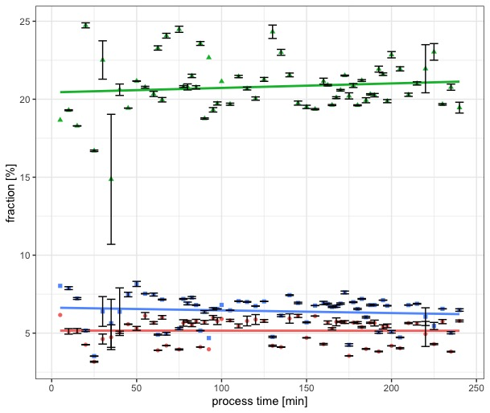
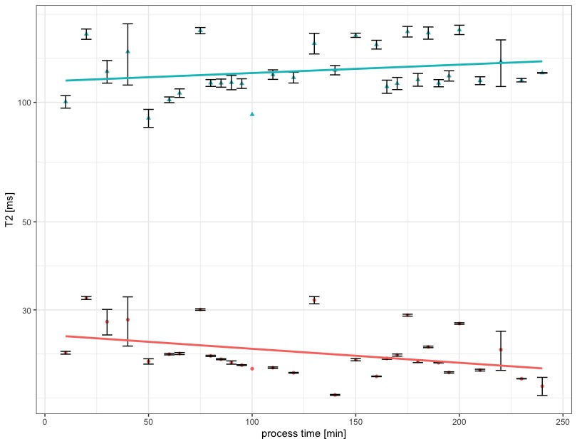
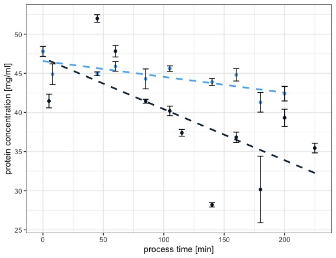
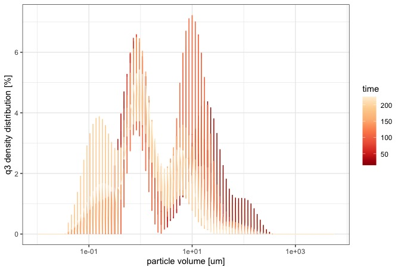
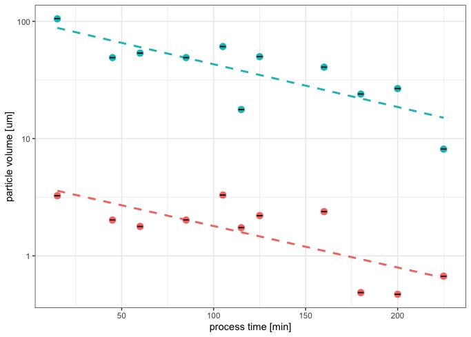
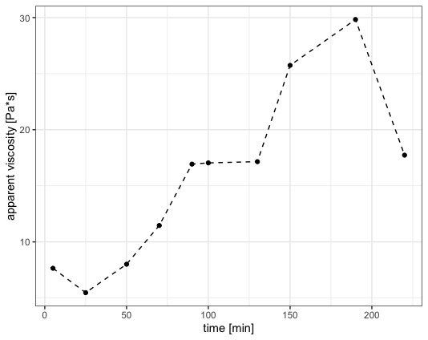

\section{Upscaling and NMR relaxometry of model process cheese}
\subsection{Introduction}
The basis of nuclear magnetic resonance spectroscopy (NMR) is the fact that atoms have magnetic fields characteristics. Subatomic particles, such as neutrons, electrons, and protons, revolve around their axis, which in particle physics is called spin. Atomic nuclei with an odd number of protons, e.g., 1H, have a total spin (I). Atoms with an even number of protons, e.g., C, have no total spin due to the pairing of the protons. A parallel orientation of the magnetic moment results in the energetically preferred orientation of it. The difference in occupation that occurs creates a magnetization vector which is the basis of a successful NMR measurement (@Schuh1982).

The NMR measurements were used to investigate the mobile water phase of the processed cheese system at different process times. The interpretation of the relaxation times can determine the chemical and physical, bound or unbound state of 1H protons and thus of water.
1H nuclei from immobilized water have considerably shorter relaxation times than nuclei from the mobile water phase. This can be attributed to the interactions of the immobile protons with their environment, which are much more frequent than those of the mobile phase of the system. By measuring the decaying signal intensity over the relaxation time, a spectrum of the different water phases in the melted cheese system was obtained (@Hinrichs2004). Studies on the water-binding capacity of protein microparticles using time-domain nuclear magnetic resonance were performed also by @Peters2016. Water immobilization by whey protein concentrate was investigated by NMR in @Hinrichs2004a.

NMR measurements on food and model systems thereof, especially low-resolution experiments on cheese, are a common practice (@Gotz2004). @Chen2012 investigated the effect of different types and amounts of emulsifying salts on the chemical and physical properties of processed cheese samples. Furthermore, signal components were also be attributed to the fat protons. @Noronha2008c identified four stages of hydration and/or matrix development in the preparation of imitation cheese made from casein. Two stages could be attributed to hydrophilic interactions of caseins with the bulk as well as two later stages, where the interactions of proteins with fat dominated the matrix formation. 
@Hinrichs2007 investigated changes in water mobility during renneting or acidification of solutions from casein micelles, using low resolution NMR. Here, a method was presented to fit the signal to relaxation times of differently bound fractions of water - immobile, weakly mobile, mobile and very mobile protons from water were detected. In @Khanal2018, different low fat cheddar cheeses were investigated during ripening. Using low-field NMR, different stages of water mobility could be identified in samples containing alginate as additive.
@El-Bakry2011 investigated a processed cheese matrix at multiple subsequent steps of preparation, besides other methods, using a T2 relaxation NMR protocol. The different sample stages showed a multi staged structure formation from a liquid dispersion to a cohesive mass.

Further use of time-domain or low-resolution NMR measurements can be found as  well in composite science. @Besghini2019 present NMR measurements for the investigation of polymerization or crystallization kinetics in rubber. Gelation and sol-gel phase transition phenomena in non-biogenic, organic materials like Poloxamers are investigated via T2 relaxation by @Shaikhullina2020. @Testamanti2019 gives use of low-field or low-resolution magnetic resonance for the evaluation of reservoirs for the petroleum industry and is especially focussed on the provision of a regularization algorithm for the determination of T2 relaxation spectra from shells.
Determination of the T2 distribution from the decaying signal can be obtained by  the CONTIN Computer Program, where an inverse Laplace transformation of the signal is performed, in order to find the T2 distribution (@Moody2004, @Whittall1996, @Borgia1998). Another possibility to obtain the relaxation and diffusion distributions in two dimensions is the use of the Fredholm integral equation of the first kind (@Mitchell2012). However, this can lead to a regularization bias, since the inverse Laplace transform represents an ill-posed problem (@Berman2013, @Giovannelli2015), especially for a multi-component environment as it is the case in processed-cheese samples. 
Fitting the envelope curve of the exponential decay with discrete parameters as in @Hinrichs2007 leads to unbiased T2 distributions, however only for the discrete parameters. Least-squares and linear programming algorithms can help to reduce the non-uniqueness of the fitted solution, meaning that the fit is not constrained by initially given discrete parameters and can therefore represent the spectrum in a more accurate way (@Whittall1989).

Therefore a fitting function, using a non-linear least squares algorithm was programmed within the R programming language. First a parameter estimate for the fraction *f* of the polyexponential decay was applied, with a subsequent fit using the nls of the measured decay over the timespan, to determine the T2 relaxation also outside the given range as displayed in the starting values, as seen in the code snippet in section 5.2.3. 

\subsection{Material and Methods}

\subsubsection{Preparation of cheese samples}
Composition of the cheese premix can be found in Chapter 3. Only samples from rennet casein were produced for the NMR measurements, since they appeared to deliver the most homogenous product samples. In order to speed up the analysis time, the model process cheese was processed in a 500g batch, the matrix was processed in a Vorwerk Thermomix processing machine. Samples were taken every five minutes and cooled at 4 C.

\subsubsection{NMR measurement}
The measurement was carried out in the sample tubes provided. The processed cheese sample was punched out with the open end of the sample tube and slightly compacted with a plastic rod to avoid air inclusions. The initial analysis was performed at 10°C using the NMR analyser mq20 minispec (Bruker Corporation , Billerica, USA). Each sample was measured in duplicate for different process times (0- 225 min, in 2.5 to 5 min steps), resulting in a total of 132 measurements. 
Measurement parameters for the NMR experiment were adapted from @Hinrichs2007, which resulted in 20.000 measurement points per sample. The reason for this high number of sampling points was to ensure inclusion of possibly late relaxing proton fractions.

\subsubsection{Curve-fitting}
The envelope curve obtained by the decaying signal of the nuclear magnetig spins was fitted using the R Programming Environment. The curve was fitted using a non-linear least squares (NLS) algorithm, where the parameters were estimated in a two step fitting protocol (see code snippet and explanation below). Documentation of the mathematical basis for the used R code can be found in @Borchers2021.

\subsection{Results and Discussion}

\subsubsection{T2 relaxation in model processed cheese}

During the curve fitting process, an envelope curve of three exponential terms in the form of 


$$y(k)=\text{f1} e^{-1/4 \text{k1}^2 t^2}+\text{f2} e^{-t/\text{k2}}+\text{f3} e^{-t/\text{k3}}$$


fitted all the obtained data best. This means that three different fractions of protons, which differ in their T2 relaxation time, could be detected. The amount or fractions *f* as fitted with formula as displayed above for the measured relaxation signal for the samples was plotted over the process times of the samples (Fig.\ref{fig:frac}).

```{r frac, echo=FALSE, out.width="60%", warning=FALSE, fig.cap="Development of the fractions of T2 relaxation times of fatty phase (red) and modile water phase (blue) \ with respective linear model fit: fraction of bound fat increases, while fraction of mobile water decreases.", fig.scap="Development of detected fractions over processing time"}

```
The fraction of the immobile water phase was in the range as presented in @Hinrichs2007. The fraction of the mobile water phase however is far below the values for the respective phase from the adapted model data in Hinrichs. This seems reasonable, since the amount of mobile water is far lower in the present study, which is by design and due to the high dry matter. A fraction of T2 relaxation components is apparen in Fig.\ref{fig:frac} as indicated by the green colour, which wasn't detected in fat-free systems.

```{r T2, echo=FALSE, out.width="60%", fig.cap="Development of T2 relaxation times of fatty phase (red) and modile water phase (blue) with respective linear model fit: \ Increase in water mobility and decrease of mobility of the fatty phase", fig.scap="T2 relaxation of fat and mobile water over process time" }

```

Fig.\ref{fig:T2} shows the development of T2 distributions for the detected fatty and mobile water-phase. In @Noronha2008c, cheese prepared in a blade cooker was investigated using T2 relaxation. Three proton fractions were found after numeric inversion, with relaxtion times of 15-20 ms, 60-80 ms and 350-500 ms. The thre fractions were attributed to the protons of immobile water, fat, and moderately bound water, respectively.
@El-Bakry2011 analyzed the formation of a processed cheese matrix from a liquid dispersion that was formed to a cohesive mass using a Farinograph. The T2 relaxation times attributed to the protons of fat were between 80 and 120 ms, depending on the process time. An increase in T2 relaxation for the fat protons was reported, followed by a decrease of fat T2 relaxation time. Hence a two step emulsification process was reported, next two a two step structure build up indicated by two peaks in the Farinograph.
The fraction that can be attributed to the fat phase in this study is the one obtaining between 15 and 25% and a T2 relaxation time of ~20 ms. Since the matrix in this study was a fine dispersion and a fine emulsion after melting, the long-time measurement protocol of @Hinrichs2007 was chosen to display the changes on the investigated micro-scale.

The biggest fraction of the model cheese matrix is the dispersed phase, as represented by Fig.\ref{fig:frac}. Also the volume fraction of the fatty phase increases, which is consistent with the data obtained by @Vollmer2021 and chapters 4 and 5 of the present study. Also, the amount of mobile water protons decreases, which is also in conclusion with previous findings.

 
Analogous to the distribution of the relaxation times (Fig.\ref{fig:T2}), the relaxation time for the watery phase shows an overall increase over the process time, whereas the the T2 relaxation time for the fatty phase decreases. A decrease in T2 relaxation time indicates a stronger interaction of the magnetized protons with their environment, here the gel matrix. An increase in T2 relaxation represents a lesser interaction. Hence it can be concluded, that over the course of processing of the model processed cheese matrix, fat gets bound more tightly by the matrix, whereas mobile water is released. 
The T2 relaxation time data was analyzed using a linear model, accuracy of the fit was determined by an  R^2 of 0.93.

\subsubsection{Protein concentration in the serum phase}

The protein concentration in the serum phase was measured after dilution and centrifugation of the matrix and subsequent centrifugation of the liquid components at 500g. The by RP-HPLC measured protein concentrations were compared to the concentrations of the serum.

```{r pc, echo=FALSE, warning=FALSE, out.width="50%", fig.cap="Development of measured protein concentration in the  \ centrifugationally separated serum phase (500g) \ over the course of processing (black), with a linear fit (dashed line), compared to the development of the total protein concentration in the serum phase processed in a batch process in a rheometer (see chapter 3) and centrifugationally separated at 6000g (blue, see chapter 4)", fig.scap="Protein concentrations in serum phases separated with different centrifugation speeds"}

```

Fig.\ref{fig:pc} shows the development of the total protein concentration of the processed cheese matrix used for the NMR measurements, compared to the total protein concentration in the serum as presented in chapter 3.
The difference in the measured samples lies in the centrifugational separation speed (6000g or 500g respectively) as well as in the mode of preparation (batch, or continuous upscaled process). Overall the protein concentrations measured in both preparation modi are in the same range of ~30-50 mg/ml. Also, both measurements show a general trend of a decreasing concentration of soluble protein during processing.
The initial increase in the protein concentration can be explained by the dissociation of the casein micelle, induced by the melting salts. After reaching a maximum concentration, the amount of protein detectable in the serum phase decreases up to a processing time of ~145 minutes to a minimum value of ~28mg/ml. The increase in protein concentration towards the end of the continuous process can be explained by the appearance of reactive aggregates which are already associated but are not separable by the relatively low G-Force of 500g.

\subsubsection{Particle size distribution in the serum phase of the upscaled, continous process}

```{r pgv.nmr, echo=FALSE, out.width="90%", warning=FALSE, fig.cap="Overview of particle size distribution of centrifugationally (500g) separated cream phase, \ obtained from the continous, upscaled process; darker colours indicate shorter, lighter colours indicate longer processing times.", fig.scap="Measured particle size for serum phases separated at 500g"}

```

Fig.\ref{fig:pgv.nmr} gives an overview of the particle size distribution measured in the serum phase as obtained by the protocol first described in section 4 of this work. The general trend was again, that smaller particles were apparent at later processing stages. 
To get a deeper insight towards the dynamic process, the modellation protocol for bimodal particle size distributions as first described in section 5 was applied towards the raw measurement data. 

```{r pgv.nmr.mod, echo=FALSE, out.width="50%", fig.cap="Development of modelled particle volume in the serum phase obtained by the centrifugation protocol described in section 4 \ from samples prepared for NMR measurements over process time: \ Decrease in small (red) and large component (blue) detectable, with a steep decrease of the small particles at the end of processing (180 - 200 minutes)", fig.scap="Modelled particle sizes for serum phase separated at 500g" }

```
In Fig.\ref{fig:pgv.nmr.mod} the development of the mesured and subsequently modeled particle sizes is displayed over the process time. As already found in the pellet of the model processed cheese, and in the 3% TP solutions prepared from rennet casein with the respective aliquot of emulsifying salts as displayed in section 6. 
The development of particle sizes here differed however with the particle sizes from the serum after ultracentrifugation. This can be explained by the applied G-force: 500g to 70.000g seems a reasonable explanation as to why the development of particle size distribution is reversed in the respective "soluble" phases. It can be theorized, that 70.000g is a strong enough force, to separate the mainly hydrophobic, from the mainly hydrophilic structures.

\subsubsection{"Offline" Rheology of continous process}

```{r rheo.nmr, echo=FALSE, out.width="50%", fig.cap="Rheological profile of the samples prepared for NMR measurements: \ measured mean viscosity of the samples processed continously in the Thermomix, measured with a cone-plate geometry. Data from single measurements of the samples was mean centered before plotting.", fig.scap="Rheological profile of the upscaled process"}

```

The measured apparent viscosity Eta as displayed in Fig.\ref{fig:rheo.nmr} was measured after sampling an aliquot from the continuous process and measuring it with a cone-plate geometry at a shear rate of 50 s^-1 and 85 C. Comparing the viscosity of the upscaled process, the viscosity is higher in range but follows a step-wise structure build-up, as reported before here and elsewhere.
The decrease in the last measurement point at 225 min can be attributed to high fluctuations in the measurement and indicate an adherent, string forming or particulate, but however more dense matrix and not a liquidation or any of the such, as discussed extensively in section 3 and elsewhere in this work.

\subsection{Conclusion and Outlook}

The relative comparison of T2 relaxation times for different proton fractions in model processed cheese systems during manufacture or processing showed to be a good protocol for measuring the different stages of formation in macroscopic scaled systems as displayed in @Noronha2008c and @El-Bakry2011.
This study showed, that with an adapted NMR protocol, the changes in microstructure could be detected following the detailed processing of a model processed cheese matrix, that was targeted to investigate casein interactions. In analogy with the studies mentioned above, a multi-step structure formation was detectable, comprising a restructuring of the mobile water phase, as well as a two step emulsification phase of the fat. 
The obtained T2 relaxation times from the model processed cheeses were compared to their particle sizes in their soluble fraction, the protein concentration in the same fraction and the viscosity at specific processing times as measured with a cone-plate geometry using a Rheometer.

The detected step-wise rise in viscosity corresponded with a shrinking particle size in the serum as well as a decreasing protein concentration measured in the serum. The T2 relation time of mobile protons from mobile water fractions increased, while the respective fraction *f* decreased. This is in conclusion with the measurement data from the serum phase, since less soluble protein correspond with less bound water molecules , hence the increase in T2 relaxation time and the general eviction of water from the system, as indicated by a slightly decreasing water fraction *f*.
T2 relaxation times for the protons corresponding to fat [T2f] were conclusive in a similar way. The viscosity increase corresponded with an overall decrease of T2f, which indicates a stronger interaction of the protons with the matrix, i.e. a stronger interaction of fat particles with the matrix. In a similar way, the fraction of protons relaxing from the fat phase increased, which leads to the conclusion that the fatglobules grow in number and shrink in size.
A matrix comprising of ripened mozzarella, corresponding to peptidized rennet casein, butter and whey protein concentrate was analyzed, varying in amount and type of emulsification in @Chen2012. The obtained NMR data was fitted to a Gaussian distribution using a numeric inversion program. Four components were fitted, T2 relaxation times were numerically in the range of this study. However, the two middle T2 relaxation times were attributed to immobile protons from water. No explanation was given, as to why the immobile water phase should display two signals. It is indicated, that the fraction of this large component in the relaxing signal is due to the immobile phase interacting with the protons in and adsorbed to the fat phase.

It can be concluded, that T2 relaxation time determination can lead to specific insight towards the compositional changes during the processing of composite materials. However, signal processing and signal identification is a crucial and admittedly somewhat arbitrary process, that relies mainly on empiric observations of previous works. 
Hence, especially changes in T2 relaxation during manufacture and processing can't give absolute results but comparable results for the individual investigated systems.
Larger insight on composition can be gained by the use of other, special types of NMR measurements.The aggregation phenomena of soft-solids like processed or cream cheese could be obtained via pulsed field gradient-nuclear magnetic resonance (PFG-NMR). @LeFeunteun2012 distinguished dissolved casein monomers besides casein particles during the rennet coagulation of highly concentrated casein suspensions. The concentration of monomers increased during the experiments, while the amount of casein particles decreased. @Salami2013 also performed PFG-NMR measurements to measure the diffusion of non-micellar phosphocaseinate and sodium caseinate preparations in environments with different Polyethylene glycols.
However, the T2 relaxation time experiments of this study gave conclusive results in combination with the other experimental data throughout this work.