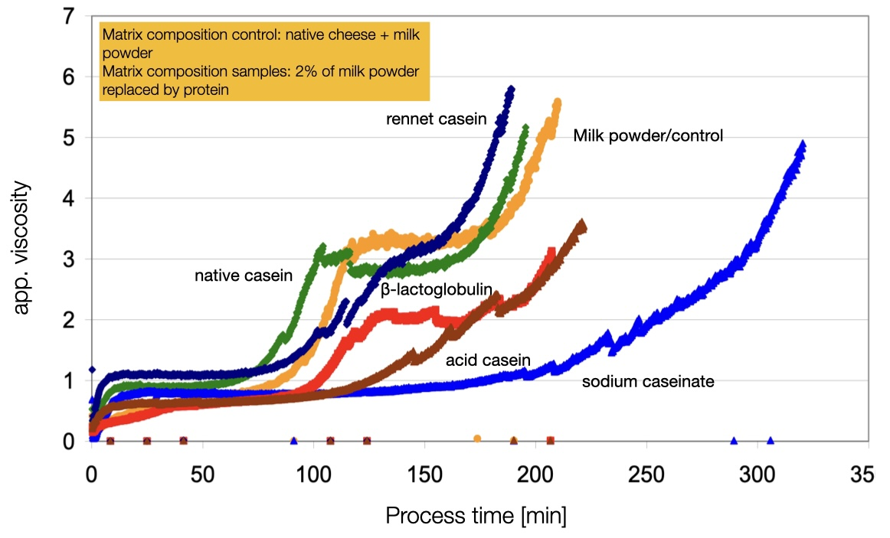
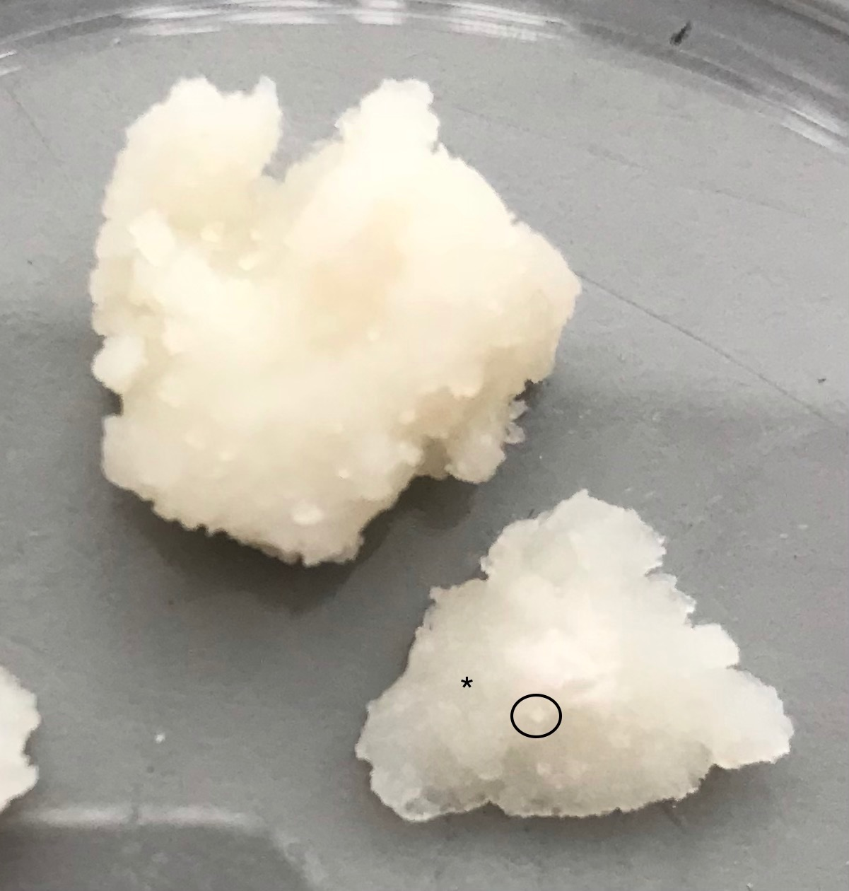
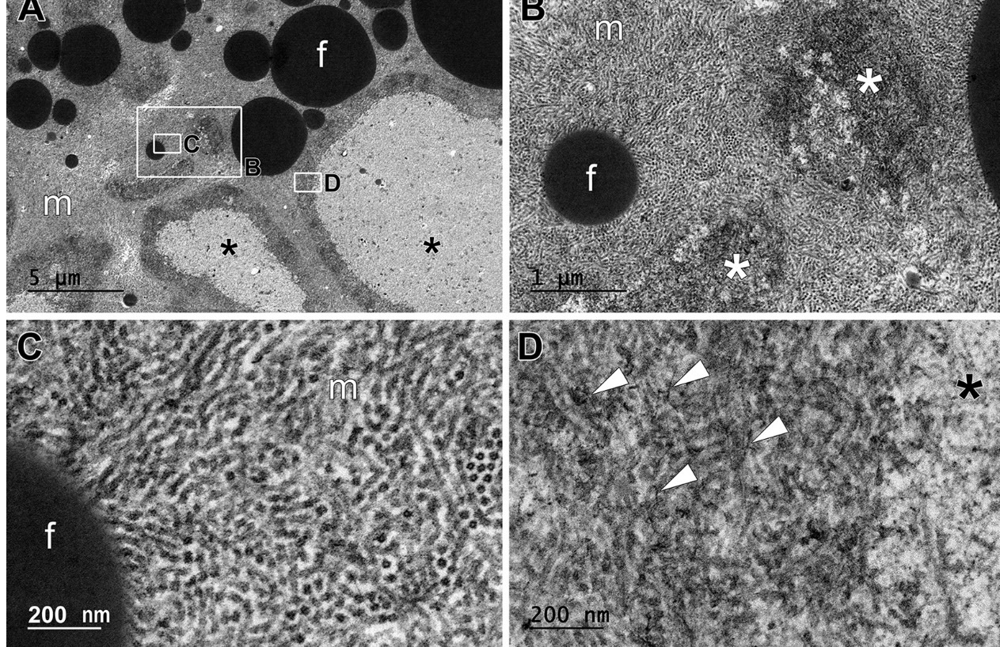
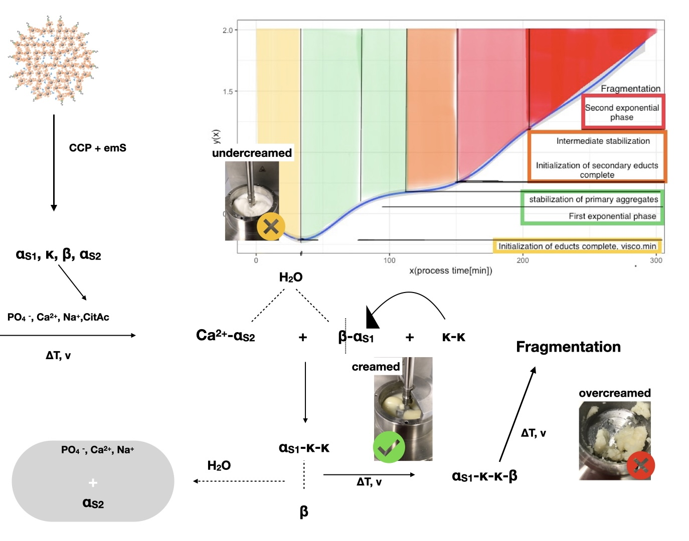

\section{General Discussion and Outlook}

The main aim of this study was to elucidate the structure formation processes occuring in protein rich, dispersed on a molecular level. The driving force that lead to structure formation of the investigated model process cheese systems, as well as to phase separation, was hydrophobic interaction in a special ionic environment, containing melting salts. Concerning the plots of the hydrophobic cluster analysis as shown in chapter 1 and the fact that the emulsifying salts enable especially kappa, alphaS1 and beta caseins to interact on a larger hydrophobic surface, the formation of insoluble structures during the processing of casein matrices is conclusive with the data presented within this work. 

It has to be sated that the viscosity measurement is not representative for the "art" that is rheology. What can be obtained by the set-up is the follow-up of the structure-formation process and a relative comparison of the structure development therein, which was sufficient for this study. Rheological characterization with oscillatory shear has been performed vastly elsewhere, for example in @Lenze2019. 

The differences in the apparent viscosity seen in the aluminum and steel are most likely to be due to a promoted autocatalytic reaction as it was presented for example in @Lenze2019 and @Cernikova2018a, also referred to as the addition of rework. Rework addition is a term describing the process of adding pre-processed material to a non-processed matrix, in order to accelerate the structure formation. The samples processed in the aluminum cup showed faster processing times and lower values of viscosity in general. The latter is probably due to the increased heat transfer in the aluminum cup. 
The first effect however could be due to the far more porous surface of the aluminum cup, where special pre aggregated protein seeds are formed in the cracks of the cup, which then promote the autocatalytic reaction. This would also explain the remaining variance (29%) in the process times that led to the model fit. 
The modellation of a flow-curve or an overall rheological profile for the model processed cheese was performed. A set of sample was used for this process, that were processed in an aluminum processing cup as in @Lenze2019. The measured apparent viscosities were calculated and fitted into a gam (general additive model), which displayed a good representation of all the obtained flow-curves that displayed a two-step structure formation. The modeled flow-curve appeared to display the shape of the curve seen in @Vollmer2021.

This model flow-curve might be specific for a system that contained solely casein as the structuring and emulsifying agent. A step wise structure formation could be detected, however the steps seemed to display underlying aggregation processes that were specific of caseins alone. 
In principle, the observed exponential phases of this study were opposite in their relative length, as compared to the preceding work. 
Samples processed in a steel cup showed a longer process time, at lower stirring speeds as in the samples analyzed in @Vollmer2021 as well as in samples that were processed at double the stirring speed (see chapter 3 model testing). In some models, where rennet casein was the source material, a pronounced second plateau phase during the second exponential phase was observable. 
The formation of the casein fibrils and the amorphous aggregates as seen in @Vollmer2021a and @Vollmer2021 could be further characterized in this study. Samples made from sodium caseinate without melting salts but an acidulent showed a distinct structure formation up to the first plateau. It was discussed, that since this model had no calcium, the only structure forming component was kappa casein, which adsorbed to the interphase which led to the viscosity increase. The method for the purification of a cream phase obtained from processed cheese and subsequent RP-HPLC analysis presented herein can be used in the future to further clarify this effect, since it can also the adsorption of beta casein to the interphase that led to the structure increase.

This shows the necessity of a purification protocol of dispersed phases from soft solid composite materials. A protocol for caseins was presented in this study. By that, the functional properties of the caseins were investigated by compositional analysis with RP-HPLC. Model processed cheese was separated into three different phases, using centrifugation at moderate (6.000g) speeds. An insoluble pellet phase, a serum phase with soluble protein  and a cream phase with adsorbed protein to the interphase could be obtained. The separation into three phases showed reproducible results in upscaling. 

Comparing the measured concentrations in the cream an pellet phases, it could be seen that they develop in a similar manner. In @Vollmer2021a it was theorized, that the fibrils from kappa casein are not the sole contributor to structure formation, which seems reasonable, since the kappa casein poses the smallest fraction of protein in the casein micelle. It was suggested that other proteins aggregate with kappa casein to form a fibrillar structure that has not been described in literature. The samples analyzed in the cited work however were processed without TSC as emulsifying salts. It has been reported, that the ratio of DSP and TSC can be used to tune functional properties and that both salts are necessary for processed cheese functionality in general (@El-Bakry2011). 
It can be theorized, that the occurrence of fibrillar structures in the cheese mass is dependent on the calcium chelation properties of the salt mixture, and the incubation time. The presence of TSC might lead to a faster chelation of calcium ions. Since it is not known, how the differing emulsifying salts work on a molecular level in the casein micelle, it can be also theorized, that TSC chelates calcium ions from the casein micelle, that furthers more initially "reactive" protein and thus an earlier occurrence of fibrils is observable. This would also explain the strong differences in viscoelastic properties of the model processed cheeses cited in the literature, when different mixtures or amounts of emulsifying salts are used. 

A particle size analysis on the centrifugationally separated phases was performed. The particle sizes in the insoluble pellet phase showed a decrease in small components at a simultaneous increase of large components during the second half of structure formation. The soluble particles were investigated after ultracentrifugation using DLS instead of light scattering, therefore their radius of gyration was measured. It could be seen, that the hydrophilic parts of the system first shrink during the first exponential phase of structure formation, while they increase in size during the second exponential phase of structure formation. Since the matrix was diluted, the displayed particle sizes are of course not the de-facto particle sizes in the processed cheese. However, it was possible to identify potential building-blocks that shape the properties of the model. These were large soluble aggregates next to small aggregates that were hydrophobic in nature and were further connected to a larger network that also emulsified the fat. 

It became apparent from the particle size measurements of the cream phase that the emulsification of the system was rather a 'by-product' of hydrophobic network formation, coming from the proteins. It can be concluded that a pronounced first exponential phase was especially found in other models not investigated in detail during this study, namely models that also contained other surface active protein moieties. \ref{fig:prot.lenze} can explain this in more detail. @Lenze2019 investigated the effect of replacing 2% milk powder (containing the more surface active whey proteins) in a 'real-type' processed cheese matrix coming from natural cheese and butter, with different protein entities. The replacement of 2% of the surface active proteins, i.e. the milkpowder, with dissociated (i.e. non micellar) casein, already leads to a complete disappearance of a first exponential increase in apparent viscosity. Native casein and rennet casein don't seem to alter the structure formation process.
The first exponential phase of structure formation displayed in this study showed only minor adsorption of caseins to the interphase, with the developed method for purification and subsequent analysis of the protein concentration and composition in the cream phase, the adsorption of whey proteins next to caseins can be studied in the future.

```{r prot.lenze, echo=FALSE, fig.cap="apparent viscosities in model processed cheeses cited in the literature, in dependence of replacement of small amounts of milk powder with the displayed protein source. Distinct first exponential phase cannot be seen in samples, when dissociated casein was added", fig.scap="Apparent viscosity of model protein cheeses with varying protein sources"}

```


The compositional analysis revealed, that the secondary aggregates besides the suspected kappa casein are made up out of beta and alphaS1 casein. The alphaS2 casein proved to play a secondary role in the formation of large insoluble aggregates, however the correlation analysis performed in the last section of this work gave insight towards alphaS2 residing mainly in the soluble fractions of the matrix. 
It can be concluded, that the protein-rich structures found during TEM imaging in @Vollmer2021 are amorphous aggregates from alphaS1 and beta casein, possibly connected by kappa casein fibrils or seeds therefrom. The areas that had a lesser protein density are supposedly populated by the alphaS2 casein.  Further, it was hypothesized that the calcium (and possibly other ions) as well as large amounts of water were stored with the alphaS2 casein, due to the depletion forces coming from the hydrophobic network formation, excluding water and ions. This results in a structure that is not completely solvable in water and thus hydrophobically aggregated.
@Sapir2015 showed two different types of depletion: entropic and enthalpic depletion. Entropic depletion occurs under the formation of a hard repulsive core of interacting molecules that co-solutes cannot penetrate. Enthalpic depletion was considered to display the 'hard-core' repulsion, next to repulsive 'soft-shell', which is defined by steric interactions.
Since the described effects (adsorption to fat, concentration in pellet of selected caseins, step-wise increase in viscosity) are not observable in a model system of sodium caseinate and emulsifying salts, it can be theorized, that the matrix segregation, is a part of structure formation. The depletion force occurs at short distances and is a strong local force (@Semenova2010). It is widely studied for liquid casein emulsions (see for example @Radford2004, @Dickinson1997, @Dickinson2012) but to the author's knowledge has not yet been presented for dense casein matrices like processed cheese. 
In emulsions, or in liquid systems in general, depletion is happening either at random or during heating due to Brownian movement. Often, it is described as depletion flocculation in dense or gelled systems, meaning an enhanced aggregation of particles due to the depletion of co-solvates from the aggregate. In the model samples the depletion is induced by the forced collision of the particles coming from the constant stirring of the matrix thus inducing a shear force by the matrix on itself, as well as by heating. 
This theory could be supported by experimental data, when investigating a colloidal system containing 3% total protein (w/w) of casein and an aliquout of melting salts. After 140 minutes of processing, large aggregates were visible. Beforehand, an increase in viscosity during heating as well as the appearance of a ~14 nm sized particle, next to larger aggregates became apparent. At later processing stages, the samples showed a high tendency to reaggregate, which hints to a favored aggregated state of caseins. This is in conclusion with the report of "sticky" fibrillar structures in the matrix as cited in the literature. The "stickyness" is herein interpreted as reactivity, or tendency to aggregate.
The HPLC analysis of the supernatants of the colloid samples revealed an initial decrease in kappa casein after 100 min of processing (heat and stir), with a subsequent decrease of beta and alphaS1 casein. Hence the primary seed, that led to hydrophobic aggregation that was looked for in this study was revealed to be a kappa casein fibril or primary aggregate (as seen in the needles after 415 minutes of processing as in @Vollmer2021), on to which alphaS1 and beta caseins aggregate.

@Vollmer2021 reported such a matrix separation in a model processed cheese system, that was processed using high heat (90 C) and approximately half the amount of stirring speed (~8 rpm) in a small processing unit with a sample weight of ~40 g. The matrix separated into areas of high electron density, where the appearance of fibrillar or tubular aggregated casein was detected and areas of lower protein density, where amorphous aggregates were displayed. This fits the results obtained in this study well and could further target investigations on the power of depletion or molecular exclusion in general in the formation of dense matrices. To further explore the theory, that the hydrophobic aggregate is not only formed in the dense matrix but also in diluted form, it is highly suggested to investigate the aggregate that is formed in the colloidal solution by TEM. 
Also, a variation in salt composition in these easy to prepare systems is highly suggested. Since the fibrillar structures only appeared at late processing stages in samples cited in the literature that were prepared without TSC, the preparation of the colloid samples without TSC should reveal, if the matrix separation is in its overall degree dependent on process or chemical (i.e. compositional) conditions. 

The exclusion of alphaS2 casein from the hydrophobic network must be due to electrostatic reasons, if this theory is applied. It is possible that the calcium is indeed present in chelated form. If this would be the case it can be theorized, that alphaS2 casein has a specific affinity for complexed calcium that the other caseins lack, which could further elucidate the binding of the casein micelle. If the calcium is in ionic form, the same applies, since then a special sensitivity or a binding modulus to ionic calcium of alphaS2 over the other caseins can be theorized. 
In the ranking of calcium sensitivity, alphaS2 caseins rank the highest, their high solubility in water is dependent on their centers of phosphorylation (@Aoki1985). From the results obtained during this trial, it can be theorized that the alphaS2 casein poses as the "definitive connector" to the ionic calcium or the CCP, whereas alphaS1 and beta casein can interact with each other, ionic calcium or CCP, or the alphaS2 casein. Kappa casein is believed to be genetically designed to sit on the outside of the micelle to carry the negative charge of CMP into the milk serum (@Dalgleish2012, @Holt2013). Further exploring the concept of genetic design, it can be theorized that kappa casein was not designed to interact in close range, therefore it aggregates to seeds or fibrils, that leads to further hydrophobic aggregation of beta and alphaS1 casein. This theory can also be supported by the fact that the melting salts are entering the casein micelle from the outside in, therefore, the outer lying kappa caseins are one of the first caseins to be released from the micelle and therefore start to aggregate early and selectively with each other during processing.

Diffusing wave spectrometry (DWS) poses as another tool to follow aggregation processes, as in @Alexander2006, but also destabilization phenomena, as in @Hemar1999 and @Vogt2015. 
The latter used DWS and small amplitude oscillation rheology, on heated cheeses (Mozzarella, medium Cheddar, aged Cheddar) and determined a progressive increase of free water in the system as cheese is heated. This effect is also seen in the T2 relaxation data obtained in this study. Over the course of processing, a progressive increase in the mobile fraction of water (T2 ~120 ms) was apparent, whereas the T2 relaxation of the detected fat-phase decreased. 
Considering the effects of matrix separation, it can be concluded from @Vogt2015 that a matrix separation in heated cheeses is also indicated by a redistribution of water. Since the progressive loss of mobile water is detectable without apparent (or forced, as in @Dang2019) syneresis or water evaporation as indicated by a strongly increasing dry matter,  this must mean that there are areas in the aggregated casein structure, that fulfill the function to hold the water in the system, whereas the other caseins participate in hydrophobic network formation.

When over-processing the cheese matrix, i.e. excessing the amount of energy and forced collision from agitation that is needed to perform the 'creaming-reaction', a particulated, almost crystalline structure of the cheese becomes apparent. It has to be noted, however, that these samples were by design strongly overprocessed, in order to find an apparent "end" point of the creaming reaction, or a maximal aggregated product. This overprocessing also lead to a notable increase in dry matter of >10%, however, what could be seen were lighter and darker areas in the protein structure (Fig.\ref{fig:cristalline}).

```{r cristalline, echo=FALSE, out.width="50%", fig.cap="Over-processed 'end-point' of the creaming reaction, appearance of the product. Incorporation of lighter globular areas (circle) into a darker matrix, containing fat (asterix)", fig.scap="Particulated gel"}

```

Applying the general concept of imaging techniques that darker areas indicate areas of higher protein density, it can be readily concluded from the appearance of the samples at the "end point" of the creaming reaction, that a phase separation has taken place.
From the investigation of the centrifugationally separated phases it was apparent, that the structures that were defined herein as 'hydrophobic-aggregates' were insoluble in water, but did show a stronger tendency to swell. The swelling behaviour was displayed in the pellet as well as in the cream phase (chapter 4 of this work). This shows, that the hydrophobic structures are formed under the exclusion of water at their core, but with hydrophilic structures, that are probably high in charge, at their surface. This also means, that the hydrophobic network formation might occur *in-situ* under the exclusion of water, without the necessity of water to leave the system, since it can be, in a way, compartmentalized in the system. This behavior of proteins is commonly known and one of the main reasons, why many proteins, such as whey proteins, appear in globular form.
This is supported by the fact that the samples investigated in @Vollmer2021 were not processed to the particulate "end-point" of the creaming reaction as described earlier, but were still elastic, probably due to the remaining water in the system. 

The particle sizes measured in the pellet and in the differently centrifuged serum phases were in conclusion with the obtained TEM images of the model cheese mass, cited in the literature. From particle size analysis in the pellet, it could be seen that a large network develops during medium to late processing stages, that further is fragmented into smaller sub-units at late processing stages. Fig.\ref{fig:TEM415} shows the TEM image of the beginning matrix fragmentation.

```{r TEM415, echo=FALSE, fig.cap="TEM imaging of model processed cheese prepared at low stirring speeds after 415 minutes of processing; \ lighter areas display areas with low protein density (asterix), these are surrounded by a dens band of a protein network that showed breakage of fibrils into needeles (arrowheads) and amorphous structures, the surrounding matrix (m) displayed convoluted and fragmented fibrillar structures, that emulsify the fat.", fig.scap="TEM images of model processed cheese at late stages of processing"}

```

In chapter 6 of this work, a reaction meachanism for the protein aggregation occuring in the model processed cheese system was shown. This mechanism consists of a two step aggregation process that leads to phase separation. As it was discussed earlier, for phase separation to occur in this environment, alphaS2 casein is supposed to be in a state, that either still has calcium bound to it, or binds calcium more readily than the remaining caseins. @Hindmarsh2017 showed the presence of previously unclassified calcium structures in the casein micelle. New immobile phosphorus bodies were found, that were suggested to reside from phosphoserine-to-phosphoserine linkages that can be inter- or intra-proteinogenic. 
Looking at the HCA plots Fig.\ref{fig:HCA}, alphaS2 has a serine free, hydrophobic planar area between residues 80 and 140, neighbored by large serine containing areas. In a dense environment, where caseins cannot swell or (all) carry large hydrate shells, they might conform into a structure as suggested in Fig.\ref{fig:HCA}. An intramolecular calcium binding of alphaS2 casein could be the reason, why no (exponential) structure formation was seen in the sodium casein models, since the alphaS2 casein in sodium caseinate either lacks the intramolecular bond to begin with or cannot form it due to a minimal concentration of calcium ions. 
Since sodium caseinate is readily used in combination with calcium in processed cheese production, and since calcium is long known to prevent sodium caseinate emulsions from depletion flocculation (@Dickinson1998), it is thinkable from the results obtained in this study, that the formation of an intramolecular phosphoserine - calcium - phosphaserine bridge in alphaS2 casein is the reason why it is not participating in the hydrophobic aggregation. The structure formation as well as the subsequent phase separation is suggested to occur due to depletion.  
@Sapir2015 made vast investigations on the depletion force. Depletion occurs from the exclusion of co-solutes from macromolecules, which creates an attractive force between the macromolecules that exclude the co-solute. Therefore it promotes self-association of the macromolecules. Also attractive depletion forces induced by heat were shown to occur. Considering the findings in this study, entropic depletion of the co-solutes (i.e. ions) from an hydrophobic aggregate seems thinkable. In addition, enthalpic or steric depletion of alphaS2 casein due to its hypothesized non-planar conformation from an intramolecular calcium bond is also contributing to the aggregation processes observed throughout this study.

Therefore, the reaction mechanism shown in section 6 of this work (Fig.\ref{fig:mech1})can be supplemented and a conclusive mechanistic explanation for the phenomena observed and measured within this study on a molecular and macroscopic level, can be given (Fig.\ref{fig:mech2}).

```{r mech2, echo=FALSE, fig.cap="Structural changes that lead to an increase in viscosity in model processed cheese." }

```


The fragmentation of the aggregates at late stages of processing can be considered to be irreversible. Indications for fragmentation were also found during the measurements of the different cream phases: at later processing stages, peptide fragments were apparent. This also includes that by fragmentation, the process becomes fully irreversible. It cannot be estimated, if the formed aggregates are stable at changing milieu conditions. It is expected, that for example ethanolization might reverse the hydrophobic aggregation to some degree.

Another effect that became apparent from the comparison with previous works, the casein aggregates are not brittle aggregates, but can be aligned during processing which makes them shapeable. This is not new for casein, since pasta filata cheeses use this as a key production step. It is thinkable, to use these now newly identified hydrophobic casein structures in a targeted manner. Since it is a heat set process that seems to allow shear to shape the structure, 3D printing is a possible application for the hydrophobic casein aggregate.
