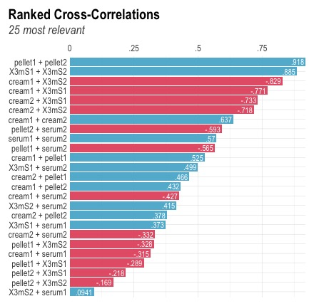
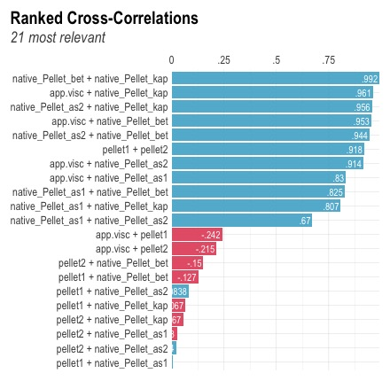
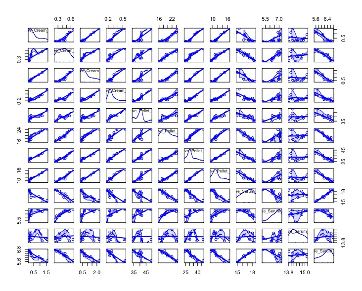
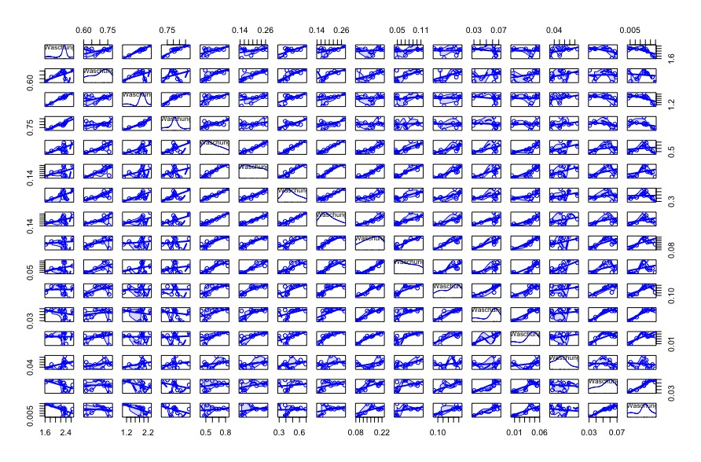

\subsubsection{Process Parameters influencing the Rheological Profile}

**Numerical Method: factor analysis**
*maybe exclude this set*
In order to explain the variance within the rheological data, a factor analysis was performed. Five factors were chosen for analysis:
* pre-mixing intensity
* aggregation rate
* calcium release
* free Energy
* total shear stress

*Describe Factors*

```{r echo=FALSE, fig.cap="Factors influencing the aggregation rate represented as total increase in viscosity over processing-time-increment: The aggregation rate (agg.rate) is independent from shear stress and free Energy (i.e. heat transfer) but calcium release (induced here by emulsifying salts in native and rennet casein samples) and pre-mixing intensity affect the degree and speed of aggregation (i.e. the aggregation rate)"}
rhfa_plot+theme_bw()
```
The factor analysis of the summary of the rheological data shows, that the pre-defined factor "aggregation rate" is independent from the shear or energy intake. This means, that the increase in viscosity over time can be accelerated by increasing the process temperature or shear rate. However, the occurence of an overall viscosity increase during processing is mainly dependent on the pre-treatment and composition of the samples, i.e. pre-mixing intensity and calcium release. This is in conclusion with the findings of **QUELLE** ...

```{r chapII_fa, child='chapterIIadd.Rmd'}
```


Since the correlation analysis of the compositional data was considered to give conclusive results, a further link that was in theory established by the comparison of experimental data is the development of the measured, and subsequently modelled (see chapter 6) data for particle size or particle volume distributions. 
In the experimental section of this work, a set up was designed to investigate possible similarities in a colloidal casein solution and a model processed cheese matrix. By correlation analysis, the link was tried to be found numerically.

In analogy to the analysis above, first the centrifugationally separated phases were investigated for correlation of their modelled small and large components, as well as their respective density distributions in a separate analysis.

The correlations found in the particle size or respective particle volume distribution are displayed in Fig.xx.
```{r , echo=FALSE, out.width="50%", fig.cap="Correlations ranked by significance value of particle size or volume data, \ positive correlations displayed in blue, nagative correlations in red colour"}

```
EXPLANATION OF FIGURE 


```{r , echo=FALSE, out.width="50%", fig.cap="Correlations ranked by significance value of data measured in the pellet; \ the apparent viscosity is included by default, since it measures all phases. Positive correlations are displayed in blue, nagative correlations in red colour."}

```

Fig.xx indicates that the main structure formation process is happening in the pellet phase, since all the positive correlations displayed in the upper half of Fig.xx correlate to structure formation. 


\newline
**Appendix B**
\newline
The following supplies supplementary data for the correlation analysis performed on the compositional data presented in chapter 4. The correlation plots displayed below were analyzed in further detail.

```{r , echo=FALSE, fig.cap="Correlation plot of HPLC measurement data of protein concentrations measured in the centrifugationally separated (and respectively washed) cream 1:4, pellet 5:8 and serum 9:12 phase. Protein concentrations are displayed in the order alphaS1, alphaS2, beta and kappa casein." }

```


```{r , echo=FALSE, out.width="80%", fig.cap="Correlation plot of HPLC measurement data of protein concentrations measured in the centrifugationally washed phases of the cream: 1st washing step 1:4, 2nd washing step 5:8, 3rd washing step 9:12 and 4th washing step. Protein concentrations are displayed in the order alphaS1, alphaS2, beta and kappa casein."}

```

