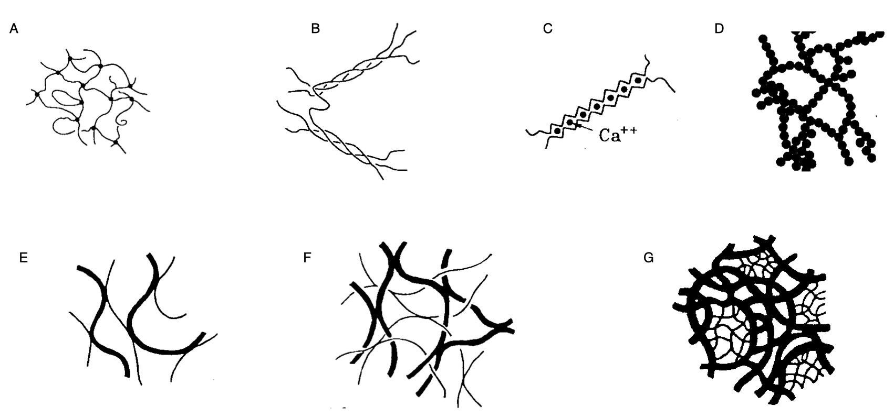
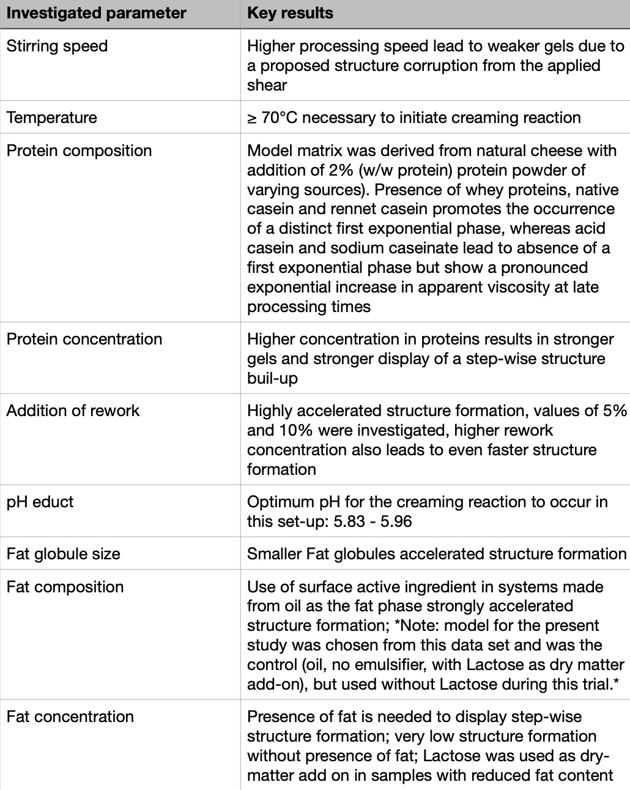

\section{Casein and its interaction properties in complex food systems}

In many complex, highly concentrated food systems, characteristic structure-forming processes take place that have so far only been described in phenomenological terms. The structure of food products is created during the process of transforming the raw materials into the final product (@McClements2007). Overall, it shapes the mouthfeel, which is expressed via sensory attributes such as creaminess, etc., but also plays a role in determining the intensity of the taste and aroma sensation.

The dominant structure-forming components are mostly proteins that are ready to aggregate. Protein-rich product systems play an increasingly important role in human nutrition, but also in pharmaceutical biotechnology. Examples are clinical and geriatric nutrition, where swallowing problems require a specific structure or viscosity controllable by protein aggregates, e.g. to circumvent the problem of "dysphagia". On the other hand, in certain neuro degenerative phenomena, the occurrence of chronic diseases is often associated with the phenomenon of aggregation, albeit under very different milieu conditions than in food, as it was reported in @Mezzenga2013. 

Elderly people and athletes require protein-rich foods to counteract progressive muscle loss and to support muscle building, respectively. Ignorant of the fundamental interrelationships of the structure-forming potential of proteins in highly concentrated systems, especially in complex multi-phased systems, one is currently not yet sufficiently able to make targeted use of protein-based structure formation in the sense of efficient, quality- and productivity-guided process control. Further, many modern pharmaceuticals today are proteins whose aggregation behavior determines their efficacy as therapeutic agents.

An emerging trend is the need for structure formation by rapid aggregation, generally for intensification of processes or, for example, in the design of food products in 3D printing processes. Here, novel structure formation processes are a prerequisite to achieve spontaneous solidification of the structure built from liquid or pasty base materials. As a recent example for this emerging trend, the work of @Kang2021 describes 3D printing of cultured meat cells derived from stem-cells into structures similar to fresh-cut meat from Waygu beef. The procedure hereby consisted of printing fibers from muscle and adipose tissue into a tendon-gel, which serves as the meat matrix. Accordingly, the formation of the gel in which novel food structures can be incorporated as well as the printing process itself are of interest when it comes to aggregation phenomena in food systems.

In order to target such specific structure formation processes, it is necessary to understand protein aggregation and especially the interaction with dispersed phases on a molecular level (@Hubbard2003a, @McClements2007). Many studies have been performed on a microscopic scale on the aggregation phenomena in colloidal, or rather liquid systems such as emulsions made from caseins (@Brunner1991, @Alexander2006, @Mizuno2005, @Liang2013 ,@WONG201291). On the other side of the spectrum, many studies have been performed on the physical properties of gelled or solidified systems (@Matsumura1993, @Brighenti2018, @Berta2016, @Sadlikova2010, @Salek2017).

If one wanted to analyze both effects simultaneously, i.e. the effects coming from a proteinogenic phase interacting with a dispersed phase, as well as the effects of gelation of said proteins, a system must be investigated, that shows both properties. The gain of knowledge coming from the investigation of such systems would be, that further insight could be given as to how a dispersed phase either stabilizes or destabilizes such systems, and if the formation of a continuous network is overall influenced by the presence of a dispersed phase.

A specific food system, which can be generalized in a way that it is generic towards many food systems, is processed or cream cheese. On the one hand, it is a heat-set gel, where aggregation processes occur during the heating phase, that lead to a gelled structure in cold state. On the other hand, it has a dispersed phase embedded in the gel structure, wherein the emulsification of the dispersed phase also occurs during the heating phase. The heating phase is referred to as processing, however the term processed cheese should not lead to the assumption that store-type cream cheese is processed without the use of heat. An intensive study on the structural behavior of commercial cream-cheese products has been performed by @Dang2019. Structure formation processes in processed, or sometimes also referred to as analogue cheese samples was investigated extensively also in recent years, Table 1 gives a non conclusive overview of studies performed in such systems. 

@Lamichhane2018 gave an overview for the scale levels in native cheese and their functional domains (Fig.\ref{fig:ch.sc}). On the molecular scale, milk salts, lactose, water and whey proteins can be found. The nano-scale which presents to be an important scale for the formation of complex structures, casein aggregates and on the higher nano scale casein micelles can be found. The micro scale in processed cheese is manly attributed to emulsified fat-globules or fat-particles. Native fat globules are not to be found in processed cheese models that are not using dairy cream as the fatty or dispersed phase. The macroscale represents the scale visible to the human eye and represents visible crystals or cracks in the structure. 

```{r ch.sc, echo=FALSE, out.width="75%", fig.cap="Structures found in cheese in the micro-, meso-, and macroscale as cited in the literature"}
knitr::include_graphics("images/scales_cheese_Lamichhane2018.jpg")
```

Such systems can be considered as emulsion gels or 'soft-solids', as in @Dickinson2012, where they are either characterized as an emulsion filled or particulate gel. Hence the main difference lies in the embedding of the dispersed phase into the structured continuous phase. 

The structured continuous phase in processed or cream cheese is built by caseins. As amphoteric proteins, caseins also emulsify the fat or fatty phase. Hence, investigating processed or cream cheese as a representative for a soft, solidified or gelled dispersed food system can provide insight into the structuring mechanisms of such structures. It might also give hints towards the occurrence of aggregation phenomena, or investigations of such, in biogenic systems in general. This concept is explored further down below.

\subsection{Casein: structure and functionality}

Milk contains two main classes of proteins, the mostly globular and heat sensitive whey proteins and the major milk proteins: caseins. Caseins can be isolated from milk, using acid treatment at pH 4.6 and 20°C. Under these circumstances, the caseins will precipitate due to the screening of electrostatic repulsion. This happens as an effect of being close to the IEP, whereas whey (and other) proteins will stay in solution. Calcium precipitation of caseins can be also used in a targeted manner, to isolate specific caseins from the micelle by their differences in calcium sensitivity (@Post2012). Since milk proteins are thus separated relatively easy, first research on caseins was performed as early as the beginning of the 19th century (@Huppertz2018a).

The casein micelle is a highly aggregated particle, stabilized by hydrophobic interactions and electrostatic interactions internally. Externally, it is stabilized by steric repulsion through the outer "hairy-layer", mainly consisting of kappa casein. With a surface area of about 4000 m2/l at a specific mass of 1.11 g/ml (20°C) and a number of 1014-1016 micelles/ml of raw milk, caseins are the main component of milk proteins. This is also represented by the strong hydration properties of the casein micelle. Caseins are reported to display a mean hydrodynamic radius within a range of 50-500 nm and are able to bind up to 2.5 g of water per gram protein. Thus, caseins make up ~13% of the volume fraction of milk, roughly five times higher than their dehydrated mass proportion in milk (@Dalgleish2012, @Fox2009).

The average molecular weight of a dehydrated micelle is about 108 daltons. The micelle itself is composed of four different casein fractions, of which different genetic variants exist: alphaS1-, alphaS2-, beta- and kappa-casein. The percentage ratio of the total protein is 30:8:30:10. The dry matter of a micelle comprises 94% protein and 6% colloidal calcium phosphate (CCP). CCP further comprises magnesium, calcium, phosphate, citrate, sodium and potassium ions (@Gaucheron2012). The exact structure of the casein micelle is not yet fully known and many models have been proposed, most recently by @Dalgleish2012.

The effect of high pressure (150-300MPa) on the casein micelle structure in milk showed the occurrence of small micelles next to large micelles under the use of cryo-transmission electron microscopy (cryo-TEM). Higher pressurization rates of 400 MPa resulted in the formation of smaller casein assemblies of 30-100 nm in size. It was also found, that free Calcium was taken in by the casein structures and that the substructures induced by high pressure treatment can be also found in untreated milk (@Knudsen2010). This shows, that the caseins are highly prone to self-assembly and aggregation, especially under the presence of calcium ions. 

To this day, the inner structure of the casein micelle is unclear. Elucidation of the inner structure using imaging techniques such as transmission electron microscopy (TEM) is not possible, since the molecular density in the casein micelle is too high. The sub micelle binding model, presented by @WALSTRA1999189 but developed from preceding models considers the casein micelle to be an aggregated particle made out of, again micellar substructures. In the sub-micelles the CCP is incorporated. On the surface of the casein micelle, a so-called "hairy-layer" made out of kappa casein prevents the micelles from *in-situ* aggregation in milk, due to steric and electrostatic repulsion. This model is grounded on experimental evidence. It was, for example, shown that casein monomers self-assemble into sub-micelles, when calcium ions are present.  

```{r sub-m, echo=FALSE, out.width="50%", fig.cap="Sub-micelle binding model as presented in the literature: \ caseins are arranged in spherical sub-micelles, in which CCPs are incorporated", fig.scap="sub-micellar binding model of the casein micelle"}

```

In later models, the focus of casein micelle stabilization was shifted to the calcium phosphate nano-clusters (CCP). The nano cluster model (Holt et al. (1998)) was followed by the dual binding model. Both models suspected the CCP to stabilize the casein micelle internally, as well as hydrophobic interactions in balance with electrostatic repulsion.

According to investigations of @Huppertz2017, the stabilisation of the micelle in the interior takes place via the CCP nano-clusters. This was found by investigating differently bound water in the casein micelle. It was possible to identify non-sperical particles, which were referred to as primary casein particles (PCP), which form a porous micelle structure through linkages via calcium phosphate nanoclusters. What's interesting here is that seemingly rebuilt casein micelles from sodium caseinate displayed similar properties as native and dried casein micelles in terms of radius of gyration, or particle size.

```{r dual-b, echo=FALSE, out.width="50%", fig.cap="Dual-Binding model of the casein micelle by as cited in the literature: beta and alpha-caseins (orange) are connected to the CCP (grey spheres), blue represents free beta-casein, hydrophobically bound. Micelle is stabilized by kappa-casein (green) wherein the black coil represents the casein Macropeptide (CMP) "}
knitr::include_graphics("images/micelle_Dalgleish.jpg")
```
In the model of the casein micelle from @Dalgleish2012 (Fig.\ref{fig:dual-b}), CCPs are connected to the phosphorylated serine side chains of the caseins via a calcium phosphate bridge, as indicated by the grey spheres. Furthermore, hydrophobic interactions and van der Waals forces contribute to the stabilisation. Among the casein fractions homogeneously distributed inside, the kappa casein sits at the surface of the micelle and stabilises the micelle through its outwardly directed, strongly hydrophilic and negatively charged part, the casein macropeptide (CMP). The negative charge causes steric repulsion of the micelles from each other, which leads to colloidal stability of the micelle. The hydrate shell additionally stabilises the micelle.
The kappa casein as "hairy-layer" is also presented in the dual binding model. Also of importance is the fact that a casein micelle is not a static system, but is in a dynamic equilibrium with the milk serum. This equilibrium can be disturbed mainly due to the calcium sensitivity of the individual casein fractions. While kappa-casein reacts quite insensitively to calcium ions, the two alphaS-fractions are strongly calcium-sensitive (@Holt2013). By binding calcium ions on the surface, the outer kappa-casein protects the calcium-sensitive casein fractions inside the micelle and thus prevents a calcium-induced structural change @Huppertz2018a.
An overview of the distribution of the calcium in the casein micelle was presented in @Dumpler2018 and can be seen in Fig.\ref{fig:ca}.

```{r ca, echo=FALSE, out.width="75%", fig.cap="Distribution of calcium in milk"}

```

From that it can be seen, that the binding state of calcium in the casein micelle is dependent on milieu conditions (pH, water concentration, Temperature). 

\subsection{Overview of gelation mechanisms}

Gelation of biopolymers is a phenomenon generally recognized as the solidification of a matrix by interaction(s) of the biopolymers, here proteins, with the solvent. Gelation can happen due to various reasons. Gelation induced by the formation of covalent bonds is used often in organic, non edible gels as in acrylamide gels for gel-electrophoresis. Covalent gelation in casein occurs, when treated enzymatically with transgrlutaminase, which connects the glutamine residues in a protein by intramolecular bonds. In general, gels from casein are particle gels, as in (D) of Fig.\ref{fig:gels}.

```{r gels, echo=FALSE, out.width="80%", fig.cap="Overview of gelation mechanisms, top row displays single component systems, bottow row shows interaction properties of multi component systems: (A) covalent or chemical gel, (B) thermo-reversible gel, (C) ionic gel, (D) particle gel, (E) coupled networks, (F) inter-penetrating networks, (G) phase separated networks", fig.scap="Types of gelation in biopolymers"}

```
Casein gels are not monomeric gels but are formed by interaction of the four components: alphaS1, alphaS2, beta and kappa casein. When looking at processed cheese it is evident that it is a composite gel with a dispersed phase embedded in it. Such systems have been described as emulsion gels and will be described in the following section.

\subsubsection{Emulsion gels: special types of composite materials}

Process-cheese based casein gels can be viewed as emulsion gels. Emulsion gels are soft solids with incorporated, emulsified fat droplets or fat particles. @Dickinson2012 made an intensive description of such structures which was also based on his own line of research as in @Dickinson1998, @Dickinson2006. 
Emulsion gels can incorporate two basic structures: the emulsion-filled protein gel (A) and the protein-stabilized emulsion gel (Fig.\ref{fig:efg}). It should be taken into consideration, that these two types pose the ideal structure, in real life models mostly a mix of the two gel types is present at the same time. 

```{r efg, echo=FALSE, out.width="50%", fig.cap="Types of emulsion gels: (A) emuslion filled gel, the proteins (green) emuslify the fat (yellow) and are embedded into the matrix. (B) particle gel, the proteins at the interphase connect the fat particles to a continous matrix", fig.scap="Types of emulsion gels"}

```

An emulsion-filled protein gel is characterized as a gelled protein matrix with embedded emulsified fat droplets. The viscoelastic properties of such gels are mostly determined by the continuous phase, i.e. the proteins.  
The protein-stabilized emulsion gel is a type of particulate gel whose properties are mostly directed by the formation of a network of aggregated fat droplets, or rather fat particles. The fat particles are considered filler particles and the properties of the gel are also directed by the properties of the filler (@Matsumura1993). It was shown, that gels with incorporated filler in form of fat particles had higher shear moduli as their fat free counterparts. @Brighenti2018 described processed cheese as emulsion filled gel. 
An emulsified fat droplet is considered to be a solid-like material in both systems. Formation of emulsion-filled gels usually takes place, when the bulk phase of a stable emulsion is solidified. Gels of the particulate type are formulated, when the emulsion droplets aggregate. Destabilization phenomena in emulsion gels are, for example, induced by excess amounts of unadsorbed protein that leads to depletion. Another type of destabilization or stabilization, for the respective matter, is bridging flocculation (@Semenova2010, @Sapir2015). 

\subsection{A complex food system: processed cheese}

In a highly concentrated protein systems, such as processed or cream cheese, wherein large protein aggregates are present, the inner structure is usually very complex and influenced by numerous factors. Furthermore, proteins in biogenic systems generally occur in different molecular structures as well as molecular scales. Such food systems often are multi-phased systems. Thus, proteins arise in combination with other substances, such as fat or carbohydrates.
Processed cheese serves as an example of a complex, highly-concentrated, and multi-phased protein system. Milk proteins (caseins), fat, and water form a dense network, triggered by the reaction of caseins with melting salts. The structure-forming reaction takes place in several stages and only under certain process conditions. 
@Guinee2004 gives an overview of cheese products that are made under (excessive) heat, meaning they are thermally processed. Such products are also called pasteurized cheeses. Also, a manufacturing protocol for processed cheese products is given.

@Fox2016 gives a summary on processed cheese products, additives in processed cheese and the development of processed cheese throughout the years. It is mentioned, that heating and shearing of a native cheese mass leads to coagulation of casein and the release of fat due to the rupture of the milk fat globule membrane (MFGM) as a result from shear and heat. Emulsifying salts are used to dissociate the caseins from their micellar form, which prevents them from coagulation and leads to hydration of single caseins that can emulsify the fat phase. According to the cited literature, the emulsifying salts fulfill the following functions, or induce them in the caseins:

  * upward adjustment buffering of pH 
  * chelation of calcium after sequestration and de-ionization of the micelle calcium
  * casein hydration 
  * binding or emulsification of free fat 
  * novel structure formation to the processed cheese matrix.
  
The steps necessary to form processed cheese are mainly mixing of the educts, i.e. cheese components and subsequent processing of the cheese mass at Temperatures between 70 - 95C$^\circ$ and constant mixing. The educts for processed cheese can be in powdered, liquid or in their native, i.e. gelled form, when natural cheese is used. Hence the type of mixing depends on the grain size or dispersity of the primary components or educts. 

Common additives in the production of processed cheeses are whey protein concentrate, starches or hydrocolloids like carageenaan. These can be found especially in cream-cheese products, where the dissociation of the casein micelle is not induced by melting salts, but by acidification. In such systems, stabilizers in the form of hydrocolloids are often used to prevent excessive syneresis of the cheeses.
Syneresis, the release of water of gelled dairy systems, is a phenomenon not occurring in processed cheeses. This might be due to high dry matter, however it is likely, that the stronger dissociation of caseins into substructures or monomers (induced by the melting salts) leads to a stronger hydration of the matrix, since more hydrateable protein units are available in total.


The main component in processed cheese is casein. Their primary aggregated structure when derived from rennet or native casein gets disrupted chemically by the melting salts a new structure is build-up due to the constant shearing and heating of the matrix.
The type of shear applied to the system is in partial determined by the composition of the educts: when working with fresh cheese curd or (model) cheeses like mozzarella or dried cheese curd, the matrix is more kneaded than stirred, as it is the case in @Noronha2008, @Noronha2008b, @Noronha2008c, @Chen2012 and @El-Bakry2011. 
Processing environments, where the emphasis was on the investigation of the structure formation itself at various processing conditions were given, besides others, by @Cernikova2018a, @Lee2003a, @Guinee2004, @Fu2018, @Fu2018d, @Cunha2013, @Lenze2019 and in the parallel work of @Vollmer2021. In these studies, the samples were of a more homogeneous or even liquid like sate in the educt stage and were processed under stirring. A summary of the studies that dealt with similar systems as in this work can be found at the end of this section.

\subsubsection{Casein interactions at the presence of melting salts}

Caseins can be described as amphoteric phosphoproteins with different hydrophobicities (@Horne2017). Their amino acid composition is not unlike those of globular proteins, however, the high level of proline hinders caseins to form globular structures. Four different gene products of caseins can be found not only in bovine milk, the alphaS1-, alphaS2-, beta-, and kappa-casein. The interactions of caseins that lead to the initial formation of micelles, as well as their interaction properties in general, have recently been debated (@Horne2017, @Horne2017b, @Holt2013, @Thorn2015). However there seems to be a common understanding on two major types of casein interactions that lead to micelle formation, hydrophobic interactions and the formation of calcium phosphate nanoclusters (@Lucey2018). 
Accordingly caseins are molecules that can interact with each other via hydrophobic interactions, as well electrostatic interactions. 
The casein micelle models presented earlier in this section are both based on the long established theory that hydrophobic interactions are a driving force for micelle assembly as well as casein aggregation (@Horne2017b). Hydrophobic interactions occur under the exclusion of water. When two opposing surfaces get close, an energy benefit arises from the new conformation of the water molecules that were disrupted by the interacting surfaces or structures. 

For estimation of the hydrophobicity of caseins, especially in the special ionic environment present in processed cheese, a hydrophobic cluster analysis (HCA) might give further insight. This type of computational analysis allows one to take into consideration, that the caseins are not lacking any kind of substructure, since there is evidence by the self-association behavior and the large amounts of hydrophobic areas in the molecule that the caseins are not intrinsically unstructured proteins (IUP) (@Huppertz2017, @Lucey2018). Their flexibility is rather derived from the high amounts of proline that allow the protein-string of the casein to remain flexible and to not conform into a globular state. 
The HCA plots show caseins in a sub-helical structure with a unit length of ~10. The amino acids in close distance within the plot can form functional areas, such as hydrophobic clusters. The coloring of the HCA plot is designed to highlight hydrophobic interaction sites, or clusters. Other amino acids are highlighted as well. Serin can occur in substituted form (as it is the case in caseins) as well as threonine, glycine poses a potential binding site and proline disrupts helical or higher ordered structures. Therefore, special symbols were chosen, as it is described in @Rebehmed2016. 
\newline
The plots were created with the website: \url{http://mobyle.rpbs.univ-paris-diderot.fr/}.


```{r HCA, echo=FALSE, out.width="100%", fig.cap="Plots on hydrophobic cluster interactions of caseins: \ (A) alphaS1 casein, (B) kappa casein, (C) beta casein, (D) alphaS2 casein; legend as cited in the literature , with addition of grey squares to highlight serin (dotted square) areas. \ hydrophobic amino acids (green) are grouped and surrounded with a solid black line to form clusters, prolin (red star), glycine (diamond), threonine (square) are also highlighted." , fig.scap="Hydrophobic Cluster Analysis (HCA plot) of caseins"}

```

In the HCA plots, caseins comprise of hydrophobic areas that are disrupted by fractions that carry charge by phosphorylation of serin (Fig.\ref{fig:HCA}). Serin rich structures were marked (gray boxes), since they are potential candidates for post-translational transformation, and then carrying a substituted phosphate group at the serin residue.
The charged areas coming from serine residue display different degrees of phosphorylation. A direct relationship between the degree of phosphorylation and calcium binding by chelation has been shown, which is why the calcium sensitivity of the caseinates is in the order kappa < beta < alphaS1 < alphaS2. The distribution of charged serine residues is not uniform in the caseins (@Aoki1985, @Clare2000).
Looking for example at kappa casein (Fig.\ref{fig:HCA}(B)), it can be seen that the serin residues are arranged over larger areas in the so plotted molecule, however in little quantities, when compared to, for example the residues 20-35 in alphaS2 casein (D). Besides the display of charged residues, the HCA plot also reveals planar hydrophobic areas, without charge from phosphoserine, due to high amounts of prolin (indicated by a red star). Such areas can especially be found in beta casein (see for example amino acids 195 - 120), but also in kappa casein (amino-acids 60 - 85) and alphaS1 casein (amino acids 15 - 45). When removing the charge (which means especially removing the CCP in this case), the planar hydrophobic areas of these three caseins become even larger. 
AlphaS2 casein displays smaller planar hydrophobic areas at amino acids 110 - 120 and 205 - 215. Even more, the planar hydrophobic area is not increased by removal of the CCP, since they are not directly neighboring hydrophobic and proline rich areas in alphaS2 casein.
Hydrophobic interaction happens on the surfaces of the interacting molecules. Hence the arrangement of planar and hydrophobic areas in the caseins, with respect to the localization of their serin rich areas in this arrangement, might give insight towards casein-casein interaction in the special environment investigated in this work.
The phosphate residues in caseins are relevant in the context of processed cheese formation, since processed cheese is formed into a new or "processed" structure due to the use of melting salts. Melting salts is a commonly used term for the type of salts that are able to chelate a divalent calcium cation. 
Examples for such salts are Mono-, Di- or Tri-sodiumcitrates, Di- or Tri- Sodium Phosphates, or polyphosphates like Pentaphosphates or medium chain phosphates, to only cite a few existing in the context of food and specifically cheesemaking. An example for a chelated calcium ion by phosphates is given by Fig.\ref{fig:chel}. 

```{r chel, echo=FALSE, out.width="30%", fig.cap="Example of a calcium chelat complex associated with three phosphate groups.\ R can be either a proteinogenic residue, a calcium phosphate nanocluster (CCP), an associated or bound phosphate, pyrophosphate or polyphosphate or similar."}

```

The term emulsifying salts is used interchangeably with the term melting salts in this study and elsewhere. However the term emulsifying salt should not lead to the conclusion, that the salts itself have any function as emulsifying agents. Rather, as indicated by the term melting salts, those type of salts lead to a dissociation of CCP in the casein micelle, which leads to free caseins that can then emulsify a dispersed phase. The viscoelastic properties however, have proven to be largely influenced by the type and concentration of emulsifying salts used (See Table 1 for exemplary studies). It can be suggested, that the chelation properties in the variety of salts used are not affecting the CCP all in the same way, hence the emulsifying salts are mostly used in binary or ternary mixtures of empirically proven salts.

Since the binding structure of the casein micelle is not yet fully understood, a conclusive answer on how the emulsification salts work on the caseins or casein micelles, respectively, cannot be given. The chelating salts enter the casein micelle during hydration through microfluidic channels. To a certain extent, also strongly depending on the type of salt used, the calcium from the CCP gets released, a shrinkage of the micelle and also the release of single caseins was reported at low concentrations, at higher concentrations, complete dissociation of the micelle took place.
However, various studies showed the different behavior of a casein matrix, depending on the type of salt used (@Sadlikova2010, @Salek2017, @Awad2002, @Salek2015b, @Brickley2008, @Chen2012, @Nagyova2014 and others). An observation made in the cited works was that ideal ratios of emulsifying salts can target special properties of the final product, such as hardness or spreadability. In general, a higher amount of phosphate salts resulted in higher viscosities or hardnesses of cheeses. The best products were given, when not one salt, but a ternary mixture of emulsifying salts was present, ideally combining a polyphosphate, a di- or tri-phosphate and a citrate. 

A detailed analysis of the structures of model processed cheeses similar in composition to this matrix were investigated containing different amounts of polyphosphates next to the other emulsifying salts, also used herein (@Vollmer2021a). The samples were analyzed using transmission electron microscopic (TEM) imaging, elucidating the structures on a nano scale. An effective increase in cheese hardness could be found with increasing amounts of polyphosphate. Also a threshold value of 1.5% of polyphosphate was necessary to induce the creaming reaction. A detailed description, what leads to the formation of casein fibrils in other environments can be found in the cited work. 
Other interactions of caseins in an environment containing melting salts are of electrostatic or general hydrophilic nature.

\subsubsection{The Creaming Reaction}

The development of processed cheese took place around the beginning of the 20th century. The aim at that time was to develop a method to extend the shelf life of cheese and thus to store it longer and also to be able to export it. In 1911, the Swiss inventors W. Gerber and F. Stettler succeeded in transforming raw cheese into a homogeneous, flowable state through the application of sodium citrate as a melting salt. From this "sol" state, a solid, homogeneous "gel" formed again after cooling. At the same time, a processed cheese based on cheddar cheese was also developed in the USA. Here, citrates and orthophosphates were already used as melting salts. In 1917, the KRAFT company launched the first processed cheddar cheese on the market, which was initially intended for army rations. The company Gebrüder Wiedemann from Wangen in Allgäu did not conquer the European market until 1921.

Initially, the grinded cheese, cheese mass or protein-fat-mixture, is mixed with melting salts and then heated under constant shear. In this melting phase, the calcium is chelated by the melting salts and replaced by sodium. This results in a dispersion of the casein, which increasingly dissociates due to the lack of calcium phosphate bridges and binds the fat into the protein network. Emulsifying salts generally increase the stability of cheese emulsions under thermal treatment (@Hougaard2015). During the production of processed cheese, first a gel-sol transition and then again a sol-gel transition takes place. The transformation from insoluble gel to sol takes place through the application of heat and mechanical processing. This process works in processed cheese, in contrast to normal cheese, where only a phase separation would occur, through the addition of melting salts. The salts add effective charge carriers to the system, the calcium is removed from the casein by ion exchange, and the polypeptide chains bind water, resulting in swelling of the matrix. The subsequent sol-gel transition, in which the flowable mass becomes a solid cheese again, is achieved by subsequent cooling. Accordingly, the "creaming reaction" is an ion exchange reaction in which the gelatinous cheese structure is converted into an emulsion with a spreadable structure under the action of energy and melting salts. The subsequent structure build-up after melting, during which complex physicochemical reactions take place, is called post-creaming. If the structure loses its spreadability as a result of too long post-creaming, this is referred to as overcreaming of the processed cheese, which results not only in very solid gel formation but also in the escape of fat and water (@Lenze2019).

@Vollmer2021 suggested to update the term "creaming" or "creaming reaction" to the term "texturizing". The term creaming can be misinterpreted in this context, since it is also used for the description of emulsion instability: when the fat phase, especially in milk (fat) or cream protrudes to the surface of the emulsion, the emulsion is said to be "creamed". The term texturization would fit the process in a better way, since texturizing, i.e. the aggregation of caseins in some kind, leads to the formation of the desired structure. 
The properties of the final product are seemingly effected more by the composition of the matrix than the processing conditions. Hence a more spreadable product will be rather obtained by the use of more water and or fat, than shorter processing times or lower processing temperatures or speeds.

\subsection{Investigation of process parameters and composition on the structure formation during manufacture of processed cheese}

The final structure of the processed cheese depends on the starting material as well as the processing conditions. Various studies have been performed analyzing the effects of matrix composition and processing conditions on the final texture of the cheese matrix.
@Fu2018 investigated different emulsification conditions for their influence on the microstructure of a model cheese network. Stirring speeds of 400 rpm and 1500 rpm, and process times of 10 min and 30 min were varied. The microstructure of the resulting protein network was identified by SEM, and the distribution of the fat globules by CLSM. Regardless of the stirring speed, a so-called "fine-stranded-network", i.e. a network of protein (aggregates) arranged together like fibers, was shown here after 30 min. In addition, a start-up phase, as well as an exponential phase, was recognizable during the processing of the matrix of 30 min. However, longer processing times were not targeted here to identify the full course of protein aggregation. 

This work also dealt with the effect of rework, i.e. already pre-processed processed cheese mass added to the raw materials at the beginning of the reaction, and its effects on the structure formation. It was shown that only sufficiently processed mass can ensure acceleration of network formation. 
The effect of the rework is manifested by smaller fat globules and a finer, more ordered network in the final product. However, no mechanistic explanation of the processes is provided, but only the phenomenon or the effect of rework on the final product is described. @Cernikova2018a also studied the effect of rework at different concentrations (0 - 20% of dry matter). Again, smaller fat globules as well as a fine, fibrous network and increasing hardness of the final product were observed up to a rework concentration of 10%. When the rework concentration was increased further, no significant change in the final product was observed. Although this work provides a good overview of compositional and process-related effects of rework addition, it does not provide a mechanistic explanation. @Lenze2019 investigated a process cheese matrix and the effects of rework addition. Processing time was significantly reduced under rework addition. This effect was explained by an autocatlytic effect. Favourably aggregated proteins act, similar to a seeding effect in crystal systems, as a template which leads to structuring the other proteins in the system in the same way. From this, it could be concluded that proteins or proteinogenic systems structurally similar to caseins aggregate within a certain process environment to form hydrophobic clusters and then eventually to a large network stabilized via hydrophobic interactions.
@Guinee2004 also dealt with similar systems. Here, structure formation was interpreted as a consequence of hydration of proteins and as a consequence of increasing viscosity during cooling of the hot mass. 

A possible cause of the viscosity increase was overall described as exposure to the ionic environment with the effect of complexation of stabilizing calcium ions results in dissolution of the casein micelle, exposing the hydrophilic and hydrophobic sections of the individual caseins. Consequently, hydration of caseins occurred due to hydrophilic interactions with the aqueous phase and interactions of caseins with the fatty phase via hydrophobic interactions. These interactions also led to emulsification of the fatty phase. 

@Cunha2013 showed the influence of different fats (soybean oil, partially hydrogenated soybean oil and milk fat in the form of butter) on the rheological, functional and sensory properties of spreadable processed cheese analogs. Smaller fat globules were observed in unhydrogenated fats, which was explained by the greater steric inhibition of unsaturated fatty acids and resulting therfrom, lower hydrophobic interactions among fat molecules. In addition, unhydrogenated, or unsaturated, fats have a lower viscosity, which makes the fat easier to break down during processing.
@Soowiej2014 investigated the effect of inulin as a fat-replacement in processed cheese. @Ramel2018 gave a protocol for the replacement of milk fat with canola oil in analogue cheeses and also used oat fiber particles for better stabilization. Other additives, such as starches were investigated in the works of @Noronha2008b. As already mentioned earlier, excessive studies have been performed on the effect of different amounts and types of emulsifying salts. 
Concluding this section, it can be stated that processed cheese is a vastly investigated model system. The focus was predominantly on the effects of processing or compositional changes on the final product. Only few studies have performed that followed the structure buil-up in a targeted manner. @El-Bakry2011 and @Noronha2008c investigated multiple samples during the formation of a processed cheese mass. However, since the samples were largely inhomogenous, the different stages of structure formation could be identified but not followed in an analytical way.

\subsection{Compositional analysis of model processed cheese systems}

Model processed cheese systems have been investigated widely in macroscopic terms, as described previously in this section. A compositional anlysis can be defined as an analysis not just in the makrostructure represented as viscosity, gel strength or any of the such. In addition, a compositional analysis cannot be given conclusively by imaging techniques, since the electron density of the casein particles is too similar.

Spectroscopic measurements like Fourier Transform Infrared  (FTIR) spectroscopy gives insight towards the intermolecular binding in molecular, giving general conclusions towards the structure of molecules. It is best applied to rather dry or powdery samples and was used for example for the structure determinition of processed cheese made with additives like starches, as it was done in @Noronha2008b. FTIR proved to be useful to elucidate such structures in the matrix, that are of distinctly different composition. For structure elucidation of very similar but differently aggregated casein structures, FTIR is not the proper tool since the differences in aggregation are too small in terms of their possible excitation state by IR.

For a compositional analysis of fat-free protein mixtures, native or reducing SDS page is a commonly used method. An SDS page is a type of polyacrylamid gel-electrophoresis (page), where Sodium Dodecyl Sulfate (SDS) is used to charge the protein residues nagtively and then separating them by size using a strong electric field. The term "native" in this context means, that no reducing (as respective for the treatment) agent like Dithiotreitol (DTT) was used in the samples. 
DTT leads to the disruption of Dithio- or Thiol induced bonds or interactions. 

Another method to determine the protein concentration in dense matrices is the method by Dumas, where the sample is burned and the total released nitrogen from this process is measured and calculated to a protein concentration, using an empiric factor. As already indicated when describing the SDS procedure, the determination of protein concentration after the method of Dumas also requires almost fat free samples, since the samples are burned and too much fat would lead to the disruption of the mesuement due too the bruning of the fat phase. Analysis by SDS page also is not suitable for processed cheese samples, since the SDS will, as a tenside, also bind to the fat-phase and therefore, clear protein bonds are not visible in fatty systems. This effect is known to the person skilled in the art and is due to the overlay or "smearing" of the fat in the runs.
To determine the structuring mechanisms in processed cheese however on a molecular level, a compositional analysis seems urgently necessary. Therefore a compositional analysis herein is a description of either the distribution (%) or concentration of certain molecular components within the matrix.

\subsubsection{Analysis by reversed phase chromatography}

Reversed phase high-pressure liguid chromatography (RP-HPLC) is a technique widely used in compositional analysis, especially in food systems. In food analysis, quick and easy measures for Quality Assurance can be implemented, as well as detailed compositional analysis of food matrices up to  Liquid Chromatography in general uses a statinary phase and a moblie phase with respective opposite polarities. Besides polar or apolar columns, a magnitude of other columns are available, reaching from columns with a special pore size for size exclusion chromatography or ionic columns for respective ion analysis in terms of ion-exchange-chromatography. The detector unit when investigating proteinogenic materials is usally a diod array detector (DAD), with detection in the UV-Vis. for proteins, a detection is usually made around a wavelength of 280 nm, since the aromatic amino acids get excited in the UV.
This requires, of course, the use of pure standards for calibration, since the excitation of individual proteins in the UV is specific and different for every species.

The basic principle of a reversed-phase chromatography experiment is the use of a hydrophobically substituted, i.e. a non-polar or reversed-phase, silica gel as the chromatographic column. As already mentioned, the column represents the stationary phase, whereas the solvent or eluent represents the mobile phase, which transports the analytes to and through the column. For RP_HPLC this means, that the mobile phase is of rather polar nature.
In RP-HPLC experiments, specifically designed to target dairy proteins, the mobile phase used is usually used as gradient elution. Gradient elution means, that the polarity of the mobile phase is adjusted (either gradually or step-wise) during the measurement, to better elute the sample components from the column. 
@Bonfatti2008 first showed a measurement for the simultaneous measurement of caseins next to whey proteins. The buffer system most suitable for this type of measurement was presented by @Bonizzi2009 and is described in chapter 4 of this work. @Dumpler2017 was able to reduce the experiment length significantly by improving the elution of whey proteins next to caseins from the column. The chromatogram which is obtained by that process as well as the identification of the elutes is shown in Fig.\ref{fig:HPLCintro}.

```{r HPLCintro, echo=FALSE, fig.cap="Casein elution in RP-HPLC as cited in the literature, next to whey protein elution"}

```


It has been shown, that RP-HPLC is a powerful tool for protein quantification. However, as already discussed in the beginning of this section, fat-rich samples pose to be a problem as well. The isolation of caseins from the fat phase seems crucial in order to determine the functional properties of the dispersed phase in the system. 


\subsubsection{Investigation of 1H T2 relaxation}

The measurement of longitudinal relaxation of protons aver being excited by a magnetic spin is a readily used technique for compositional analysis. The principle of those type of measurements lies in the fact that positive nuclei have a magnetic spin. This spin can be exited using a polarized magnetic field, which is the first 90$^\circ$C pulse. By the use of a spin-echo-train, better known as CPMG sequence, a pulsed magnetic field puts the spins back into the direction of the magnetization vector, but with a decaying intensity due to the interaction of the spins with the surrounding matrix. The CPMG sequence is especially useful when applied in dense systems (as in @Hinrichs2007). An overview, from CPMG pulse to data for NMR T2 relaxation measurement is given by Fig.\ref{fig:T2intro}.

```{r T2intro, echo=FALSE, out.width="80%", fig.cap="Obtaining the T2 relaxation time: Free Induction decay (FID) after first magnetic pulse (90 degrees at impulse time), subsequent CPMG pulse (red) leads to rephasing of the 1H spins, decaying singal (dashed line) is Fourier transposed to the data output, which represents the envelope curve, or the LaPlace function, depending on the numeric method chosen (data processing).", fig.scap="Overview of T2 relaxation measurements: from signal to data." }

```


Some of the composite model systems already described herein were also investigated using T2 relaxation times. In the following section, the systems most similar in their experimental approach or composition are described below in more detail. 

In @Chen2012, a matrix consisting of differently ripened mozzarella as the protein source and butter as the fat phase was processed to a coherent cheese matrix and analyzed using T2 relaxometry. The components were fitted using the Laplace inversion computer program, further details of the fitting process were not disclosed. Four components were fitted, however instead of attributing one of the fitted peaks in the distribution to the fat phase as done elsewhere, the two peaks between 1 and 100 ms were attributed to water, with no further explanation as to why.
@Noronha2008c investigated an imitation cheese matrix made from particulate rennet casein, vegetable oil emulsifying salts and 53% water, processed in a Farinograph cooker. The matrix was constantly kneaded and analyzed, *inter alia*, in their T2 relaxation times. The middle component was attributed to the fat fraction. 
@El-Bakry2011 investigated a model processed cheese system, prepared with a Farinograph-type cooker, in order to follow the structure build-up during processing. Samples with a lowered amount of emulsifying salts were also tested. The T2 relaxation times proved a lesser casein hydration and a longer time for fat emulsification in an environment with reduced amounts of melting salts.

\subsection{Studies related to this work}

The studies performed by @Rock2010, @Lenze2019 and @Vollmer2021, @Vollmer2021a are in direct relation to this work, since an equal model processed cheese composition as it was in this study was investigated. @Lenze2019 (or @Rock2010, respectively) did a vast investigation and characterization of a model processed cheese mass that was processed (constant heating, constant stirring) in a rheometer as a processing device. 
The rheometer was set-up with a custom made cup and a two blade stirring rod in order to make use of both of its functions; as heating and shearing - in our case stirring - device as well as instrument to detect changes in the Torque of the stirrer, which was interpreted as apparent viscosity during this process. 
A step-wise structure formation process was reported, and the processed matrix was roughly characterized at distinct processing times, using imaging techniques (LM, TEM). The process parameters influencing the structure formation of the model matrix were investigated. An analysis by comparison was performed, investigating the influence of variances in model composition on the detected structure formation. A summary of the investigated parameters (process and "compositional") is given in Fig.\ref{fig:len.res}. From the obtained data, the step-wise structure formation process could be characterized into the following phases:

  (a) an initial phase (0 - 25 min), where matrix hydration and therefore chemical reactions take place,
  (b) a first exponential phase (25 - 140 min), characterized as an increase in apparent viscosity, dedicated to the formation of a stable emulsion in the system, up to a  
  (c) plateau phase (140 - 180 min), characterized as de-emulsification, concluded by 
  (d) a second exponential phase (180 - 225 min), characterized as protein network formation.

The formed structures were characterized on a microscopic level by fat globule size and light imaging, on the macroscopic level by oscillatory shear rheology. Values for pH and dry matter of the products were obtained. Besides sampling for LM imaging, the process was investigated as a whole. No explanations on a molecular, i.e. casein-casein interactions concerning level were made.


```{r len.res, echo=FALSE, fig.cap ="Parameters influencing the structure formation of model processed cheese" }

```

@Vollmer2021 investigated the same model processed cheese mass that was investigated in this study, but with adapted process parameters to give a long processing time (total of 415 minutes). The processing of the samples, followed a sampling procedure that is key to this study, and will be presented later on. This allowed, to give six consecutive samples to be investigated by LM imaging and TEM imaging. 
The obtained images strongly suggested the formation of casein fibrils. In fact, it was suggested, that the casein fibrils were prominent for the structure formation reaction, that is the "creaming"-reaction.
An updated model for the proposed structure formation processes that take place in processed cheese is displayed in Fig.\ref{fig:vol.mod}.

```{r vol.mod, echo=FALSE, fig.cap="Model presented for structure formation reaction as cited in the literature; formation of fibrillogenic caseins and non-fibrillogenic caseins; fibrillogenic caseins emulsify the dispersed phase and later seem to form a particulate network", fig.scap="Most recent model for aggregation phenomena during the creaming reaction"}

```

The obtained TEM images showed the formation of large entangeled or interconnected networks with fibrillar structure. During the plateau phase of the structure formation, elongation of the detected fibrils was apparent. The emulsification of the fat was considered mainly due to specific interactions of the fibrillar structures with the fat phase. 
Even more, the followed structure build-up revealed the progressive separation of the casein matrix, into protein dense, fibrillary aggregated areas and areas with low protein density. At late stages of processing, degradation of the fibrils becomes evident.
@Vollmer2021a investigated a model processed cheese matrix that had varying amounts of a binary mixture of emulsifying salt. The samples were processed in the same manner as above. Casein fibrils were present at later processing times, also the progressive phase separation already beginning at early stages of processing in @Vollmer2021 could be seen at later processing stages. 
An important threshold value for this study could be given: the degree of dissociation of the casein micelle in the model system, measured as the amount of insoluble calcium after acid-base titration depends on the concentration of a specific emulsifying salt. A compositional analysis was made to investigate the fibrils, which were detected as a slight increase of kappa casein in the insoluble pellet after ultracentrifugation. 

@Lee2003a gave a model description (Fig.\ref{fig:Lee}) for the formation of a protein matrix in processed cheese. It was indicated, that the casein monomers form a string like network, not unlike a particle gel, which resulted in a peak in viscosity. 

```{r Lee, echo=FALSE, out.width="50%", fig.cap="Structure formation and destruction process as indicated by viscosity of a fat-free processed chess mass as cited in the literature; Protein network formation leads to a peak in viscosity, in a fat free formulation the collapse of the network is visible by decreasing viscosity", fig.scap="Structure formation of a fat-free processed cheese as in Lee et al. (2003)"}

```

From comparison to a fat-free model, it was concluded that the connected protein matrix collapses to form dense units. It was concluded that fat was not prevalent for the creaming reaction to occur and emphasized protein protein interactions. The industrial terms for typical errors in processed cheese, namely "undercreamed", "creamed" and "overcreamed" were brought into context with the observed structure formation and structure destruction processes.
To conclude this section, Table 1 gives a summary of recent works already cited in this section, due to likewise protein matrices. 

```{r message=FALSE, warning=FALSE, include=FALSE}
library(readr)
pr.ch <- read_csv2("tables/I_pr.ch.csv")
```
```{r echo=FALSE, results='asis'}
knitr::kable(pr.ch, caption = "Studies on processed cheese relevant for this work")
```

