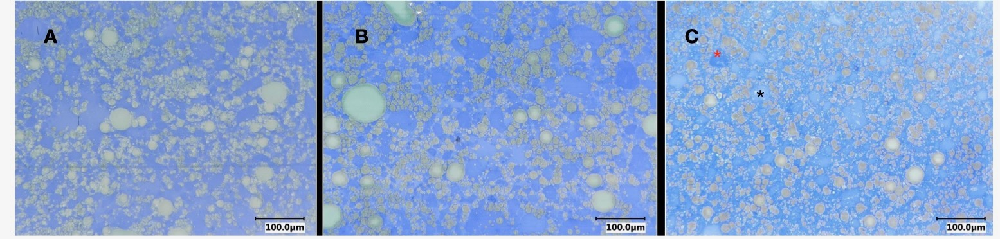
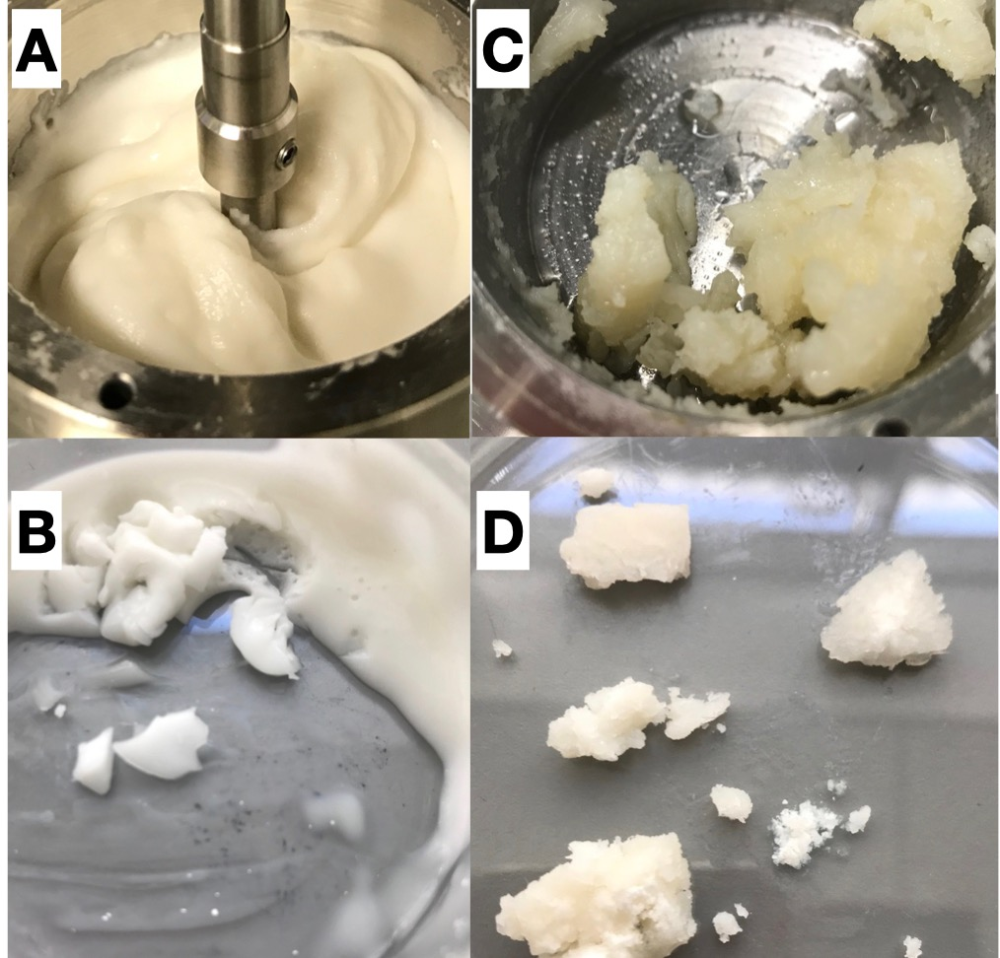
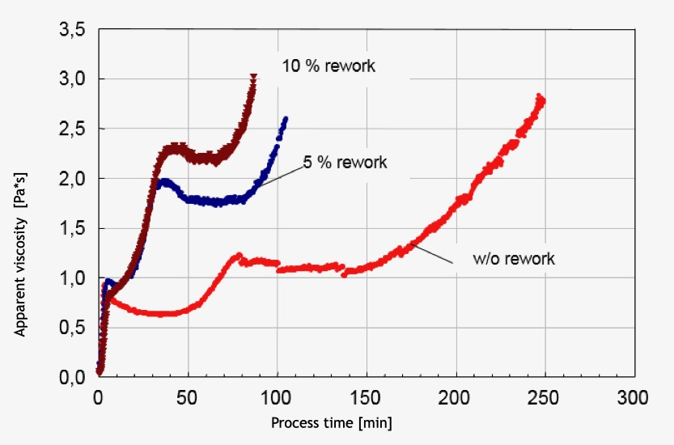

\section{Motivation and Aim}

The aim of this project was to elucidate reactions with caseins as the main players in structure formation, with a special focus on the presence of a dispersed phase. A prerequisite  of the concept is to use casein in high concentrations to make them the determining factor in structure formation and the only surface active ingredient to emulsify the dispersed phase.

A representative model to elucidate mechanisms and process-structure interactions in structure formation processes in multiphased, highly-concentrated protein systems are observations in product systems such as fresh or processed cheese. A general conclusion from the investigations made made on this type of structure formation so far is, that fat is incorporated into the matrix over the course of processing and that a network from protein is formed progressively, that shows different protein densities (Fig.\ref{fig:LM}) within the developed structure. The determination of the composition of these structures is a main aim of this work and should serve additional insight to the parallel investigations of @Vollmer2021, where the structures were characterized morphologically at a molecular scale, using TEM. 
At best, a reaction mechanism for the creaming reaction, with respect to casein-casein interactions might be given by combining the morphological and compositional analysis, to a reaction pathway that explains conformational changes of the casein monomers that would lead to such a type of aggregation.

```{r LM, echo=FALSE, fig.cap="Microscopic images of the model processed cheese investigated herein. Protein has been stained using Coomassie blue, (A) (B) an (C) show the matrix at early, medium and late processing stages. Shrinkage of the fatglobules (grey areas) can be seen as well as areas with higher (darker blue, red asterix) and lower (lighter blue, black asterix) protein density, especially in (C)", fig.scap="LM imaging of processed cheese samples" }

```
The model system by @Lenze2019 is built to follow the structure formation processes during the "creaming" reaction in a Rheometer as simultaneous processing and measurement device. The set-up is used to process the model processed cheese matrix, that has only caseins as the proteinogenic and also as the surface active agent. The structure formation is suspected to display a step-wise increase in matrix resistance during processing, as it is in the red curve in Fig.\ref{fig:rework}. Recent findings (@Vollmer2021) however suggested a gradual matrix development. Thus the matrix is investigated at different processing times in order to clarify, which interactions are responsible for the sudden increase in apparent viscosity. 

Many analytical methods are available for obtaining compositional data. The matrix is a solidified gel at room temperature. Thus, dilution of the matrix is a requirement. Since RP-HPLC analysis is a readily used tool, it was chosen for compositional analysis of the diluted matrix. Analyzing the solely diluted matrix would give, of course, little mechanistic insight towards the targeted specific casein-casein interactions. Dispersed systems are easily seperable by means of centrifugation. It is expected that after centrifugation, the matrix should present itself at least two-phased, due to the presence of the dispersed phase.

The compositional analysis consists also of the characterization of the separated matrix in terms of particle size analysis. On the one hand, fat globule size is to be investigated, but also the diluted matrix seperated into probable functional compartments. It is primarily to be determined, if an insolubly aggregated network is formed, that can be followed during its build-up.
Additionally, a colloidal analysis of low concentrated casein solutions in the presence of the emulsifying salts might show a behaviour that is also found in the dense matrix. The aim of this investigation was also, to explore the theory of reactive building blocks, or seeds, that are suspected to be formed during this process, and promote an autocatalytic reaction (Fig.\ref{fig:state}). 

```{r state, echo=FALSE, out.width="50%", fig.cap="model process cheese structure after shorter processing times of 100 minutes in hot (A) and cold (B) state and after longer processing times of 300 minutes in hot (C) and cold (D) state"}

```

In addition, a compositional analysis is performed on the non-diluted matrix by T2 relaxation measurements to best support the overall compositional findings in this study. In order to give a more detailed overview of T2 relaxation events during processing of a model processed cheese matrix, an upscaled process is used. In a final step, numeric analysis on the obtained experimental data is performed using the tools of the R programming language. The aim here is to elucidate correlations that seem reasonable in terms of structure formation and would give more mechanistic insight about the complex processes occurring during the structure build-up in model processed cheeses.

So far, there is no compositional mechanistic explanation for such a type of structure formation process or for the causes of the sequence of their individual phases. It has been suggested, that the formation of casein fibrils is a key element of structuring the matrix. Fig.\ref{fig:state} displays differently long processed samples of the model processed cheese. It is apparent that the affinity of the matrix to bind or incorporate fat during structuring lessens, since free oil is apparent after long processing times. Also, in cold state, a shorter processed gel still shows elasticity, whereas a longer processed gel has a particulate, almost crystalline structure.
Characterization of these two apparently differently aggregated structures is a key element of this work. Further, it is to be clarified how the matrix is developing from the elastic to the particulate structure during processing.

```{r rework, echo=FALSE, out.width="65%", fig.cap="Effect of pre-cooked cheese (rework) addition on structure formation of model processed cheese, suggestion of an auto-catalytic effect"}

```

Therefore, the model cheese is processed using a Rheometer with a custom made stirring rod and processing cup up to distinct sampling times during structure formation. The set-up is further equipped with a lid, to diminish water evaporation during processing.
The optimum parameters for processing the model cheese mass are chosen from the process and compositional analysis preceding this work in @Rock2010, and were a shear-rate of 200/s of the stirrer, which is ~16 min^-1 stirring speed. The temperature was chosen to be 90 C, the total protein concentration is set to be 15% and only derived from casein, the pH for the educt was set to 5.88.

The data obtained from this procedure is herein referred to as either measured apparent viscosity, rheological profile or flow curve. However it is important to note, that the measured apparent viscosity in no way represents the dynamic or complex viscosity Eta or Eta* respectively, which is measured with standard geometry, and protocols. The increase in overall cohesiveness of the matrix is displayed as an increase in rotating resistance induced by the sample, or the torque of the stirring rod. Accordingly, the apparent viscosities presented herein were presented as a unitless but integer value.

Investigation of the structure formation and characterization of the interactions between components of such systems should lead in extended approaches to generic knowledge for highly concentrated protein systems. 